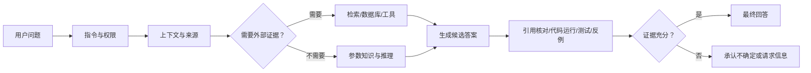
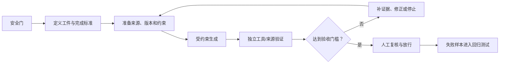

# 01. LLM 幻觉：原理、模型方案与实务指南

> 适用场景：个人系统学习与实践
> 适合读者：具备普通软件工程基础、尚未系统学习 LLM 和 Agent 的个人学习者
> 建议方式：分三部分阅读，每部分安排一次笔记、一次小练习和一次复盘
> 资料核对日期：2026-07-02
> 使用边界：本文只讨论公开原理和通用例子，不涉及公司源码、日志、芯片结构或内部架构。

本文将原来的三份材料合并为一条完整学习路径：

```text
第一部分：幻觉为什么产生
→ 第二部分：先进模型和 Agent 如何降低幻觉
→ 第三部分：使用者如何建立证据链并控制影响
```

不同部分回答不同问题：原理用于建立正确心智模型，模型方案用于理解能力边界，实务流程用于把输出变成可验收工件。

本文中的 **LLM（Large Language Model，大语言模型）** 指通过大量文本训练、根据上下文生成 token 的模型；**幻觉（hallucination）** 指模型生成缺乏依据、与事实或给定材料不符的内容，并以看似可信的方式表达。后文会进一步区分幻觉、推理错误和需求误解。

### 如何使用本文

建议不要一次读完。每部分按照以下顺序学习：

```text
先阅读学习目标
→ 用自己的语言复述核心概念
→ 完成一个脱敏小练习
→ 检查工具输出或资料来源
→ 回答复盘问题并记录不确定点
```

学习时可以建立个人笔记，分成“我已经理解”“需要验证”“容易混淆”三栏。遇到模型版本、产品能力和 API 信息时，应重新打开官方来源核对，而不是只记住文档结论。

## 第一部分：幻觉的产生原因与原理

### 1. 本部分目标

读完这一部分，听众应该能够回答三个问题：

1. 什么是 LLM 幻觉？
2. 为什么 next-token prediction 天然可能生成“看似合理但不真实”的内容？
3. 为什么幻觉只能降低，不能靠提示词或模型升级彻底消灭？
4. 为什么 token 概率、语言自信和事实可信度不是一回事？

### 2. 什么是 LLM 幻觉

LLM 幻觉通常指：模型生成了缺乏依据、与事实不符、与给定材料矛盾，或者无法由现有信息推出的内容，却把它表达得像可信答案。

软件研发中常见表现包括：

- 编造不存在的 API、类、命令、参数或第三方包；
- 混用不同版本的软件接口；
- 声称引用了某份标准或文档，但章节并不存在；
- 根据有限日志直接断言唯一根因；
- 生成无法编译、存在资源泄漏或并发问题的代码；
- 声称“测试已经通过”，但实际上没有执行测试；
- 忽略用户给出的约束，自己补充一个看似合理但未经确认的条件。

可以进一步区分几类风险：

| 类型 | 含义 | 示例 |
|---|---|---|
| 事实性幻觉 | 陈述了错误或不存在的事实 | 编造 `std::scheduler` |
| 上下文幻觉 | 与用户材料或约束矛盾 | 要求 C++17，却使用 C++20 接口 |
| 推理错误 | 已知信息正确，但推导过程错误 | 错误计算结构体对齐后的大小 |
| 信息缺失 | 没覆盖关键边界条件 | 调度器未处理任务取消后的资源释放 |
| 需求误解 | 对模糊需求作了错误假设 | 把“超时”理解成执行前超时，而非执行中超时 |

严格来说，推理错误、需求误解和信息遗漏不一定都属于狭义的“幻觉”。但在软件工程实践中，它们都会形成“看起来可用、实际上不可直接信任”的输出风险。学习时既要理解术语边界，也不要只盯着编造事实而忽略其他错误。

可以先用一句话建立直觉：

> LLM 最危险的地方不一定是说出明显荒谬的话，而是把错误答案说得流畅、完整、专业。

### 3. 从 GPT-2 动画开始讲：模型到底在做什么

推荐用下面三个可视化材料：

- [Transformer Explainer](https://poloclub.github.io/transformer-explainer/)：浏览器里运行 GPT-2 small，可以演示 token、embedding、attention、temperature、top-k、top-p。
- [The Illustrated GPT-2](https://jalammar.github.io/illustrated-gpt2/)：静态图适合理解 decoder-only Transformer、自回归生成、masked self-attention。
- [LLM Visualization](https://bbycroft.net/llm)：适合展示模型内部层级和向量流动的直观感觉。

#### 3.1 动画讲法

可以按这个节奏讲 8～10 分钟：

1. 输入一句话：`Data visualization empowers users to`
2. 展示 tokenization：一句话被切成 token。
3. 展示 embedding：每个 token 变成向量。
4. 展示 masked self-attention：每个 token 只能看左侧上下文，不能偷看未来。
5. 展示 logits / softmax：模型输出的是下一个 token 的概率分布。
6. 拖动 temperature / top-k / top-p：让大家看到“更确定”和“更发散”的差异。
7. 点出关键：模型本质上不是在查事实库，而是在概率空间里续写。

一句适合收尾的话：

> GPT-2 像一个超级强的文本/代码补全器；现代 ChatGPT、Claude、GLM、DeepSeek 则是在这个核心生成机制外面叠加了指令训练、推理、工具、检索、评测和安全策略。

### 4. 从文字到 token

模型不会直接理解完整句子。输入首先会被切分成 token。Token 可能是一个词、词的一部分、符号或一段常见字符。

代码也会被 token 化，例如类型名、标识符、括号、运算符都会成为模型处理的序列元素。模型看到的是 token 之间的统计关系，而不是编译器拥有的抽象语法树、类型系统和执行语义。

设输入经过分词后得到序列：

```math
x_1,x_2,\ldots,x_n
```

每个 token ID 会通过嵌入矩阵映射为向量，再加入位置信息：

```math
h_i^{(0)}=E[x_i]+P_i
```

其中，`E[x_i]` 是 token embedding，`P_i` 是位置编码或位置嵌入。

对软件工程师来说，这带来两个结果：

1. 相似名称和代码模式在表示空间中可能接近，所以模型擅长模仿 API 风格。
2. Token 序列并不自带编译器语义，所以“形式像正确代码”不等于类型、生命周期、并发行为正确。

### 5. Transformer 和 self-attention

Transformer 的核心机制之一是 self-attention。它允许模型在处理当前 token 时，根据上下文判断其他 token 的相关程度。

对于某一层输入矩阵 `X`，模型通过训练得到的参数矩阵产生 Query、Key、Value：

```math
Q=XW_Q,\qquad K=XW_K,\qquad V=XW_V
```

缩放点积注意力的核心公式是：

```math
\operatorname{Attention}(Q,K,V)
=\operatorname{softmax}\left(\frac{QK^T}{\sqrt{d_k}}+M\right)V
```

其中：

- `QK^T` 衡量当前位置与其他位置的匹配程度；
- `sqrt(d_k)` 用于缩放，避免点积过大导致 softmax 过度饱和；
- `M` 是掩码。自回归模型使用因果掩码，使当前位置不能看到未来 token；
- softmax 将分数转换为归一化权重；
- 最后乘以 `V`，得到融合上下文后的表示。

多头注意力可以简化表示为：

```math
\operatorname{MultiHead}(Q,K,V)
=\operatorname{Concat}(\operatorname{head}_1,\ldots,\operatorname{head}_h)W_O
```

不同 head 可能关注不同关系，例如局部语法、变量引用、函数调用风格、长距离依赖等。

### 6. 自回归生成：一个 token 接一个 token

GPT-2 这类 decoder-only 模型的生成过程可以简化为：

```text
给定前文 x_1, x_2, ..., x_t，预测下一个 token x_{t+1}
```

训练目标是最大化真实文本序列概率：

```math
P(x_1,x_2,\ldots,x_T)=\prod_{t=1}^{T}P(x_t\mid x_{<t})
```

对应损失函数通常是负对数似然：

```math
\mathcal{L}=-\sum_{t=1}^{T}\log P_\theta(x_t\mid x_{<t})
```

这套目标带来一个关键后果：

> 模型被训练成“给出最像训练语料的续写”，而不是“只输出可验证事实”。

所以当上下文不足、训练数据稀疏、问题含糊、用户要求不存在的东西，或者采样温度较高时，模型仍然会继续生成看起来合理的 token。

### 7. softmax、temperature 与“自信地编”

模型最后会输出每个候选 token 的 logit。Softmax 把 logit 转成概率：

```math
P(x_{t+1}=i\mid x_{\le t})
=\frac{\exp(z_i/T)}{\sum_j\exp(z_j/T)}
```

其中 `T` 是 temperature：

- `T < 1`：分布更尖锐，输出更确定；
- `T = 1`：保持原始分布；
- `T > 1`：分布更平，输出更发散。

这解释了一个常见现象：

- 降低 temperature 可以减少随机性，但不能保证事实正确；
- 提高 temperature 可以增加创意，但也可能增加幻觉；
- 即使 temperature 很低，如果最高概率候选本身就是错的，模型仍然会稳定地产生错误。

#### 7.1 Token 概率不等于事实置信度

这里最容易产生一个误解：softmax 给出的概率，并不是“这句话为真的概率”。

至少要区分四件事：

1. **Token 概率**：某个 token 在当前上下文中作为下一步续写的相对可能性；
2. **答案正确概率**：整个答案是否符合外部事实或程序语义；
3. **语言表达的自信程度**：措辞听起来有多肯定；
4. **证据强度**：答案是否由文档、检索结果、编译器或测试支持。

模型可能对每一步都选择高概率 token，最终却得到错误答案；也可能用“显然”“一定”“根因就是”等强语气描述一个未经验证的推断。

```text
高 token 概率 ≠ 高事实正确率
流畅、肯定的表达 ≠ 有可靠证据
```

这就是模型能够“稳定、自信地说错”的重要原因。降低 temperature 主要减少采样随机性，不能把语言模型的概率自动校准成事实置信度。

### 8. 幻觉产生的主要原因

#### 8.1 训练目标不是事实验证

语言建模训练的是“预测下一个 token”，不是“证明这个 token 对应的事实为真”。

模型可以学到很多事实，但这些事实是通过文本统计关系内化到参数中的，不等于一个可查询、可更新、可审计的事实数据库。

#### 8.2 训练数据有噪声、冲突和过时信息

训练数据来自大量公开文本，里面天然包含：

- 过时文档；
- 错误教程；
- 复制粘贴的 bug；
- 版本不一致的 API；
- 未注明上下文的经验总结；
- 互相矛盾的资料。

模型会学习这些分布。当问题落在噪声区域或冲突区域时，它可能生成一个流畅但错误的折中答案。

#### 8.3 参数知识是压缩表示，不是事实数据库

预训练把大量文本规律压缩进参数。知识通常分散在许多权重和表示中，并不是数据库里一条带主键、版本号、时间和来源的记录。

因此，参数知识具有几个天然限制：

- 不能默认回溯某个结论来自哪份原始文档；
- 相近但不同版本的资料可能在表示中互相干扰；
- 记住常见代码模式不等于掌握完整类型、生命周期和执行语义；
- 模型可能把真实存在的名称、参数和调用模式重新组合成一个不存在的 API；
- 训练资料中出现过某个事实，也不保证模型能在正确条件下稳定取出它。

可以用一个软件工程类比：

> LLM 的参数更像经过有损压缩的知识表示，而不是带主键、版本号和来源字段的事实数据库。

#### 8.4 参数知识不能实时更新

模型参数中的知识来自训练阶段。对新版本 API、新法规、新论文、新漏洞、新工具链，如果没有联网检索或外部资料，模型很可能凭旧知识回答。

#### 8.5 上下文缺失导致“补洞”

如果用户没有提供版本、约束、边界条件、运行环境，模型会根据常见模式自动补齐。

例如只说“写一个调度器”，模型可能默认：

- 单线程；
- 任务不可取消；
- deadline 是软约束；
- priority 越大越优先；
- 不考虑时钟漂移；
- 不考虑任务执行失败。

这些假设不一定错，但如果没有标注出来，就会变成幻觉风险。

#### 8.6 长上下文不等于完整理解

给模型更多材料通常有帮助，但“材料已经放进上下文”不等于“模型一定正确使用了全部材料”。长上下文还可能出现：

- 关键信息被大量无关内容淹没；
- 位于中间位置的约束没有得到足够关注；
- 多份文档版本不一致，模型没有识别冲突；
- 系统指令、用户要求和引用材料之间发生优先级冲突；
- 模型找到了相关段落，却在推理或代码实现时错误应用；
- 上下文超过窗口后，早期内容被截断、压缩或遗漏。

因此，1M-token context 代表“可以输入更多内容”，不代表“对每个 token 都具有同等可靠的理解和召回”。[Lost in the Middle](https://arxiv.org/abs/2307.03172) 等研究显示，模型利用长输入中不同位置的信息时可能存在明显差异。对代码库、长日志和大型 API 文档，仍需要检索、分块、版本标记和结果验证。

#### 8.7 奖励机制可能鼓励猜测

OpenAI 研究论文 [Why Language Models Hallucinate](https://arxiv.org/abs/2509.04664) 提出一个重要观点：很多训练和评测流程奖励“猜答案”，却不奖励“承认不确定”。

这很像考试：

- 答对得分；
- 答错扣分；
- 空着也不得分。

在这种制度下，模型会学会“不会也猜”。要降低这类幻觉，需要让评测和训练也奖励恰当的不确定性表达。

#### 8.8 指令遵循可能变成迎合错误前提

后训练让模型更愿意帮助用户、遵循指令并维持对话，但“有帮助”和“同意用户”有时会压过事实准确性。这类迎合倾向常被称为 sycophancy，相关现象可参考 [Towards Understanding Sycophancy in Language Models](https://arxiv.org/abs/2310.13548)。

例如用户问：

```text
我记得 C++17 已经支持 std::scheduler，请给一个使用示例。
```

如果模型没有先检查前提，就可能顺着用户的肯定语气编造接口。类似风险还包括接受错误根因、虚构论文结论，或者为了满足用户期待而夸大测试效果。

#### 8.9 训练—生成分布差异会让错误滚雪球

训练时，模型通常在真实数据提供的正确前文上学习预测下一个 token：

```math
x_{<t}\sim p_{\text{data}}
```

实际生成时，后续上下文包含模型自己刚生成的内容：

```math
x_{<t}\sim p_{\theta}
```

一旦模型在前面生成错误，后续预测就会建立在错误前提上，并逐渐进入训练数据中更少见的上下文区域。

模型一旦先生成了错误结论，后续 token 会围绕这个结论继续展开，形成自洽但错误的解释。

论文 [How Language Model Hallucinations Can Snowball](https://arxiv.org/abs/2305.13534) 讨论了这种现象：模型可能在后续解释中继续为早先错误“找理由”，让错误越来越完整。

#### 8.10 语言流畅性会掩盖事实不确定性

LLM 的强项是生成自然、连贯、符合风格的语言。可读性、专业术语、结构完整，都会让人误以为内容可信。

这对软件工程尤其危险：代码片段、错误日志分析、性能解释、论文引用都可能看起来“专业”，但未经验证。

### 9. 软件研发中的典型幻觉案例

#### 9.1 编造 API

```text
请用 C++ 写一个跨平台定时任务调度器。
```

模型可能编造一个不存在的标准库 API，或者混用不同库版本的接口。

降低方式：

- 指定语言标准和依赖版本；
- 要求引用官方文档；
- 要求给出可编译最小例子；
- 本地编译验证。

#### 9.2 编造包名

模型可能建议安装不存在的 npm/PyPI 包。代码生成场景中，这不仅是准确性问题，还可能带来供应链风险。

降低方式：

- 查询官方 registry；
- 锁定依赖；
- 不允许模型随意引入第三方包；
- 对新依赖做人工 review。

#### 9.3 根因过度断言

```text
这个错误日志说明是什么问题？
```

模型可能把“可能原因”说成“唯一原因”。

降低方式：

- 要求列出多个候选假设；
- 要求说明证据和反证；
- 要求给出下一步验证命令；
- 不允许在证据不足时下结论。

### 10. 第一部分小结

LLM 幻觉不是单一 bug，而是由生成目标、参数知识的压缩性质、数据分布、上下文限制、训练与生成的分布差异、采样机制、奖励激励和验证缺失共同造成的。

最重要的认识是：

> LLM 的默认能力是“生成合理文本”，不是“保证事实正确”。事实可靠性需要额外系统工程来约束。

#### 个人练习：观察“合理续写”与“事实正确”的差异

选择一个完全公开、自己能够核验的问题，例如某个标准库 API 的版本差异，连续向模型提出三次：

```text
请回答这个公开技术问题，并把内容分成：
1. 可由官方文档直接确认的事实；
2. 你的推断；
3. 尚未验证的内容。
每项事实给出官方来源；找不到来源时明确说不知道。
```

然后亲自打开来源，记录：模型是否编造链接、是否混用版本、语气自信是否与正确性一致。

#### 第一部分复盘问题

1. next-token probability 为什么不是“事实为真的概率”？
2. temperature 降低后，为什么模型仍可能稳定地产生错误？
3. 参数知识与数据库记录有什么区别？
4. 长上下文为什么不等于完整理解？
5. 你能否用自己的软件开发经历举出一个“错误在前面产生、后面才暴露”的例子？

### 第一部分参考资料

- [Attention Is All You Need](https://arxiv.org/abs/1706.03762)
- [The Illustrated GPT-2](https://jalammar.github.io/illustrated-gpt2/)
- [Transformer Explainer](https://poloclub.github.io/transformer-explainer/)
- [GPT-4 Technical Report](https://arxiv.org/abs/2303.08774)
- [Why Language Models Hallucinate](https://arxiv.org/abs/2509.04664)
- [How Language Model Hallucinations Can Snowball](https://arxiv.org/abs/2305.13534)
- [Language Models (Mostly) Know What They Know](https://arxiv.org/abs/2207.05221)
- [HaluEval](https://arxiv.org/abs/2305.11747)
- [Lost in the Middle: How Language Models Use Long Contexts](https://arxiv.org/abs/2307.03172)
- [Towards Understanding Sycophancy in Language Models](https://arxiv.org/abs/2310.13548)

## 第二部分：先进模型和 Agent 系统如何降低幻觉

### 本部分学习目标

完成本部分后，你应该能够：

- 解释预训练、后训练、推理预算和工具反馈分别解决什么问题；
- 区分“模型能力增强”和“结果已经得到验证”；
- 阅读模型发布说明时识别 benchmark、厂商结论和工程推断；
- 说明 Agent 为什么在可验证任务上更可靠，以及它新增了哪些风险。

核心知识点：模型升级降低的是部分错误概率；真正可审计的可靠性来自来源、工具、测试、权限和流程共同作用。

### 11. 一句话结论

从 GPT-2 到 GPT-5.5、GPT-5.6 Preview、Claude Opus 4.8、GLM-5.2、DeepSeek-V4-Pro，降低幻觉依赖的不是单一技巧，而是多层系统工程：

1. 更大规模、更高质量的预训练；
2. 指令微调和人类/AI 反馈对齐；
3. 诚实性、不确定性和拒答训练；
4. 推理模型和 test-time compute；
5. 检索、搜索、代码执行和测试工具；
6. 长上下文与高效注意力；
7. 系统卡、红队、评测、监控和用户反馈。

现代模型只能降低幻觉，不能消灭幻觉。



### 12. 从 GPT-2 到指令助手

#### 12.1 GPT-2：会续写，但不会查证

GPT-2 是教学基线：decoder-only Transformer、自回归语言建模、没有现代助手式对齐，也不会主动搜索、引用或运行测试。

> GPT-2 是“会续写”的模型，不是“会查证”的模型。它解释了幻觉为什么是语言模型的自然风险。

#### 12.2 InstructGPT / ChatGPT：从续写器变成助手

[InstructGPT](https://arxiv.org/abs/2203.02155) 在预训练基础上加入指令微调和 RLHF，使模型更会遵循问题、格式和多轮意图，也更愿意澄清需求。

它主要降低交互层风险，但仍可能：

- 编造引用、API、包名和参数；
- 为了显得有帮助而不愿承认不知道；
- 顺从用户给出的错误前提。

### 13. 规模、数据、后训练和推理预算

#### 13.1 GPT-4 / GPT-4.5

- [GPT-4 Technical Report](https://arxiv.org/abs/2303.08774) 说明其预训练目标仍是预测下一个 token，后训练提升 factuality 和 desired behavior；
- [GPT-4.5](https://openai.com/index/introducing-gpt-4-5/) 的官方资料将扩大无监督学习、知识和世界理解与更低幻觉联系起来，并公布 SimpleQA 对比。

规模和后训练能减少一部分事实错误，但模型仍不是实时事实数据库。版本号、标准条款、法规、论文和 API 必须核对。

#### 13.2 GPT-5.5

[GPT-5.5 官方说明](https://openai.com/index/introducing-gpt-5-5/) 将其定位为面向真实工作的模型，强调编程、在线研究、数据分析、文档和跨工具任务。[GPT-5.5 System Card](https://deploymentsafety.openai.com/gpt-5-5) 描述了强化学习推理、预部署评测、红队和真实错误样本评估。

主要机制包括：

- reasoning / test-time compute；
- 更强工具使用和长任务保持；
- 工作流自检、测试和验证；
- 系统级安全策略与监控。

幻觉降低来自验证闭环，不是模型突然永远正确。

#### 13.3 GPT-5.6 Preview

2026 年 6 月 26 日，OpenAI 开始限量预览 GPT-5.6 系列，包括 Sol、Terra 和 Luna。

[官方说明](https://openai.com/index/previewing-gpt-5-6-sol/) 提到：

- `max` reasoning effort 为复杂任务提供更高推理预算；
- `ultra` 模式通过多个子代理处理复杂工作；
- 重点评测 coding、biology 和 cybersecurity 等长程 agentic tasks；
- 使用模型级约束、实时检查、账户级信号、监控和持续测试组成分层防护。

谨慎表述：

> 发布说明主要展示 agentic 能力、推理预算和安全机制，没有给出可直接与 GPT-5.5 对比的通用幻觉率。可以说它增强了形成验证闭环的能力，不能说它已经解决幻觉。

### 14. 诚实性、长上下文和开放模型

#### 14.1 Claude Opus 4.8

[Anthropic 官方说明](https://www.anthropic.com/news/claude-opus-4-8) 强调 honesty、uncertainty 和 pushback：模型应减少无法支持的断言，更愿意指出输入问题和不确定性。

主要机制：

- 诚实性和安全对齐；
- effort control；
- agentic coding 中的上下文保持和自检；
- dynamic workflows 中的验证步骤；
- 对错误计划更敢于提出异议。

官方特定评测显示，Opus 4.8 让自己所写代码中的缺陷在未提示情况下通过的概率约为前代四分之一。它是特定代码缺陷评测，不是通用幻觉率。

#### 14.2 GLM-5.2

[GLM-5.2 model card](https://huggingface.co/zai-org/GLM-5.2) 显示其采用 MIT 许可，强调 1M-token context、long-horizon tasks、advanced coding 和 flexible effort，并包含 HLE with tools、SWE-bench Pro、Terminal Bench、Tool-Decathlon 等评测。

可能降低幻觉影响的工程能力：

- 长上下文减少材料完全缺失；
- flexible effort 为困难任务增加推理预算；
- 工具和代码评测推动可验证任务能力；
- 开放权重便于部署自定义检索和 verifier。

长上下文不代表完整理解；公开资料也不支持“已经解决幻觉”的说法。

#### 14.3 DeepSeek-V4-Pro

[DeepSeek-V4-Pro model card](https://huggingface.co/deepseek-ai/DeepSeek-V4-Pro) 描述了 MoE、1M context、混合注意力、SFT、GRPO、on-policy distillation，以及事实性和工具类评测。

这些技术提供了更大的知识容量、更长材料输入、更高推理预算和工具接口，但公开 benchmark 不能证明它在所有场景的幻觉率低于其他模型。

[DeepSeek API 更新日志](https://api-docs.deepseek.com/updates/) 说明旧模型名 `deepseek-chat` 和 `deepseek-reasoner` 于 2026 年 7 月 24 日停用；示例应使用当前正式模型名，并在学习或实践前重新核对。

### 15. Agent 为什么能降低一部分幻觉

普通 LLM 通常直接生成答案；Agent 可以循环读取文件、查询资料、运行命令、观察结果、修改计划并验证。

| 问题 | 普通回答的风险 | Agent 可利用的反馈 |
|---|---|---|
| 项目结构 | 猜文件和函数位置 | `rg`、目录和文件读取 |
| API 用法 | 凭记忆编造参数 | 官方文档、类型定义、最小样例 |
| 语法问题 | 代码看似正确但不能运行 | 编译器、解释器 |
| 行为问题 | 缺少边界和失败路径 | 单测、回归测试、反例 |
| 依赖问题 | 编造包名或版本 | registry、锁文件、安装结果 |
| Bug 根因 | 根据最终错误位置猜测 | 复现、sanitizer、调试器、trace |

> Agent 降低幻觉的核心不是模型更神，而是它能被现实世界“打脸”：文件不存在、命令失败、测试变红、参数错误都会产生外部反馈。

### 16. Agent 新增的风险

工具能力也扩大了错误影响：

1. 工具选择幻觉：该查文档却直接回答；
2. 工具参数幻觉：选对工具但传错参数或版本；
3. 结果解释幻觉：运行了命令却误读输出；
4. 伪验证：只跑弱测试便声称充分验证；
5. 工具调用和结果汇报不准确；
6. 外部网页、issue、邮件或代码注释中的 prompt injection；
7. 错误变成文件修改、删除、提交、部署或外部调用；
8. 多 Agent 互相引用并强化同一个错误。

多 Agent 不天然等于多份独立证据。如果各代理共享模型、材料和错误前提，其错误高度相关。更可靠的做法是分别查询原始来源、运行独立工具和构造反例，由主 Agent 聚合证据而不是投票。

### 17. 模型与方法横向比较

| 阶段 | 代表 | 主要机制 | 推荐说法 |
|---|---|---|---|
| 纯语言建模 | GPT-2 | 预训练和采样 | 解释幻觉为何自然发生 |
| 指令助手 | InstructGPT / ChatGPT | SFT、RLHF、指令遵循 | 从续写器变成助手，但仍会编造 |
| 大规模模型 | GPT-4 / GPT-4.5 | 数据、规模、后训练 | 降低部分事实错误，不替代查证 |
| 推理与工具模型 | GPT-5.5 / GPT-5.6 Preview | 推理、工具、自检、系统评测 | 靠验证闭环降低影响；5.6 仍在预览 |
| 诚实性助手 | Claude Opus 4.8 | honesty、uncertainty、pushback | 更少装知道，更愿指出不确定 |
| 开放长上下文模型 | GLM-5.2 | 1M context、effort、开放部署 | 为工程验证提供能力，不等于解决幻觉 |
| 开放 MoE 模型 | DeepSeek-V4-Pro | MoE、长上下文、后训练 | 结合工具和本地 verifier 使用 |
| Agent 系统 | Claude Code / Codex / OpenClaw 等 | 工具反馈、测试、权限、审计 | 可验证任务更可靠，行动风险也更高 |

#### 实际案例：比较模型发布说明

从本部分选择两个模型，分别打开官方发布说明，用下面的提示词生成初步比较，再亲自核对：

```text
请只依据我提供的两个官方页面进行比较。
分别列出：官方明确声明、官方提供的评测、没有公开的信息、你的工程推断。
不要用 benchmark 推导所有场景的通用幻觉率。
```

#### 第二部分个人练习与复盘

练习：为“普通聊天回答”和“能够查资料、运行测试的 Agent”画一张反馈回路图，并各写出三个可能失败的位置。

复盘问题：

1. 更强推理模型为什么仍需外部验证？
2. 长上下文主要缓解什么问题，又不能保证什么？
3. 工具调用如何降低幻觉，又会引入哪些新错误？
4. 为什么不能直接比较不同厂商宣传中的“准确率”或“幻觉率”？
5. 多 Agent 的一致意见为什么不等于独立证据？

### 第二部分参考资料

- [Training language models to follow instructions with human feedback](https://arxiv.org/abs/2203.02155)
- [GPT-4 Technical Report](https://arxiv.org/abs/2303.08774)
- [Introducing GPT-4.5](https://openai.com/index/introducing-gpt-4-5/)
- [Introducing GPT-5.5](https://openai.com/index/introducing-gpt-5-5/)
- [GPT-5.5 System Card](https://deploymentsafety.openai.com/gpt-5-5)
- [Previewing GPT-5.6 Sol](https://openai.com/index/previewing-gpt-5-6-sol/)
- [GPT-5.6 Preview System Card](https://deploymentsafety.openai.com/gpt-5-6-preview)
- [Introducing Claude Opus 4.8](https://www.anthropic.com/news/claude-opus-4-8)
- [GLM-5.2 model card](https://huggingface.co/zai-org/GLM-5.2)
- [DeepSeek-V4-Pro model card](https://huggingface.co/deepseek-ai/DeepSeek-V4-Pro)
- [Reducing Tool Hallucination via Reliability Alignment](https://arxiv.org/abs/2412.04141)
- [Tool Receipts, Not Zero-Knowledge Proofs](https://arxiv.org/abs/2603.10060)
- [Collective Hallucination in Multi-Agent LLMs](https://arxiv.org/abs/2606.07941)

## 第三部分：使用中如何系统降低幻觉影响

### 本部分学习目标

完成本部分后，你应该能够把一次 AI 使用过程改造成可验收流程：

- 在生成前定义工件、约束和判定器；
- 使用来源、引用和工具建立证据链；
- 区分“测试通过”“验证充分”和“可人工放行”；
- 用根因测试判断 Agent 是否修复了原因而不是掩盖症状；
- 记录失败样本并形成自己的回归测试集。

核心知识点：不要管理模型表现出来的自信，要管理来源、执行结果、权限和验收证据。

### 18. 不要管理“模型自信”，要管理“证据链”

可靠性不能只靠一句“请准确回答”。应把 AI 输出放进可检查的工程流程：



这套流程与三类权威来源一致：

- [NIST AI 600-1](https://doi.org/10.6028/NIST.AI.600-1) 强调治理、来源、部署前测试、持续监控和事件记录；
- RAG、Chain-of-Verification、CRITIC、SelfCheckGPT 分别研究外部知识、独立验证问题、工具反馈和采样一致性；
- [Anthropic 反幻觉指南](https://platform.claude.com/docs/en/test-and-evaluate/strengthen-guardrails/reduce-hallucinations) 与 [GitHub Copilot 负责任使用说明](https://docs.github.com/en/enterprise-cloud@latest/copilot/responsible-use-of-github-copilot-features/responsible-use-of-github-copilot-code-review) 要求来源约束、引用核验以及人工 review 和测试。

> AI 可以生成候选答案，但不能同时担任候选答案的唯一证人、测试工具和最终审批人。

### 19. 安全门和任务风险

降低幻觉不能成为扩大输入范围的理由。外部 AI 不应接触：

- 公司源码、补丁、代码片段和目录结构；
- 内部日志、错误信息、波形和真实定位过程；
- 芯片结构、寄存器、接口协议和验证策略；
- 客户问题、内部 benchmark、性能数据和未公开缺陷；
- 账号、密钥、网络信息和供应商敏感材料；
- 删除名称后仍能通过结构、数值或上下文反推出产品的信息。

当前适合使用完全虚构或公开材料进行：通用结构转换脚本、教学调度器、公开语言特性、公开 API、脱敏文档和通用测试练习。

| 等级 | 示例 | 处理方式 |
|---|---|---|
| L1 草稿 | 脱敏改写、教学示例 | 人工阅读后使用 |
| L2 可执行辅助 | 通用脚本、调度器、公开 API 示例 | 必须运行自动验证 |
| L3 决策建议 | 架构取舍、性能判断、根因分析 | AI 只生成假设，由实验和人验证 |
| 禁止 | 公司代码、芯片信息、真实内部问题 | 不使用外部 AI |

### 20. 生成前先定义“什么算正确”

NIST 建议用经过实证验证的方法评估模型能力，并提醒不要从狭窄、非系统或轶事式测试外推能力。因此应先写验收标准，再写提示词。

#### 20.1 工件、约束和判定器

```text
工件：AI 最终交付什么？
约束：版本、依赖、行为和禁止事项是什么？
判定器：用什么外部信号判断对错？
```

示例：教学用 Python 调度器。

```text
工件：scheduler.py 和 test_scheduler.py

约束：
- 仅用标准库；
- 非抢占式；
- priority 数值越小越优先；
- 相同 priority 保持输入顺序；
- deadline 无法满足时报告；
- 不声称算法全局最优。

判定器：
- python -m unittest -v；
- 空输入、冲突 deadline、相同优先级等边界用例；
- 人工检查复杂度和失败语义。
```

如果任务没有可接受的判定器，模型回答只能是候选方案，不能当作完成结果。

#### 20.2 最小验收表

| 验收项 | 通过条件 | 证据 |
|---|---|---|
| 功能 | 指定用例全部通过 | 命令、退出码、测试摘要 |
| 约束 | 版本和依赖正确 | 官方文档、依赖清单 |
| 边界 | 失败路径可解释 | 对应测试和反例 |
| 声明 | 不夸大最优性和验证范围 | 最终报告 |
| 安全 | 输入和输出均为允许材料 | 人工复核 |

### 21. 为答案提供可追溯证据

#### 21.1 区分事实、约束和待判断项

```text
【事实来源 S1】官方文档中关于某 API 的节选……
【任务约束 C1】只允许标准库。
【任务约束 C2】priority 越小越优先。
【待判断 U1】是否需要稳定排序；信息不足时先提问。
```

输出时用 `S1/C1/U1` 标注依据，避免把材料、用户要求和模型猜测混在一起。

#### 21.2 长文档采用“先找证据，再回答”

Anthropic 官方指南建议长文档任务先提取逐字引用，再执行总结或判断；每项事实声明应附支持它的引用，找不到支持时撤回。

```text
只依据提供的公开材料回答。
第一步：列出相关原文片段和来源编号。
第二步：基于片段回答。
第三步：为每个事实性结论标注来源编号。
找不到支持时写“材料不足”，不要用模型记忆补全。
```

引用存在不等于引用支持结论，仍需人工打开来源检查版本、上下文和原意。

#### 21.3 使用 RAG，但不要神化 RAG

[Retrieval-Augmented Generation](https://arxiv.org/abs/2005.11401) 把参数知识和外部检索结合起来。完整链路至少包括：

```text
问题 → 检索 → 版本/权限过滤 → 相关性检查
→ 基于证据生成 → 引用对齐检查 → 回答
```

RAG 仍可能检索过期资料、漏掉正确来源、截断上下文、过度解释材料，或者受到文档中 prompt injection 的影响。NIST 因此要求验证检索数据的来源与 grounding，并持续核查引用。

### 22. 让模型输出可验证工件

#### 22.1 允许不知道和请求澄清

Anthropic 建议显式允许模型说不知道；[Why Language Models Hallucinate](https://arxiv.org/abs/2509.04664) 指出，只奖励答对而不奖励适当拒答会鼓励猜测。

```text
当信息不足时：
1. 不要猜；
2. 指出缺少哪项信息；
3. 说明它影响什么结论；
4. 给出取得信息或验证假设的方法。
```

#### 22.2 固定输出契约

代码任务至少输出：

```text
1. 已知约束；
2. 自行补充的假设；
3. 实现；
4. 测试；
5. 实际运行命令与结果；
6. 未运行或无法验证的项目；
7. 仍需人工判断的风险。
```

没有执行能力时必须写“未运行”，不能用“应该通过”替代“已经通过”。不需要展示冗长、不可验证的私有思维链；应展示假设、来源、公式、工具输出、测试和反例。

### 23. 用独立判定器验证

#### 23.1 代码验证

GitHub 官方说明指出，AI 生成代码可能表面有效，却在语法、语义、安全或问题修复方面出错，因此必须 review 和测试。

```text
格式/语法 → 编译或解释执行 → 单元测试 → 静态分析
→ 边界和失败路径 → 依赖/安全检查 → 人工 review
```

| 输出声明 | 判定器 |
|---|---|
| 代码能运行 | 编译器或解释器 |
| 满足样例 | 单元测试 |
| 类型正确 | type checker |
| 没有常见静态缺陷 | lint / static analyzer |
| 性能更好 | 同条件 benchmark |
| API 存在且参数正确 | 对应版本官方文档和最小样例 |
| 算法一定最优 | 证明、权威来源或精确算法对照 |

测试也可能很弱。只覆盖 happy path 不能支持“充分验证”，报告必须说明覆盖范围和未测试风险。

#### 23.2 事实验证：claim-evidence matrix

| Claim | 事实声明 | 来源 | 是否真的支持 | 处理 |
|---|---|---|---|---|
| F1 | 某 API 在指定版本可用 | 官方段落 | 是/否 | 保留/删除 |
| F2 | 算法复杂度为 O(n log n) | 推导或权威来源 | 是/否 | 修正 |
| F3 | 某方案性能最好 | 无同条件 benchmark | 否 | 改为待验证假设 |

验证重点不是有没有链接，而是链接具体内容是否支持该句。

#### 23.3 根因分析：寻找第一次异常，而不是最终报错

要求 Agent 输出：

```text
候选假设 → 支持证据 → 反证 → 能区分假设的实验
```

当程序在 B 处崩溃，但错误可能在 A 处发生时：

```text
1. 保存原始复现、输入、命令和错误栈；
2. 暂不修改，使用告警、ASan/UBSan、测试或调试器定位第一次非法状态；
3. 证明 A 到 B 的数据或生命周期路径；
4. 为 A 增加根因定向测试；
5. 最小修改 A，保持 B 的正常检查和清理；
6. 原始复现、根因测试和诊断工具全部通过；
7. 临时撤销 A 的修复，确认测试重新失败；
8. 恢复修复，确认重新通过。
```

这能区分“修复根因”和“在 B 增加 `if` 掩盖症状”。

#### 23.4 Chain-of-Verification

[Chain-of-Verification](https://arxiv.org/abs/2309.11495) 的流程是：形成草稿、生成验证问题、独立回答、依据证据修订。

```text
第一轮：给出草稿并拆出可验证声明。
第二轮：为每项声明设计不预设原答案正确的问题。
第三轮：只用官方材料或工具独立回答。
第四轮：建立声明—证据表，删除或降级无支持内容。
```

独立性很重要：验证提示如果直接包含原结论，模型容易继续维护错误。

#### 23.5 工具反馈和多次采样

[CRITIC](https://arxiv.org/abs/2305.11738) 让模型调用搜索、解释器等工具检查并修订输出；对编程任务对应“生成→运行→读取失败→修改→再运行”。工具调用仍可能选错或被误读，因此要保存工具、参数、输入版本、退出码和未运行项。

[SelfCheckGPT](https://arxiv.org/abs/2303.08896) 利用多次采样不一致发现可疑内容。它适合寻找风险点，但一致不等于正确：模型可能稳定重复同一个偏差。

### 24. 多 Agent 用于独立取证，不用于制造多数真理

不充分：

```text
Agent A 给结论
→ Agent B 阅读 A 后表示同意
→ 主 Agent 宣布“两个 Agent 已验证”
```

更可靠：

```text
Agent A：查官方来源和原文
Agent B：运行最小样例和测试
Agent C：构造反例和失败条件
主 Agent：比较独立证据，保留冲突和未验证项
```

[Collective Hallucination in Multi-Agent LLMs](https://arxiv.org/abs/2606.07941) 是较新的预印本，提示多 Agent 交互可能传播和放大无证据结论；它适合作为风险提示，不应被视为覆盖所有架构的最终结论。

### 25. 人工放行、持续监控和失败回归

AI 生成者不能成为唯一 reviewer，AI reviewer 也不能成为最终批准者。人工至少确认：

- 需求和假设是否正确；
- 依赖、许可证和安全影响；
- 测试是否覆盖真实失败模式；
- 工具结果是否被正确解释；
- 是否存在信息安全和隐私风险；
- 最终表述是否超出证据范围。

NIST 建议持续监控 confabulation，并记录错误、near-miss 和负面影响。可以维护失败登记：

| 字段 | 内容 |
|---|---|
| 任务类型 | 脚本、API、文档总结等 |
| 失败表现 | 编造 API、误读材料、漏约束等 |
| 发现方式 | 编译器、测试、人工核查等 |
| 根因类别 | 来源缺失、提示歧义、验证不足等 |
| 修正措施 | 增加来源、测试、拒答条件等 |
| 回归用例 | 更换模型、提示或工具后必须重跑的样例 |

### 26. 可直接采用的任务模板

```text
【安全声明】
这是完全虚构、脱敏的练习，不包含公司代码、日志、芯片或客户信息。

【目标工件】
说明要生成的文件、文档或分析结果。

【事实来源】
S1: 官方材料及版本……
S2: 官方材料及版本……
只允许依据这些来源做事实性陈述；材料不足时明确说明。

【约束】
C1: ……
C2: ……

【验收标准】
A1: 必须通过的测试……
A2: 必须核对的引用……
A3: 必须人工判断的部分……

【执行流程】
1. 复述约束，区分已知条件和自行假设；
2. 生成最小实现或答案；
3. 把事实结论拆成 claim 并标注来源；
4. 生成并运行可执行测试；
5. 根据外部证据修订；
6. 报告实际结果、未运行项和剩余风险。

【失败协议】
- 找不到可靠来源：写“未验证”；
- 信息不足：提出需要补充的问题；
- 工具未执行：不得声称已经通过；
- 约束冲突：停止并报告，不自行选择。
```

### 27. 完整练习：脱敏调度器

任务：

```text
用 Python 标准库实现教学用非抢占式调度器。
任务包含 id、priority、deadline、duration。
priority 越小越优先；相同 priority 保持输入顺序。
无法满足 deadline 时报告原因。
```

生成前固定验收标准：

- 空输入返回空列表；
- 两个不同 priority 的任务顺序正确；
- 相同 priority 保持稳定；
- deadline 不可满足时不会假装成功；
- duration 为负数时拒绝输入；
- 只使用标准库；
- 文档说明算法不保证全局最优。

运行：

```text
python -m unittest -v
```

再增加模型未提前见过的反例，检查失败是否诚实报告。最终验收报告应写：

```text
已验证：指定单元测试通过，退出码为 0。
已核对：仅导入 Python 标准库模块。
未验证：大量任务下的性能；算法全局最优性。
人工结论：适合作为教学示例，不直接用于真实调度系统。
```

### 28. 常见但证据不足的做法

| 做法 | 为什么不够 | 替代方法 |
|---|---|---|
| “请不要幻觉” | 没有来源或判定器 | 提供来源、验收和失败协议 |
| 降低 temperature | 可能稳定生成同一个错误 | 使用外部证据和测试 |
| 让模型再检查一次 | 容易维护原结论 | 独立验证问题或工具反馈 |
| 多数投票 | 错误可能高度相关 | 把分歧当风险信号，查外部证据 |
| 有引用就相信 | 引用可能不存在或不支持结论 | claim-evidence 对齐核查 |
| 测试通过就采用 | 测试可能弱、需求可能误解 | 审查测试范围和业务语义 |
| 更强模型可以免审 | 能力增强不消除幻觉 | 保留同样放行门槛 |

### 第三部分个人复盘

完成调度器练习或其他公开小任务后，回答：

1. 我在生成前是否写出了可以观察的完成标准？
2. 哪些结论来自来源，哪些只是模型推断？
3. 测试覆盖了哪些路径，还有哪些路径没有覆盖？
4. 如果撤销修复，失败是否会重新出现？
5. Agent 有没有通过跳过、吞错或缩小验证范围制造“成功”？
6. 哪些失败样本值得保存为下次更换模型后的回归用例？

建议把答案保存在自己的学习记录中。经过数次练习后，再回看记录，检查自己是否从“相信回答”逐步转向“检查证据”。

### 第三部分参考资料

- [NIST AI 600-1: Generative AI Profile](https://doi.org/10.6028/NIST.AI.600-1)
- [Anthropic Claude Platform Docs: Reduce hallucinations](https://platform.claude.com/docs/en/test-and-evaluate/strengthen-guardrails/reduce-hallucinations)
- [Why Language Models Hallucinate](https://arxiv.org/abs/2509.04664)
- [Retrieval-Augmented Generation for Knowledge-Intensive NLP Tasks](https://arxiv.org/abs/2005.11401)
- [Chain-of-Verification Reduces Hallucination](https://arxiv.org/abs/2309.11495)
- [CRITIC: Tool-Interactive Critiquing](https://arxiv.org/abs/2305.11738)
- [SelfCheckGPT](https://arxiv.org/abs/2303.08896)
- [GitHub Docs: Responsible use of Copilot code review](https://docs.github.com/en/enterprise-cloud@latest/copilot/responsible-use-of-github-copilot-features/responsible-use-of-github-copilot-code-review)
- [Tool Receipts, Not Zero-Knowledge Proofs](https://arxiv.org/abs/2603.10060)
