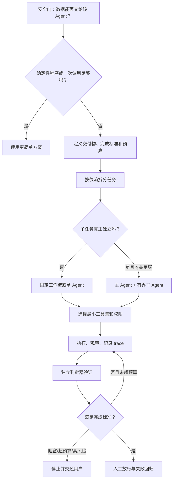

# 02. Agent 使用指南：任务选择、指令、编排、验证与成本控制

> 适用场景：软件部门内部培训与个人实践
> 目标听众：普通软件工程师和希望使用 Agent 提效的同事
> 资料核对日期：2026-07-02
> 使用边界：当前只能在工作环境之外使用 AI 工具。不得输入公司源码、日志、芯片结构、内部接口、客户信息或任何可反推出产品信息的材料。

## 阅读说明：如何判断证据强度

本文用以下标签区分结论来源：

- **【官方指导】**：标准机构或产品官方文档中的明确建议；代表其设计和使用经验，不自动等于跨产品定律。
- **【研究证据】**：技术论文中的实验结果；优先同行评审，预印本会明确标注。
- **【真实案例】**：厂商公开的生产架构或客户案例；能说明做法可落地，但可能存在选择性披露。
- **【工程推断】**：根据公开证据和软件工程原则形成的可执行规则；具体阈值需要用本地、脱敏任务评测校准。

## 1. 一页以内的结论摘要

### 1.1 Agent 与普通聊天模型的本质区别

【官方指导】OpenAI 把 Agent 定义为能够较独立地代表用户完成任务的系统，其基础由模型、工具和指令组成；模型负责管理工作流、选择工具、读取反馈并判断是否结束。仅把问题交给模型生成一次回答，不属于完整 Agent。

【官方指导】Anthropic 进一步区分：

- **Workflow**：模型和工具沿开发者预先写好的固定路径执行；
- **Agent**：模型根据当前状态动态决定下一步和工具调用。

```text
普通聊天：问题 → 一次回答

固定工作流：输入 → 固定步骤 A → 固定步骤 B → 输出

Agent：目标 → 观察 → 计划 → 调工具 → 读取结果
             ↑                         ↓
             └──── 修正、继续或停止 ──┘
```

[ReAct](https://arxiv.org/abs/2210.03629) 展示了推理、行动和环境观察交错进行的基本范式。工具反馈可以让模型更新计划，但前提是工具结果可观察、可信，而且模型没有误读结果。

### 1.2 不要从“聊天”直接跳到“多 Agent”

推荐采用最低必要复杂度：

```text
确定性程序
→ 单次模型调用
→ 固定工作流
→ 单 Agent + 工具
→ 多 Agent
```

| 方案 | 适合场景 | 优点 | 主要代价 |
|---|---|---|---|
| 确定性程序 | 规则稳定、输入输出明确 | 最便宜、最快、可测试 | 不擅长模糊语义和例外 |
| 普通聊天 | 解释、改写、头脑风暴、一次性草稿 | 交互简单、成本低 | 不会自主闭环执行 |
| 固定工作流 | 步骤明确且存在依赖 | 可预测、易审计 | 对新情况适应较弱 |
| 单 Agent + 工具 | 路径不固定，但目标和判定器明确 | 能根据反馈调整 | token、延迟和错误面增加 |
| 多 Agent | 高价值、可并行、跨来源或跨专业任务 | 扩大覆盖面和上下文 | 协调、重复、合并和成本最高 |

【官方指导】OpenAI 和 Anthropic 都建议从简单方案开始。只有低一级方案经过评测仍不能满足要求时，才增加自治或 Agent 数量。

### 1.3 任务选择与核心结论

【官方指导】OpenAI 建议优先考虑复杂情境判断、难维护规则和非结构化数据；若确定性方案足够，就不必使用 Agent。

| 适合 Agent | 不适合 Agent |
|---|---|
| 目标明确但路径不固定，需要搜索、工具和反馈修正 | 简单稳定、脚本或规则引擎即可完成 |
| 有测试、来源或人工审批作为判定器 | 连完成标准都说不清，且无法验证 |
| 错误能在造成高后果前被阻断 | 无人审批的付款、发送、删除和生产变更 |
| 高价值、可独立并行、跨来源的复杂研究 | 多个 Agent 必须频繁修改同一共享状态 |
| 只处理授权的公开或脱敏数据 | Agent 无权接触的内部或敏感资料 |

带走五句话：

1. 先定义交付物和完成标准，再决定是否需要 Agent。
2. 指令必须包含目标、边界、工具、验收、停止条件和预算。
3. 能用代码完成的路由、聚合、校验和去重，不交给 LLM 自由发挥。
4. 多 Agent 扩大的是计算和覆盖面，不自动提高事实正确性。
5. 事实靠来源、代码靠测试、性能靠 benchmark、根因靠实验；提示词不能替代权限隔离和人工审批。

## 2. Agent 使用流程



### 2.1 第一步：通过安全门

先回答：输入能否交给当前 Agent？它连接的模型、工具和外部服务能看到什么？

对当前工作环境，外部 Agent 只使用公开或完全虚构材料。即使任务本身低风险，也不能上传：

- 公司源码、目录结构、补丁和内部脚本；
- 内部日志、波形、错误栈和真实问题定位过程；
- 芯片结构、接口协议、验证策略和性能数据；
- 客户信息、账号、密钥和未公开资料；
- 删除名称后仍可通过结构、数值或上下文反推出产品的信息。

### 2.2 第二步：建立 Agent 任务合同

在调用 Agent 前，至少写清以下九项：

```markdown
# 目标
最终解决什么问题，结果给谁使用。

# 输入与事实来源
允许使用哪些文件、网址和数据；资料版本与核对日期。

# 范围与禁止事项
允许读取、修改、创建什么；哪些内容和动作禁止。

# 工作方式
先调查还是可以修改；需要分阶段暂停吗？

# 工具与权限
允许哪些工具；默认只读还是可写；哪些操作必须审批。

# 交付物
文件、补丁、表格、报告及其格式。

# 完成标准
测试、schema、引用、数值核对和人工判断要求。

# 停止与升级条件
何时成功、阻塞、失败、超预算或必须请求用户决策。

# 预算与报告
Agent 数、工具调用、重试、token、费用和时间上限；最终证据清单。
```

【官方指导】GitHub 对编码 Agent 的理想任务描述也要求：问题清晰、验收标准完整，并说明建议修改范围。

### 2.3 第三步：按依赖关系拆分，而不是按模糊角色拆分

先画出任务依赖：

```text
问题定义
├── 可独立调查 A ──┐
├── 可独立调查 B ──┼→ 证据合并 → 验证 → 最终产物
└── 可独立调查 C ──┘
```

每个工作包必须包含：

| 字段 | 说明 |
|---|---|
| 输入 | 允许使用的最小上下文 |
| 唯一责任 | 只负责一个明确问题 |
| 输出 schema | 主 Agent 能机械合并的格式 |
| 证据要求 | 来源、命令、测试或截图 |
| 写入范围 | 哪些文件或资源可改 |
| 依赖 | 开始前必须得到什么结果 |
| 完成标准 | 什么条件下返回成功 |
| 停止条件 | 无进展、工具失败或预算触顶如何处理 |

不好的拆分：

```text
Agent A：研究一下
Agent B：也研究一下，看看有没有遗漏
Agent C：综合判断
```

更好的拆分：

```text
Agent A：只查官方文档和原始论文，输出 claim-source 表。
Agent B：只查真实案例和失败案例，输出 case-failure-mitigation 表。
Agent C：只比较成本、权限和风险，输出 decision matrix。
主 Agent：打开关键来源复核，去重、处理冲突并形成统一结论。
```

### 2.4 第四步：选择模型和工具

#### 模型选择

【官方指导】OpenAI 建议先用能力较强的模型建立质量基线，再尝试用更小、更快的模型替换简单步骤，并用 eval 判断是否仍达标。

| 子任务 | 推荐策略 |
|---|---|
| 分类、抽取、格式转换 | 小模型或确定性代码优先 |
| 多来源综合、复杂调试、冲突分析 | 更强模型 |
| schema 校验、数值重算、去重 | 确定性代码 |
| 最终高风险判断 | 强模型辅助 + 人工决定 |

#### 工具选择

只提供完成任务必需的最小工具集。工具描述要写清：

- 什么时候使用和不使用；
- 输入参数和版本；
- 返回值与错误码；
- 是否只读、可逆；
- 是否产生费用或外部影响；
- 失败后能否重试。

【厂商经验】OpenAI 指出，工具是否容易混淆比工具数量本身更重要：十几个边界清晰的工具可能运行良好，少量高度重叠工具也可能频繁误选。

### 2.5 第五步：执行时保留状态和证据

Agent 每轮至少维护：

```text
当前目标
已完成事项
已访问的 URL/文件/查询
关键证据及来源
未解决问题
下一步及其理由
剩余预算
```

用 ledger 对 URL、查询、文件哈希和工具参数去重，避免重复搜索和重复修改。不要依赖 Agent 的自然语言记忆判断“是否已经做过”。

### 2.6 第六步：用独立判定器验证

完成标准按证据强度排序：

```text
确定性判定器：编译、测试、lint、schema、重算、diff
        ↓
外部原始证据：官方文档、原始论文、数据库查询
        ↓
独立 checker：在新上下文中按 rubric 尝试证伪
        ↓
人工放行：敏感、不可逆或高影响操作
```

生成者不能只凭“我已经检查过”宣布完成。最终报告应包含实际命令、退出码、来源、测试结果、未验证项和剩余风险。

### 2.7 第七步：明确结束，不无限重试

任务必须有四类终止条件：

| 状态 | 条件 |
|---|---|
| 成功 | 所有必需工件存在，测试、schema、引用或人工审批通过 |
| 阻塞 | 缺少权限、输入、用户选择或外部服务 |
| 失败 | 同类工具错误达到重试上限，或证据否定当前方案 |
| 超预算 | Agent 数、token、费用、工具调用或时间任一触顶 |

可采用的起始阈值【工程推断，需本地校准】：

```text
同一工具错误最多重试 2 次；
连续 2 轮没有新增证据或产物变化则停止；
同一 URL、文件哈希或相同查询不重复处理；
高风险或不可逆操作一律暂停请求批准。
```

## 3. 最佳实践清单

### 3.1 运行前

- [ ] 确认数据允许交给该 Agent，且已做不可逆脱敏。
- [ ] 证明普通程序、一次调用或固定工作流不足。
- [ ] 写清目标工件，而不是只写“帮我处理一下”。
- [ ] 为每个工件定义可观察的完成标准。
- [ ] 给出来源优先级、版本和核对日期。
- [ ] 工具默认只读，权限和凭证遵循最小化。
- [ ] 写入、发送、删除、发布、付款和扩权需要真实参数级审批。
- [ ] 设置 Agent 数、工具调用、重试、时间、token 和费用上限。

### 3.2 运行中

- [ ] 先探索和规划，再修改或执行高成本操作。
- [ ] 外部网页、邮件、PDF、issue、代码注释和工具返回都视为不可信数据。
- [ ] 不把网页或文件中的文字提升为系统指令。
- [ ] 公共网络检索与私有数据/高权限工具尽量分阶段、分权限执行。
- [ ] 记录已访问资源和当前剩余预算。
- [ ] 对重复查询、重复工具参数和无进展循环自动停止。
- [ ] 并行 Agent 不同时修改相同文件或共享可变状态。
- [ ] 工具失败要区分网络暂时错误、权限错误和逻辑错误，不无脑重试。

### 3.3 运行后

- [ ] 事实声明可追溯到原始来源，而不是其他 Agent 的转述。
- [ ] 代码有编译、测试、静态/动态检查或人工 diff 证据。
- [ ] 性能结论来自同条件 benchmark。
- [ ] 根因结论来自可证伪实验，而不是报错位置猜测。
- [ ] AI reviewer 没有替代人工批准者。
- [ ] 报告列出没运行的验证和剩余风险。
- [ ] 保存 trace、成本、批准记录和失败样本。
- [ ] 把失败样本加入后续回归 eval。

### 3.4 什么时候使用多个子 Agent

建议满足下列五项中的至少三项，并且不存在共享写状态冲突【工程推断】：

1. 子任务边界互不重叠，输出 schema 明确；
2. 各分支不依赖其他分支的中间结论；
3. 各分支需要不同来源、工具或专业上下文；
4. 单一上下文会被大量材料挤满；
5. 任务价值足以覆盖明显增加的 token、工具和汇总成本。

优先使用“主 Agent + specialists”模式，让主 Agent 负责用户沟通、预算、冲突处理和最终验收。Peer-to-peer handoff 更灵活，但责任边界和上下文污染更难控制。

【真实案例】Anthropic 的 Research 系统采用 lead-agent + 并行 workers 搜索不同方向。其公开生产数据中，普通 Agent 大约消耗聊天交互 4 倍 token，多 Agent 约 15 倍；这是特定系统的观测，不应当作所有 Agent 产品的固定倍率。

多 Agent 不适合：

- 单 Agent 已经能够稳定完成；
- 任务有强顺序依赖；
- 多个 Agent 要修改同一工作树或文档；
- 没有统一验收器和冲突解决规则；
- 只是希望用“多数意见”证明事实。

### 3.5 成本控制

近似成本模型【工程推断】：

```text
总成本 ≈ Σ(输入 token × 输入单价
           + 输出 token × 输出单价
           + 工具/API 费用
           + 沙箱/CI 计算费用
           + 人工复核成本)
```

降本优先级：

1. 单 Agent 先建立基线，eval 证明不足再增加 Agent；
2. 用代码完成路由、聚合、去重和 schema 校验；
3. 小模型处理分类和抽取，强模型只处理困难分支；
4. 子 Agent 只接收最小任务包，不复制全部历史；
5. 缓存查询、URL、文件哈希和确定性工具结果；
6. 低置信度或高价值分支才触发第二 Agent；
7. 用“每个被接受的事实、通过的测试或完成工件的成本”评估价值。

预算示例：

```text
最多 1 个主 Agent + 3 个子 Agent；
每个子 Agent 最多 8 次工具调用；
总工具调用不超过 24 次；
同类错误最多重试 2 次；
墙钟时间不超过 20 分钟；
达到 token/费用上限立即停止并返回部分结果。
```

## 4. 常见错误与解决办法

| 失败模式 | 典型表现 | 根因 | 改进方法 |
|---|---|---|---|
| 把聊天当 Agent | 要求“一次给完最终答案” | 没有工具反馈和状态循环 | 简单任务继续聊天；复杂任务定义工作流和判定器 |
| 任务过宽 | “研究一下并给最佳方案” | 交付物和边界不清 | 写任务合同，拆成互斥工作包 |
| Agent 永不停止 | 不断换关键词、重试相同工具 | 没有成功/阻塞/预算条件 | 设置无进展、重试、时间和费用上限 |
| 重复工作 | 多个 Agent 查同一网页、改同一文件 | 没有 ledger 和责任边界 | 查询去重、最小上下文、写入范围隔离 |
| 工具误选 | 相似工具反复调用错误 | 描述和参数边界重叠 | 改名和 schema；仍不稳定时再拆 Agent |
| 伪验证 | Agent 声称测试通过但没有执行 | 把自述当证据 | 检查命令、退出码、日志和生成工件 |
| 在症状处掩盖错误 | B 处加 `if` 后不崩溃，A 处越界仍存在 | 以“现象消失”代替因果验证 | 定位第一次非法状态，根因测试和撤销实验 |
| 多 Agent 集体错误 | 多个 Agent 引用同一二手来源后形成共识 | 错误高度相关 | 独立原始来源、独立工具验证，主 Agent 聚合证据而非投票 |
| Prompt injection | 网页或邮件诱导 Agent 调用私有工具 | 把不可信内容当指令，权限过大 | 数据/指令隔离、最小权限、结构化输出和人工审批 |
| 长任务漂移 | 后期忘记约束、重复修改、破坏文档 | 上下文累积和缺少阶段验收 | 分阶段快照、patch/diff、每阶段验证不变量 |
| 办公文档损坏 | 连续重写唯一原件，内容逐步丢失 | 长程编辑缺少版本和结构检查 | 使用副本、patch、字段/公式检查和人工放行 |
| 成本失控 | 多 Agent、高级模型和重试全量启用 | 没有分级路由和预算 | 按难度路由、缓存、熔断和单位产物成本指标 |

### 4.1 失败案例：程序在 B 报错，Agent 在 B 掩盖问题

错误做法：Agent 看到 `free()` 处崩溃，就在 B 处跳过释放、增加无依据的 `if` 或关闭 sanitizer。

【官方指导】GitHub 要求 Agent 创建的修改接受与人工贡献同等严格的 review；【研究证据】[AnalysisBench](https://arxiv.org/abs/2604.11270) 的 2026 预印本发现，在程序分析任务中，模型自述的验证成功会持续高估人工核验结果。因此验收应查看工具产物和退出码，而不是 Agent 的成功声明。

正确流程：

```text
1. 保存原始复现和错误栈；
2. 暂不修改，使用编译器告警、ASan/UBSan、测试等寻找第一次非法状态；
3. 证明错误在 A 发生、在 B 表现的数据或生命周期路径；
4. 为 A 增加根因定向测试；
5. 最小修改 A，保持 B 的正常检查和清理；
6. 原始复现、根因测试和 sanitizer 全部通过；
7. 临时撤销 A 的修复，确认测试重新失败；
8. 恢复修复，确认重新通过。
```

### 4.2 失败案例：多个研究 Agent 产生“虚假共识”

三个 Agent 都引用同一篇二手文章，不代表三份独立证据。要求每个 Agent 返回：

```text
原始链接
发布主体和日期
支持的原子 claim
原文证据位置
证据限制
是否与其他 Agent 来源独立
```

【真实案例】Anthropic 公开的多 Agent Research 早期版本曾为简单查询生成大量子 Agent、重复搜索、无休止寻找不存在的来源；其改进方式包括为每个 worker 明确目标、来源、工具、输出格式和边界，并根据问题复杂度限制 Agent 数和工具调用。

### 4.3 失败案例：办公 Agent 越做越多

Agent 原本只需生成汇总，却继续发送邮件或修改源表。解决方案：

- 抽取、计算、草稿和发送分成不同阶段；
- 默认只读源文件，只在新目录生成结果；
- 邮件发送、上传和覆盖源文件必须单独审批；
- 审批界面展示真实收件人、附件、diff 和工具参数，不能只展示 AI 摘要。

【真实案例】Microsoft 公布的 Regal Rexnord 案例先把电子表格抽取成结构化 CSV，再进入检索系统；mobilezone 的客服与 IT Agent 在复杂或法律敏感场景转交人工。这些案例支持“先结构化、再自动化、超边界交人”的架构，但客户故事可能存在选择性披露，不能直接当作通用效果数据。

【研究证据】Microsoft Research 的长期文档委派研究观察到，模型在长工作流末尾可能产生稀疏但严重的语义内容损坏。更稳妥的办法是使用副本、版本快照和 patch/diff，每阶段检查字段、公式、引用和不变量，而不是反复全文重写唯一原件。

## 5. 三个可直接复制的提示词模板

### 5.1 研究 Agent 模板

```text
【目标】
研究：<主题>。形成截至 <YYYY-MM-DD> 的比较报告，供 <受众> 使用。

【范围】
- 只使用公开信息；
- 来源优先级：官方文档 > 原始论文 > 厂商工程文章 > 二手资料；
- 区分“官方指导、研究证据、真实案例、工程推断”；
- 信息不足时写未知，不使用模型记忆补全。

【拆分】
如果至少有两个相互独立的方向且收益足以覆盖成本，可使用子 Agent。
每个子 Agent 必须有互斥问题、来源范围、输出 schema 和工具预算。

【输出】
1. 一页摘要；
2. 方法比较表；
3. claim-evidence 表；
4. 冲突与不确定项；
5. 可执行建议；
6. 原始来源链接。

【验证】
- 每个重要 claim 至少有一个直接来源；
- 打开关键链接，检查来源是否真的支持原句；
- 多个 Agent 的一致意见不能代替来源；
- 主 Agent 负责去重、查缺和冲突处理。

【预算与停止】
- 最多 <N> 个子 Agent；
- 每个最多 <N> 次搜索/工具调用；
- 连续 2 次搜索没有新增一手来源则停止；
- 达到时间或费用上限时返回部分结果和缺口。
```

### 5.2 编程与根因调试 Agent 模板

```text
【目标】
诊断并修复：<可复现现象>。报错位置不一定是根因位置。

【阶段 1：只诊断，不修改】
1. 稳定复现，记录输入、命令、退出码和完整错误栈；
2. 使用项目已有测试、编译器告警、sanitizer、调试器或静态分析；
3. 沿数据流和生命周期寻找第一次非法状态；
4. 给出候选根因、支持证据、反证和可证伪实验；
5. 形成证据后暂停汇报，未经确认不修改代码。

【阶段 2：最小修复】
- 说明根因 A 与表现位置 B 的因果路径；
- 优先只修改首次破坏不变量的位置；
- 禁止删除检查、吞错、跳过清理、返回默认值、关闭 sanitizer 或添加 suppression；
- 如需修改 B，必须证明 B 存在独立缺陷。

【完成标准】
- 原始复现通过；
- 根因定向测试通过；
- 编译、测试和适用的 sanitizer/静态检查通过；
- B 的正常检查和清理仍然执行；
- 临时撤销 A 的修复后，根因测试重新失败；
- 输出 diff、实际命令、退出码、未运行项和剩余风险。

【权限】
- 不安装依赖、不访问网络、不提交或 push，除非我单独批准；
- 不覆盖我的现有修改。
```

### 5.3 办公自动化 Agent 模板

```text
【目标】
根据完全虚构/脱敏的 <CSV/XLSX/公开材料> 生成统计表和一页摘要。

【权限边界】
- 只读取 <input 目录>；
- 只在 <output 目录> 新建文件；
- 不修改原文件；
- 不发送邮件、不上传、不调用公司系统；
- 不猜测缺失数据；任何外部动作先暂停审批。

【处理流程】
1. 先输出字段映射、口径和计算规则；
2. 检查缺失值、重复行、异常类型和口径冲突；
3. 使用脚本或公式计算，不用自然语言心算；
4. 生成结果副本和摘要草稿；
5. 重新打开生成文件，检查公式、格式和工作表完整性。

【完成标准】
- 输入行数、过滤和去重规则可追溯；
- 分组汇总与原始总计一致；
- 随机抽查至少 5 行；
- 输出输入文件哈希、执行脚本、核对结果和异常清单；
- 邮件或发布内容只生成草稿，不执行发送。

【停止条件】
发现字段含义不明、数据冲突、需要外部传输或会覆盖原件时立即停止并询问。
```

## 6. 针对当前情况的行动建议

你当前只能在工作环境之外使用 AI，最适合先建立“小而可验证”的 Agent 使用方式，而不是追求全自动。

### 6.1 建议从三个脱敏试点开始

| 试点 | Agent 做什么 | 判定器 | 不允许做什么 |
|---|---|---|---|
| 通用结构转换脚本 | 读取虚构 schema，生成 C/Python 数据结构和测试 | 编译、单测、边界样例 | 使用真实寄存器、接口或结构体 |
| 教学调度器 | 生成、运行测试、根据失败修正 | 单测、属性测试、复杂度审查 | 映射内部调度策略 |
| 公开资料研究 | 搜索官方资料，形成带引用比较 | claim-evidence 核查 | 混入内部背景和未公开需求 |

### 6.2 建立两份通用规则文件

1. `AGENT_TASK_TEMPLATE.md`：保存任务合同、预算和报告格式；
2. `ROOT_CAUSE_DEBUGGING.md`：保存“先诊断、找第一次异常、禁止掩盖、反事实验证”的调试协议。

不同工具可以通过项目指令、Skill 或规则文件引用它们，日常只需说“按任务合同和根因调试协议执行”。规则中只放通用流程，不写公司路径、项目名或真实信息。

### 6.3 用数据决定是否扩大使用

每次试点记录：

```text
人工基线耗时
Agent 墙钟时间
人工复核时间
token/费用/工具调用数
首次通过率
发现的问题数
伪验证或无效调用次数
最终是否接受产物
```

连续积累 10～20 个脱敏样例后，再决定：

- 哪些任务保留普通聊天；
- 哪些升级到单 Agent；
- 哪些值得并行子 Agent；
- 哪些因安全、成本或不可验证而永久禁止。

### 6.4 推荐培训练习顺序

```text
第一轮：普通聊天生成调度器
第二轮：单 Agent 读取失败测试并修复
第三轮：加入根因调试协议和完成标准
第四轮：比较质量、调用次数、人工复核时间和成本
```

这样同事能直接看到：Agent 的优势来自工具反馈和闭环验证，而不是模型“更会说”。

## 7. 来源链接

### 7.1 官方定义、设计与使用方法

- [OpenAI — A practical guide to building agents](https://openai.com/business/guides-and-resources/a-practical-guide-to-building-ai-agents/)
- [OpenAI API — Agents](https://platform.openai.com/docs/guides/agents)
- [OpenAI Academy — Workspace agents](https://openai.com/academy/workspace-agents/)
- [Anthropic — Building effective agents](https://www.anthropic.com/engineering/building-effective-agents)
- [Anthropic — How we built our multi-agent research system](https://www.anthropic.com/engineering/multi-agent-research-system)
- [Anthropic — Demystifying evals for AI agents](https://www.anthropic.com/engineering/demystifying-evals-for-ai-agents)
- [Claude Code — Best practices](https://code.claude.com/docs/en/best-practices)
- [Microsoft — AI agent orchestration patterns](https://learn.microsoft.com/en-us/azure/architecture/ai-ml/guide/ai-agent-design-patterns)
- [GitHub — Best practices for Copilot coding agent tasks](https://docs.github.com/en/copilot/using-github-copilot/using-copilot-coding-agent-to-work-on-tasks/best-practices-for-using-copilot-to-work-on-tasks)
- [GitHub — Review Copilot output](https://docs.github.com/en/copilot/how-tos/copilot-on-github/use-copilot-agents/review-copilot-output)

### 7.2 安全、权限和治理

- [NIST AI 600-1 — Generative AI Profile](https://doi.org/10.6028/NIST.AI.600-1)
- [OpenAI — Safety in building agents](https://developers.openai.com/api/docs/guides/agent-builder-safety)
- [OpenAI Agents SDK — Human-in-the-loop](https://openai.github.io/openai-agents-python/human_in_the_loop/)
- [OWASP LLM01:2025 — Prompt Injection](https://genai.owasp.org/llmrisk/llm01-prompt-injection/)
- [OWASP — Excessive Agency](https://genai.owasp.org/llmrisk2023-24/llm08-excessive-agency/)
- [GitHub — Copilot cloud agent risks and mitigations](https://docs.github.com/en/copilot/concepts/agents/cloud-agent/risks-and-mitigations)

### 7.3 技术论文与可靠性研究

- [ReAct: Synergizing Reasoning and Acting in Language Models](https://arxiv.org/abs/2210.03629)
- [SWE-agent: Agent-Computer Interfaces Enable Automated Software Engineering](https://arxiv.org/abs/2405.15793)
- [AgentDojo: A Dynamic Environment to Evaluate Prompt Injection Attacks and Defenses](https://arxiv.org/abs/2406.13352)
- [Why Do Multi-Agent LLM Systems Fail?](https://proceedings.neurips.cc/paper_files/paper/2025/hash/b1041e52d3be19f0a9bc491657488e4a-Abstract-Datasets_and_Benchmarks_Track.html)
- [Collective Hallucination in Multi-Agent LLMs](https://arxiv.org/abs/2606.07941)（2026-06 预印本）
- [ReliabilityBench](https://arxiv.org/abs/2601.06112)（2026 预印本）
- [AnalysisBench](https://arxiv.org/abs/2604.11270)（2026 预印本）
- [SWE-bench verification limitations study](https://arxiv.org/abs/2503.15223)

### 7.4 真实案例

- [Microsoft customer story — Regal Rexnord](https://www.microsoft.com/en/customers/story/26197-regal-rexnord-microsoft-copilot-studio)
- [Microsoft customer story — mobilezone](https://www.microsoft.com/en/customers/story/26389-mobilezone-dynamics-365-customer-service)
- [Microsoft Research — LLMs corrupt your documents when you delegate](https://www.microsoft.com/en-us/research/publication/llms-corrupt-your-documents-when-you-delegate/)
- [Microsoft Research — Further notes on long-horizon delegation reliability](https://www.microsoft.com/en-us/research/blog/further-notes-on-our-recent-research-on-ai-delegation-and-long-horizon-reliability/)

> 维护提示：模型、产品功能、价格和 API 会快速变化。培训前应重新核对带有产品行为、成本和发布日期的内容；原理性论文和方法也应关注后续复现或反例。
