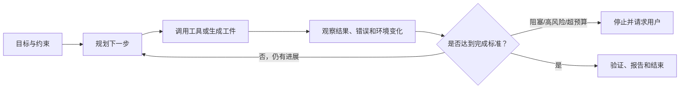
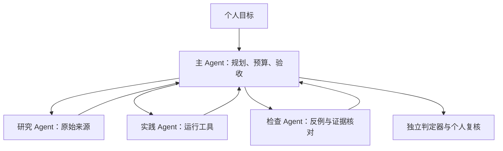
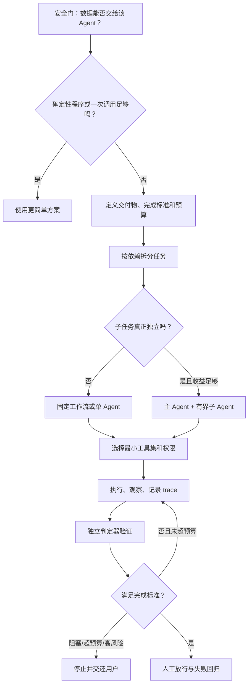

# 02. AI Agent 个人学习指南：概念、分类、原理与实践

> 适用场景：个人系统学习、脱敏实践与能力复盘
> 适合读者：具备基础软件使用经验、尚未系统了解 AI Agent 的个人学习者
> 资料核对日期：2026-07-05
> 使用边界：个人练习优先使用公开、虚构或明确授权的材料。使用 AI 服务前，应核对其数据政策，不提交个人隐私、账号凭证、商业秘密、受保密约束的工作资料或其他未经授权的数据。

## 建议学习方法

本文按照“先建立概念 → 再理解原理 → 最后完成实践”的顺序组织。第一次学习时，不必记住所有产品名称或框架；应优先掌握：Agent 为什么需要工具、怎样判断完成、哪些操作必须由人批准。

建议为自己建立一个学习目录：

```text
agent-learning/
├── notes.md              # 概念笔记和复盘
├── prompts/              # 实际使用过的提示词
├── exercises/            # 虚构或公开的小练习
├── evidence/             # 来源、命令和测试结果
└── failures.md           # 失败案例及改进方法
```

每学完一个重要章节，至少完成一项：用自己的语言复述、运行一个小案例、改写一段提示词，或者回答复盘问题。

## 阅读说明：如何判断证据强度

本文用以下标签区分结论来源：

- **【官方指导】**：标准机构或产品官方文档中的明确建议；代表其设计和使用经验，不自动等于跨产品定律。
- **【研究证据】**：技术论文中的实验结果；优先同行评审，预印本会明确标注。
- **【真实案例】**：厂商公开的生产架构或部署案例；能说明做法可落地，但可能存在选择性披露。
- **【工程推断】**：根据公开证据和软件工程原则形成的可执行规则；具体阈值需要用本地、脱敏任务评测校准。

### 核心术语速查

- **LLM（Large Language Model，大语言模型）**：通过大量文本训练、根据上下文生成 token 的模型。
- **Token（词元）**：模型处理文本的基本单位，可能是一个字、词的一部分或符号；token 数通常影响上下文长度和费用。
- **Prompt（提示词）/Instruction（指令）**：告诉模型目标、背景、约束和输出方式的输入；本文更强调可执行的任务指令。
- **Context（上下文）**：模型当前能够读取的指令、对话、文件片段和工具结果。
- **Tool（工具）**：Agent 用来读取外部信息或执行动作的函数、命令、API 或应用接口。
- **Workflow（工作流）**：按预先定义的步骤和分支执行的一组操作。
- **Agent（智能体）**：能够围绕目标选择步骤、调用工具、读取反馈并判断是否继续的系统。
- **Schema（结构定义）**：规定输入或输出必须包含哪些字段及其类型，便于程序校验。
- **Eval（评测）**：使用固定任务、标准和指标检查系统质量的过程。
- **Trace（执行轨迹）**：一次 Agent 运行中的计划、工具调用、结果、错误和状态记录。
- **Rubric（评分准则）**：用于人工或自动检查结果的明确评价条目。
- **Benchmark（基准测试）**：在统一条件下比较能力、速度或成本的测试集合。
- **Human-in-the-loop（人在回路）**：由人参与关键选择、审批或最终放行的运行方式。
- **API（应用程序编程接口）**：软件之间交换数据或触发功能的约定接口。
- **MCP（Model Context Protocol）**：让模型应用连接外部工具和数据源的一种开放协议；接入 MCP 不等于工具天然可信。
- **RAG（检索增强生成）**：先从外部资料检索相关内容，再让模型依据检索结果生成回答的方法。
- **Sandbox（沙箱）**：限制程序可访问的文件、网络、进程或系统资源的隔离环境。
- **CI（持续集成）**：自动执行构建、测试、lint 等检查的工程流程。
- **Sanitizer（运行时检查器）**：用于发现越界、释放后使用或未定义行为等问题的工具，如 ASan、UBSan。
- **Ledger（执行台账）**：用于记录已处理资源、工具参数、证据和预算的结构化清单。

## 1. 一页以内的结论摘要

### 学习目标

先用本章建立整体地图。读完后，你应该能够用几句话区分普通聊天、自动化程序、固定工作流和 Agent，并知道为什么“更多 Agent”不是默认的升级方向。

核心知识点：Agent 的关键不是聊天界面，而是模型是否在明确边界内管理任务步骤、选择工具、读取反馈并判断何时停止。

### 1.1 Agent 与普通聊天模型的本质区别

【官方指导】[OpenAI](https://openai.com/business/guides-and-resources/a-practical-guide-to-building-ai-agents/) 把 Agent 定义为能够较独立地代表用户完成任务的系统，其基础由模型、工具和指令组成；模型负责管理工作流、选择工具、读取反馈并判断是否结束。仅把问题交给模型生成一次回答，不属于该定义下的 Agent。不同机构对“Agent”的边界并不完全统一，本文采用的是“模型控制多步执行循环”的工程定义。

【官方指导】[Anthropic](https://www.anthropic.com/engineering/building-effective-agents) 进一步区分：

- **Workflow**：模型和工具沿开发者预先写好的固定路径执行；
- **Agent**：模型根据当前状态动态决定下一步和工具调用。

```text
普通聊天：问题 → 一次回答

固定工作流：输入 → 固定步骤 A → 固定步骤 B → 输出

Agent：目标 → 观察 → 计划 → 调工具 → 读取结果
             ↑                         ↓
             └──── 修正、继续或停止 ──┘
```

[ReAct](https://arxiv.org/abs/2210.03629) 展示了推理、行动和环境观察交错进行的基本范式。工具反馈可以让模型更新计划，但前提是工具结果可观察、可信，而且模型没有误读结果。

### 1.2 不要从“聊天”直接跳到“多 Agent”

推荐采用最低必要复杂度：

```text
确定性程序
→ 单次模型调用
→ 固定工作流
→ 单 Agent + 工具
→ 多 Agent
```

| 方案 | 适合场景 | 优点 | 主要代价 |
|---|---|---|---|
| 确定性程序 | 规则稳定、输入输出明确 | 最便宜、最快、可测试 | 不擅长模糊语义和例外 |
| 普通聊天 | 解释、改写、头脑风暴、一次性草稿 | 交互简单、成本低 | 不会自主闭环执行 |
| 固定工作流 | 步骤明确且存在依赖 | 可预测、易审计 | 对新情况适应较弱 |
| 单 Agent + 工具 | 路径不固定，但目标和判定器明确 | 能根据反馈调整 | token、延迟和错误面增加 |
| 多 Agent | 高价值、可并行、跨来源或跨专业任务 | 扩大覆盖面和上下文 | 协调、重复、合并和成本最高 |

【官方指导】OpenAI 和 Anthropic 都建议从简单方案开始。只有低一级方案经过评测仍不能满足要求时，才增加自治或 Agent 数量。这是设计建议，不是经证明适用于所有任务的定律。

### 1.3 任务选择与核心结论

【官方指导】OpenAI 建议优先考虑复杂情境判断、难维护规则和非结构化数据；若确定性方案足够，就不必使用 Agent。

| 适合 Agent | 不适合 Agent |
|---|---|
| 目标明确但路径不固定，需要搜索、工具和反馈修正 | 简单稳定、脚本或规则引擎即可完成 |
| 有测试、来源或人工审批作为判定器 | 连完成标准都说不清，且无法验证 |
| 错误能在造成高后果前被阻断 | 无人审批的付款、发送、删除和生产变更 |
| 高价值、可独立并行、跨来源的复杂研究 | 多个 Agent 必须频繁修改同一共享状态 |
| 只处理授权、公开或虚构的数据 | 任务依赖未授权或敏感资料 |

带走五句话：

1. 先定义交付物和完成标准，再决定是否需要 Agent。
2. 指令必须包含目标、边界、工具、验收、停止条件和预算。
3. 能用代码完成的路由、聚合、校验和去重，不交给 LLM 自由发挥。
4. 多 Agent 扩大的是计算和覆盖面，不自动提高事实正确性。
5. 事实靠来源、代码靠测试、性能靠 benchmark、根因靠实验；提示词不能替代权限隔离和人工审批。

### 1.4 个人练习与复盘

从下面任务中各选一个，判断应该使用确定性程序、普通聊天、固定工作流、单 Agent 还是多 Agent，并写出理由：

1. 把 100 个日期统一转换格式；
2. 解释一个公开的编译器报错；
3. 搜集多个厂商的公开文档并比较；
4. 修改一个程序、运行测试并根据失败继续修正；
5. 根据表格生成邮件草稿但不发送。

自查：你的理由是否包含任务路径、工具需求、验证方式、风险和成本，而不只是“任务看起来复杂”？

## 2. AI Agent 的基本概念与主要分类

### 本章学习目标

读完本章后，你应该能够：

- 解释 AI Agent 的定义和组成；
- 区分聊天式 AI、自动化程序、工作流和 Agent；
- 从自主程度、任务类型、控制方式和系统结构四个角度分类；
- 根据一个具体任务选择合适类型，而不是追求最高自主程度。

### 2.1 AI Agent 是什么

**AI Agent（人工智能智能体）**是能够围绕一个目标感知当前状态、决定下一步、调用工具、读取结果并继续调整的系统。这里的“自主”不是不受控制，而是指系统能在预先规定的权限、预算和停止条件内选择部分执行路径。

一个实用的 Agent 通常包含：

| 组成 | 作用 | 简单例子 |
|---|---|---|
| 模型 | 理解目标、判断和规划 | 判断下一步先查文档还是运行测试 |
| 指令 | 规定目标、边界和行为 | 禁止修改源文件，找不到证据时停止 |
| 上下文 | 提供当前任务信息 | 用户要求、公开资料、文件内容 |
| 工具 | 观察或改变外部环境 | 搜索、读文件、运行命令、生成文档 |
| 状态/记忆 | 保存已完成事项和中间结果 | 已访问链接、失败测试、剩余预算 |
| 判定器 | 判断结果是否达到要求 | 单元测试、schema、引用核对、人工审批 |

> Agent 不是一个单独模型名称，而是“模型 + 指令 + 上下文 + 工具 + 状态 + 控制机制”组成的系统。

下面的分类不是一棵互斥、穷尽的“物种树”，而是四个彼此独立的观察维度：同一系统可以同时是“人在回路 + 研究任务 + 混合控制 + 单 Agent”。这些名称主要用于分析设计取舍，不是统一行业标准。

### 2.2 Agent 与聊天式 AI、自动化工具和工作流

**聊天式 AI**主要根据当前对话生成回答；**自动化工具**按照确定规则执行；**工作流（workflow）**把多个固定步骤串联；**Agent**让模型根据中间状态动态选择步骤。

| 类型 | 谁决定下一步 | 能否使用工具 | 路径是否固定 | 适用例子 |
|---|---|---:|---:|---|
| 聊天式 AI | 用户通过每轮提问决定 | 可选 | 基本由用户推进 | 解释概念、改写一段文字 |
| 自动化程序 | 代码和规则 | 是 | 固定 | 批量改文件名、格式转换 |
| 固定工作流 | 开发者定义的流程 | 是 | 大部分固定 | 读取 CSV→计算→生成报告 |
| AI Agent | 模型在边界内动态决定 | 是 | 可根据反馈变化 | 搜索资料→比较→补查→引用核验 |

Agent 的优势：

- 能处理路径不固定、包含例外的任务；
- 能把自然语言、文档和工具连接起来；
- 能根据失败结果调整计划；
- 能在较长任务中维护进度和证据。

Agent 的局限：

- 规划、工具选择和结果解释都可能出错；
- 同一个任务重复运行，路径和结果可能不同；
- 工具越多、权限越大，风险面越大；
- 长任务会增加 token、延迟和费用，并可能发生目标漂移；
- 没有外部判定器时，Agent 可能只是更长时间地生成看似合理的内容。

### 2.3 按自主程度分类

自主程度描述“Agent 可以独立决定和执行多少步骤”，并不代表智能高低。下表是本文为学习方便采用的连续谱，不是公认的四级标准；真实系统还应分别描述可读数据、可调用工具、可写范围、最长运行时间和审批点。

| 类型 | 定义与特点 | 适用场景 | 简单例子 |
|---|---|---|---|
| 建议型助手 | 只提供建议，用户决定并执行每一步 | 学习、设计讨论、高风险决策 | 给出三种调试方向，由你选择命令 |
| 人在回路 Agent | 可连续执行低风险步骤，在关键节点暂停批准 | 编程、研究、文档生成 | 读公开文件和跑测试，提交前询问 |
| 有界自治 Agent | 在时间、目录、工具和预算范围内独立完成任务 | 可验证、可回滚的异步任务 | 在独立目录生成脚本并运行测试 |
| 高自治 Agent | 长时间运行并可执行较多外部动作 | 仅适合成熟控制环境 | 监控公开数据并按策略处理异常 |

个人学习阶段推荐从“建议型助手”和“人在回路 Agent”开始。高自治不是学习捷径，它要求更成熟的权限隔离、监控、回滚和事件响应。

### 2.4 按任务类型分类

这是按主要用途给出的常见类型，不追求穷尽，也不互斥。一个研究 Agent 可以同时执行数据分析和文档生成。

| 类型 | 主要工作 | 特点 | 适用场景 | 简单例子 |
|---|---|---|---|---|
| 信息/研究 Agent | 搜索、阅读、比较、引用 | 重来源和覆盖面 | 公开技术调研 | 比较三份官方 API 文档 |
| 编程 Agent | 读代码、修改、运行工具 | 结果通常可编译和测试 | 小范围实现、测试、调试 | 实现练习用调度器并跑单测 |
| 数据分析 Agent | 清洗、计算、绘图、解释 | 应用脚本而非自然语言心算 | 公开或虚构数据分析 | 汇总脱敏 CSV 并核对总计 |
| 办公自动化 Agent | 抽取、归类、生成文档和草稿 | 要保护原件和外部动作 | 报告草稿、表格整理 | 生成月报和待审批邮件 |
| 操作/事务 Agent | 调用外部系统产生动作 | 风险和权限要求最高 | 成熟、受控流程 | 创建工单但不自动关闭 |
| 监控 Agent | 周期观察、判断并通知 | 要处理误报、重复和长期成本 | 公开信息监测 | 发现官方文档更新后提醒 |

同一个 Agent 可能跨类型，例如研究 Agent 搜集数据后生成报告。分类的意义是帮助你选择工具、完成标准和权限，而不是给产品贴唯一标签。

### 2.5 按决策与编排机制分类

这一维度描述“谁决定路径”，其中纯规则系统和纯固定工作流通常不是本文定义下的 Agent，而是用来与 Agent 比较的相邻方案。只有模型能够依据中间状态选择后续步骤时，才进入本文的 Agent 范围。

| 类型 | 定义 | 特点 | 适用场景 | 简单例子 |
|---|---|---|---|---|
| 规则系统（通常非 Agent） | 决策由 if/else、状态机或规则引擎控制 | 最确定、易测试，灵活性低 | 规则清晰稳定 | 文件后缀分类器 |
| 固定工作流（通常非 Agent） | 按预定义节点和分支调用模型/工具 | 可观测、易设置审批 | 大部分步骤已知 | 抽取→计算→校验→生成报告 |
| 大模型驱动 | LLM 动态规划、选工具和判断停止 | 灵活，但不确定性和成本高 | 路径难预先定义 | 开放式公开资料研究 |
| 混合型 | 规则控制安全和关键路径，LLM 处理模糊判断 | 实际系统常用的折中 | 需要灵活性又要可控 | 规则限制目录，Agent 自选搜索和测试步骤 |

优先考虑混合型：让代码负责权限、预算、schema、去重和审批，让模型负责自然语言理解、探索和候选方案。

### 2.6 单 Agent 与多 Agent

**单 Agent**由一个主要模型循环管理任务和工具；**多 Agent 系统**由多个具有不同职责或上下文的 Agent 协作。

| 结构 | 特点 | 适用场景 | 主要风险 |
|---|---|---|---|
| 单 Agent | 上下文统一、协调简单、成本较低 | 大多数个人任务 | 上下文过长、单一路径遗漏 |
| 主 Agent + 子 Agent | 主 Agent 负责拆分、汇总和验收 | 多方向独立研究 | 重复调查、汇总丢信息 |
| Maker–Checker | 两个独立 Agent 分别生成与检查；若只是两次固定调用，则属于工作流 | 有清晰 rubric 的审核 | Checker 受原结论影响 |
| Handoff | 当前 Agent 把任务交给专门 Agent | 专业边界明确的会话 | 上下文和责任转移不清 |
| 并行独立 Agent | 各自处理无依赖工作包 | 批量文档、不同来源调查 | 费用增加、共享写入冲突 |

默认使用单 Agent。只有子任务独立、需要不同工具或上下文、且收益覆盖协调成本时才使用多 Agent。

### 2.7 实际案例：同一个任务的四种实现

任务：根据一份虚构 CSV 生成月度摘要。

```text
规则程序：固定列名和公式，直接计算。
固定工作流：校验字段 → 清洗 → 计算 → 生成 Markdown。
单 Agent：检查异常列，自选脚本分析，根据结果补充说明。
多 Agent：一个检查数据质量，一个计算统计，一个审查报告；主 Agent 汇总。
```

如果列名和公式稳定，规则程序或固定工作流更合适；只有输入变化较大、需要解释异常时，Agent 才可能增加价值。

### 2.8 可复制提示词与个人练习

```text
我要学习判断一个任务是否需要 AI Agent。
任务是：<描述任务>。

请分别分析：
1. 用确定性程序实现；
2. 用固定工作流实现；
3. 用单 Agent 实现；
4. 用多 Agent 实现。

比较每种方案的灵活性、可验证性、成本、权限风险和维护难度。
最后推荐最低必要复杂度，并明确你的假设。
```

个人练习：选择日常生活中的三个非敏感任务，分别按自主程度、任务类型、控制方式和单/多 Agent 分类。

复盘问题：

1. Agent 与“调用过一次工具的聊天模型”有什么区别？
2. 自主程度为什么不等于能力高低？
3. 哪些控制适合交给规则，哪些判断适合交给模型？
4. 多 Agent 相比单 Agent 默认增加了哪些成本和风险？

## 3. AI Agent 的工作原理

### 本章学习目标

读完本章后，你应该能够说明 Agent 怎样从目标出发完成一次循环，理解上下文、记忆和工具分别做什么，并画出单 Agent 和多 Agent 的基本数据流。

核心知识点：Agent 的核心循环是“理解目标 → 规划 → 行动 → 观察 → 评估 → 继续或停止”。可靠性取决于每一环是否有清楚输入、受限工具和可检查反馈。

### 3.1 目标理解与任务规划

Agent 首先把自然语言要求转换成任务状态：目标是什么、有哪些约束、缺少什么信息、怎样判断完成。然后形成计划，计划可以是简单的下一步，也可以是带依赖关系的任务列表。

规划可能失败：

- 把模糊愿望当成可执行目标；
- 忽略隐含约束；
- 一开始就制定过长计划，后续环境变化却不更新；
- 把“输出已经生成”误认为“任务已经完成”。

更可靠的方式是让计划与完成标准绑定，并允许短周期重规划。

### 3.2 上下文和记忆机制

**上下文窗口（context window）**是模型一次推理能够读取的 token 范围，包括指令、对话、文件片段和工具结果。它不是无限的，也不保证所有位置都被同等重视。

Agent 的“记忆”通常不是人类式记忆，而是外部存储和检索机制：

| 记忆类型 | 保存内容 | 例子 | 风险 |
|---|---|---|---|
| 工作记忆 | 当前步骤需要的信息 | 当前计划、最近工具结果 | 上下文过长后被截断、压缩或注意不足 |
| 任务状态 | 已完成事项和剩余工作 | todo、失败次数、预算 | 状态未更新导致重复工作 |
| 短期外部记忆 | 当前任务的持久笔记 | scratchpad、临时 JSON | 错误信息被持续沿用 |
| 长期记忆 | 跨任务保存的偏好或知识 | 个人偏好、检索库 | 过时、隐私和错误污染 |

重要信息应结构化保存并带来源、时间和版本。不要把“Agent 记住了”当作事实正确或永久可用的保证。

### 3.3 工具调用

工具是 Agent 观察或改变外部环境的接口，例如搜索、文件读取、数据库查询、代码执行、浏览器和邮件 API。

一次工具调用通常包含：

```text
模型选择工具
→ 生成结构化参数
→ 权限和参数校验
→ 工具执行
→ 返回结果或错误
→ 模型解释结果并决定下一步
```

工具接口应该有明确名称、参数 schema、适用条件、错误码、权限和副作用。工具返回、网页、邮件和文件内容都可能包含错误或恶意指令，必须作为不可信数据处理。读取工具与写入工具应分开；发送、删除、发布等高风险工具应在执行前要求人工批准。

### 3.4 执行、观察、反馈与纠错循环



Agent 的纠错依赖可观察反馈。编译器错误、测试失败和不存在的文件都是强反馈；“看起来不错”是弱反馈。循环必须有重试和无进展上限，否则 Agent 可能无限换措辞、重复搜索或反复修改。

### 3.5 多 Agent 的分工与协作

常见协作方式：

1. **Orchestrator–Worker（编排者–工作者）**：主 Agent 拆分任务，子 Agent 并行执行，主 Agent 汇总；
2. **Maker–Checker（生成者–检查者）**：一个生成候选，另一个按独立 rubric 尝试发现问题；
3. **Handoff（移交）**：当前 Agent 把完整责任交给更合适的专门 Agent；
4. **Pipeline（流水线）**：多个 Agent 按固定顺序处理不同阶段；如果各阶段只是固定模型调用或普通程序，它是工作流而不是多 Agent；
5. **Debate/Voting（讨论或投票）**：多个 Agent 提供观点；只能用于发现分歧，不能代替事实证据。



协作能扩大覆盖面，但会产生重复上下文、沟通损耗、共享错误和更多费用。主 Agent 必须处理冲突、缺口和来源独立性，不能只做多数投票。

### 3.6 案例：公开资料研究 Agent 如何运行

目标：比较三个公开开发工具的官方能力。

```text
1. 理解目标：只比较官方资料，核对日期固定。
2. 规划：分别调查功能、限制、费用和安全。
3. 记忆：保存已访问 URL、claim、发布日期和缺口。
4. 工具：搜索和打开官方网页。
5. 观察：发现某项费用页面缺失或版本冲突。
6. 纠错：补查价格页，无法确认则标记未知。
7. 验证：逐项检查 claim 是否有直接来源。
8. 停止：所有必需栏目有证据或明确未知。
```

### 3.7 可复制提示词与个人练习

```text
请把下面任务模拟成一个 AI Agent 的执行轨迹：<任务>。

按顺序展示：
1. 目标、约束和完成标准；
2. 当前上下文和需要保存的任务状态；
3. 可用工具及最小权限；
4. 第一个行动；
5. 可能观察到的成功、失败和异常结果；
6. 每种结果下如何调整计划；
7. 停止、请求批准和最终验证条件。

不要假装实际调用了工具；这是原理模拟。
```

个人练习：为“公开资料比较”“示例脚本调试”“脱敏 CSV 汇总”各画一张 Agent 循环图，标出最可能出错的一环。

复盘问题：

1. 上下文窗口与长期记忆有什么区别？
2. 工具调用为什么需要结构化参数和权限校验？
3. 什么样的观察结果可以支持 Agent 继续，什么情况应停止？
4. Maker–Checker 为什么仍可能共享同一个错误前提？

## 4. Agent 实际使用流程

### 本章学习目标

本章把原理转成可执行步骤。完成后，你应该能为自己的任务写出任务合同、拆分工作包、选择工具、设置完成标准，并明确何时停止或请求批准。

核心知识点：高质量 Agent 指令不是“更长的提示词”，而是一份包含目标、上下文、权限、交付物、判定器、预算和失败协议的任务合同。



### 4.1 第一步：通过安全门

先回答：输入能否交给当前 Agent？它连接的模型、工具和外部服务能看到什么？

在个人学习和实践中，先根据数据敏感度和服务的数据政策决定材料能否提交。即使任务本身低风险，也不要提供：

- 身份信息、私人通信、财务或健康信息等个人敏感数据；
- 商业秘密、非公开源码、工作文档、运行日志和安全信息；
- 密码、API Key、访问令牌、私有地址和敏感配置；
- 受合同、版权、隐私或监管约束且未获授权的数据；
- 表面已脱敏，但仍能由时间、结构、稀有数值或组合特征重新识别来源的数据。

“公开、虚构或明确授权”是适合个人练习的默认边界，不代表所有本地 Agent 都具有相同限制。实际使用前还要核对：模型与工具由谁运营、数据是否用于训练、保存多久、存储和处理地区、管理员或第三方连接器能否访问、能否删除记录，以及适用的政策、合同和法律是否允许。脱敏也不是简单删掉姓名；稀有组合、时间、结构和数值仍可能重新识别个人或资料来源。

### 4.2 第二步：建立 Agent 任务合同

在调用 Agent 前，建议写清以下九项。它们是本文的任务设计清单，不是所有产品强制要求的统一规范：

```markdown
# 目标
最终解决什么问题，结果给谁使用。

# 输入与事实来源
允许使用哪些文件、网址和数据；资料版本与核对日期。

# 范围与禁止事项
允许读取、修改、创建什么；哪些内容和动作禁止。

# 工作方式
先调查还是可以修改；需要分阶段暂停吗？

# 工具与权限
允许哪些工具；默认只读还是可写；哪些操作必须审批。

# 交付物
文件、补丁、表格、报告及其格式。

# 完成标准
测试、schema、引用、数值核对和人工判断要求。

# 停止与升级条件
何时成功、阻塞、失败、超预算或必须请求用户决策。

# 预算与报告
Agent 数、工具调用、重试、token、费用和时间上限；最终证据清单。
```

【官方指导】[GitHub](https://docs.github.com/en/copilot/using-github-copilot/using-copilot-coding-agent-to-work-on-tasks/best-practices-for-using-copilot-to-work-on-tasks) 对编码 Agent 的理想任务描述也要求：问题清晰、验收标准完整，并说明建议修改范围。

### 4.3 第三步：按依赖关系拆分，而不是按模糊角色拆分

先画出任务依赖：

```text
问题定义
├── 可独立调查 A ──┐
├── 可独立调查 B ──┼→ 证据合并 → 验证 → 最终产物
└── 可独立调查 C ──┘
```

每个工作包必须包含：

| 字段 | 说明 |
|---|---|
| 输入 | 允许使用的最小上下文 |
| 唯一责任 | 只负责一个明确问题 |
| 输出 schema | 主 Agent 能机械合并的格式 |
| 证据要求 | 来源、命令、测试或截图 |
| 写入范围 | 哪些文件或资源可改 |
| 依赖 | 开始前必须得到什么结果 |
| 完成标准 | 什么条件下返回成功 |
| 停止条件 | 无进展、工具失败或预算触顶如何处理 |

不好的拆分：

```text
Agent A：研究一下
Agent B：也研究一下，看看有没有遗漏
Agent C：综合判断
```

更好的拆分：

```text
Agent A：只查官方文档和原始论文，输出 claim-source 表。
Agent B：只查真实案例和失败案例，输出 case-failure-mitigation 表。
Agent C：只比较成本、权限和风险，输出 decision matrix。
主 Agent：打开关键来源复核，去重、处理冲突并形成统一结论。
```

### 4.4 第四步：选择模型和工具

#### 模型选择

【官方指导】OpenAI 建议先用能力较强的模型建立质量基线，再尝试用更小、更快的模型替换简单步骤，并用 eval 判断是否仍达标。

| 子任务 | 推荐策略 |
|---|---|
| 分类、抽取、格式转换 | 小模型或确定性代码优先 |
| 多来源综合、复杂调试、冲突分析 | 更强模型 |
| schema 校验、数值重算、去重 | 确定性代码 |
| 最终高风险判断 | 强模型辅助 + 人工决定 |

#### 工具选择

只提供完成任务必需的最小工具集。工具描述要写清：

- 什么时候使用和不使用；
- 输入参数和版本；
- 返回值与错误码；
- 是否只读、可逆；
- 是否产生费用或外部影响；
- 失败后能否重试。

【厂商经验】OpenAI 指出，工具是否容易混淆比工具数量本身更重要：十几个边界清晰的工具可能运行良好，少量高度重叠工具也可能频繁误选。

### 4.5 第五步：执行时保留状态和证据

Agent 每轮至少维护：

```text
当前目标
已完成事项
已访问的 URL/文件/查询
关键证据及来源
未解决问题
下一步及其理由
剩余预算
```

用 ledger 对 URL、查询、文件哈希和工具参数去重，避免重复搜索和重复修改。不要依赖 Agent 的自然语言记忆判断“是否已经做过”。

### 4.6 第六步：用独立判定器验证

完成标准应组合互补证据，而不是把下面各层当成永远成立的强弱排名：

```text
确定性检查：编译、测试、lint、schema、重算、diff
        +
外部原始证据：官方文档、原始论文、数据库查询
        +
独立 checker：在新上下文中按 rubric 尝试证伪
        +
人工放行：敏感、不可逆或高影响操作
```

生成者不能只凭“我已经检查过”宣布完成。测试和 schema 虽可重复执行，也只覆盖其编码的条件；测试通过不等于需求被完整满足。最终报告应包含实际命令、退出码、来源、测试结果、未验证项和剩余风险。

### 4.7 第七步：明确结束，不无限重试

任务必须有四类终止条件：

| 状态 | 条件 |
|---|---|
| 成功 | 所有必需工件存在，测试、schema、引用或人工审批通过 |
| 阻塞 | 缺少权限、输入、用户选择或外部服务 |
| 失败 | 同类工具错误达到重试上限，或证据否定当前方案 |
| 超预算 | Agent 数、token、费用、工具调用或时间任一触顶 |

可采用的起始阈值【工程推断，需本地校准】：

```text
同一工具错误最多重试 2 次；
连续 2 轮没有新增证据或产物变化则停止；
同一 URL、文件哈希或相同查询不重复处理；
高风险或不可逆操作一律暂停请求批准。
```

### 4.8 个人练习与复盘

从一个完全公开或虚构的任务开始，例如“比较两个公开库的官方文档”。先不调用 Agent，只填写本章的任务合同，再检查是否存在：范围过宽、来源不清、工具权限过大、验收无法观察或没有停止条件。

可复制的自查提示词：

```text
请审查下面这份 Agent 任务要求，但不要执行任务。
从目标、上下文、范围、工具权限、交付物、完成标准、预算、停止条件和安全边界九个方面找缺口。
对每个缺口说明可能导致的失败，并给出最小修改建议。
```

复盘问题：

1. 我的完成标准是可执行测试，还是主观描述？
2. 哪些步骤适合固定代码，哪些需要模型判断？
3. 如果工具连续失败，Agent 会停止还是无限重试？
4. 最坏情况下，当前权限允许 Agent 造成什么影响？

## 5. 最佳实践清单

### 本章学习目标

把本章当作运行前后的个人检查表。第一次实践时逐项检查，熟悉以后再将稳定规则固化到项目指令或模板中。

### 5.1 运行前

- [ ] 确认数据允许交给该 Agent，且已做不可逆脱敏。
- [ ] 证明普通程序、一次调用或固定工作流不足。
- [ ] 写清目标工件，而不是只写“帮我处理一下”。
- [ ] 为每个工件定义可观察的完成标准。
- [ ] 给出来源优先级、版本和核对日期。
- [ ] 工具默认只读，权限和凭证遵循最小化。
- [ ] 核对服务条款、数据保留/删除、训练使用、处理地区、知识产权和第三方连接器。
- [ ] 写入、发送、删除、发布、付款和扩权需要真实参数级审批。
- [ ] 设置 Agent 数、工具调用、重试、时间、token 和费用上限。

### 5.2 运行中

- [ ] 先探索和规划，再修改或执行高成本操作。
- [ ] 外部网页、邮件、PDF、issue、代码注释和工具返回都视为不可信数据。
- [ ] 不把网页或文件中的文字提升为系统指令。
- [ ] 公共网络检索与私有数据/高权限工具尽量分阶段、分权限执行。
- [ ] 记录已访问资源和当前剩余预算。
- [ ] 对重复查询、重复工具参数和无进展循环自动停止。
- [ ] 并行 Agent 不同时修改相同文件或共享可变状态。
- [ ] 工具失败要区分网络暂时错误、权限错误和逻辑错误，不无脑重试。

### 5.3 运行后

- [ ] 事实声明可追溯到原始来源，而不是其他 Agent 的转述。
- [ ] 代码有编译、测试、静态/动态检查或人工 diff 证据。
- [ ] 性能结论来自同条件 benchmark。
- [ ] 根因结论来自可证伪实验，而不是报错位置猜测。
- [ ] AI reviewer 没有替代人工批准者。
- [ ] 审批者看到真实参数、收件人、目标资源和 diff；避免因频繁弹窗形成“无脑批准”。
- [ ] 报告列出没运行的验证和剩余风险。
- [ ] 保存 trace、成本、批准记录和失败样本。
- [ ] 把失败样本加入后续回归 eval。

### 5.4 什么时候使用多个子 Agent

可先用下列五项做启发式筛选；“至少三项”只是起始规则，不是经研究验证的通用阈值，并且仍需排除共享写状态冲突【工程推断】：

1. 子任务边界互不重叠，输出 schema 明确；
2. 各分支不依赖其他分支的中间结论；
3. 各分支需要不同来源、工具或专业上下文；
4. 单一上下文会被大量材料挤满；
5. 任务价值足以覆盖明显增加的 token、工具和汇总成本。

优先使用“主 Agent + specialists”模式，让主 Agent 负责用户沟通、预算、冲突处理和最终验收。Peer-to-peer handoff 更灵活，但责任边界和上下文污染更难控制。

【真实案例】Anthropic 的 Research 系统采用 lead-agent + 并行 workers 搜索不同方向。其公开生产数据中，普通 Agent 大约消耗聊天交互 4 倍 token，多 Agent 约 15 倍；这是特定系统的观测，不应当作所有 Agent 产品的固定倍率。

多 Agent 不适合：

- 单 Agent 已经能够稳定完成；
- 任务有强顺序依赖；
- 多个 Agent 要修改同一工作树或文档；
- 没有统一验收器和冲突解决规则；
- 只是希望用“多数意见”证明事实。

### 5.5 成本控制

近似成本模型【工程推断】：

```text
总成本 ≈ Σ(输入 token × 输入单价
           + 输出 token × 输出单价
           + 缓存、推理或其他计费 token
           + 工具/API 费用
           + 沙箱/CI、存储和网络费用
           + 人工复核成本)
```

降本优先级：

1. 单 Agent 先建立基线，eval 证明不足再增加 Agent；
2. 用代码完成路由、聚合、去重和 schema 校验；
3. 小模型处理分类和抽取，强模型只处理困难分支；
4. 子 Agent 只接收最小任务包，不复制全部历史；
5. 缓存查询、URL、文件哈希和确定性工具结果；
6. 低置信度或高价值分支才触发第二 Agent；
7. 用“每个被接受的事实、通过的测试或完成工件的成本”评估价值。

预算示例：

```text
最多 1 个主 Agent + 3 个子 Agent；
每个子 Agent 最多 8 次工具调用；
总工具调用不超过 24 次；
同类错误最多重试 2 次；
墙钟时间不超过 20 分钟；
达到 token/费用上限立即停止并返回部分结果。
```

### 5.6 个人练习与复盘

选择一次过去的 AI 使用记录，用运行前、运行中、运行后三张清单重新审查。记录至少一个当时没有设置、但现在认为必要的控制项。

复盘问题：哪项检查能够防止最高后果的问题？哪项检查可以由脚本自动完成？哪项必须由你亲自判断？

参考判断：日期格式统一通常选确定性程序；公开资料比较可先用单 Agent，只有调查方向真正独立且材料很多时再并行；邮件任务应把“生成草稿”和“发送”拆开，并让发送保持人工批准。参考答案不是唯一答案，理由必须落到路径、验证、权限和成本。

## 6. 常见错误与解决办法

### 本章学习目标

学习识别“表面成功、实际失败”。重点不是记住错误名称，而是训练自己追问：成功声明对应什么证据？错误是否只是被移动、吞掉或隐藏？

| 失败模式 | 典型表现 | 根因 | 改进方法 |
|---|---|---|---|
| 把聊天当 Agent | 要求“一次给完最终答案” | 没有工具反馈和状态循环 | 简单任务继续聊天；复杂任务定义工作流和判定器 |
| 任务过宽 | “研究一下并给最佳方案” | 交付物和边界不清 | 写任务合同，拆成互斥工作包 |
| Agent 永不停止 | 不断换关键词、重试相同工具 | 没有成功/阻塞/预算条件 | 设置无进展、重试、时间和费用上限 |
| 重复工作 | 多个 Agent 查同一网页、改同一文件 | 没有 ledger 和责任边界 | 查询去重、最小上下文、写入范围隔离 |
| 工具误选 | 相似工具反复调用错误 | 描述和参数边界重叠 | 改名和 schema；仍不稳定时再拆 Agent |
| 伪验证 | Agent 声称测试通过但没有执行 | 把自述当证据 | 检查命令、退出码、日志和生成工件 |
| 在症状处掩盖错误 | B 处加 `if` 后不崩溃，A 处越界仍存在 | 以“现象消失”代替因果验证 | 定位第一次非法状态，根因测试和撤销实验 |
| 多 Agent 集体错误 | 多个 Agent 引用同一二手来源后形成共识 | 错误高度相关 | 独立原始来源、独立工具验证，主 Agent 聚合证据而非投票 |
| Prompt injection | 网页或邮件诱导 Agent 调用私有工具 | 把不可信内容当指令，权限过大 | 数据/指令隔离、最小权限、结构化输出和人工审批 |
| 长任务漂移 | 后期忘记约束、重复修改、破坏文档 | 上下文累积和缺少阶段验收 | 分阶段快照、patch/diff、每阶段验证不变量 |
| 办公文档损坏 | 连续重写唯一原件，内容逐步丢失 | 长程编辑缺少版本和结构检查 | 使用副本、patch、字段/公式检查和人工放行 |
| 成本失控 | 多 Agent、高级模型和重试全量启用 | 没有分级路由和预算 | 按难度路由、缓存、熔断和单位产物成本指标 |

### 6.1 失败案例：程序在 B 报错，Agent 在 B 掩盖问题

错误做法：Agent 看到 `free()` 处崩溃，就在 B 处跳过释放、增加无依据的 `if` 或关闭 sanitizer。

【官方指导】GitHub 要求 Agent 创建的修改接受与人工贡献同等严格的 review；【研究证据】[AnalysisBench](https://arxiv.org/abs/2604.11270) 的 2026 预印本发现，在程序分析任务中，模型自述的验证成功会持续高估人工核验结果。因此验收应查看工具产物和退出码，而不是 Agent 的成功声明。

正确流程：

```text
1. 保存原始复现和错误栈；
2. 暂不修改，使用编译器告警、ASan/UBSan、测试等寻找第一次非法状态；
3. 证明错误在 A 发生、在 B 表现的数据或生命周期路径；
4. 为 A 增加根因定向测试；
5. 最小修改 A，保持 B 的正常检查和清理；
6. 原始复现、根因测试和 sanitizer 全部通过；
7. 临时撤销 A 的修复，确认测试重新失败；
8. 恢复修复，确认重新通过。
```

### 6.2 失败案例：多个研究 Agent 产生“虚假共识”

三个 Agent 都引用同一篇二手文章，不代表三份独立证据。要求每个 Agent 返回：

```text
原始链接
发布主体和日期
支持的原子 claim
原文证据位置
证据限制
是否与其他 Agent 来源独立
```

【真实案例】Anthropic 公开的多 Agent Research 早期版本曾为简单查询生成大量子 Agent、重复搜索、无休止寻找不存在的来源；其改进方式包括为每个 worker 明确目标、来源、工具、输出格式和边界，并根据问题复杂度限制 Agent 数和工具调用。

### 6.3 失败案例：办公 Agent 越做越多

Agent 原本只需生成汇总，却继续发送邮件或修改源表。解决方案：

- 抽取、计算、草稿和发送分成不同阶段；
- 默认只读源文件，只在新目录生成结果；
- 邮件发送、上传和覆盖源文件必须单独审批；
- 审批界面展示真实收件人、附件、diff 和工具参数，不能只展示 AI 摘要。

【真实案例】Microsoft 公布的 Regal Rexnord 案例先把电子表格抽取成结构化 CSV，再进入检索系统；mobilezone 的客服与 IT Agent 在复杂或法律敏感场景转交人工。这些案例支持“先结构化、再自动化、超边界交人”的架构，但厂商发布的案例可能存在选择性披露，不能直接当作通用效果数据。

【研究证据】Microsoft Research 的长期文档委派研究观察到，模型在长工作流末尾可能产生稀疏但严重的语义内容损坏。更稳妥的办法是使用副本、版本快照和 patch/diff，每阶段检查字段、公式、引用和不变量，而不是反复全文重写唯一原件。

### 6.4 个人练习与复盘

```text
请根据下面的 Agent 执行记录进行失败分析：<粘贴完全脱敏的记录>。
不要重新完成原任务。请找出：
1. 第一次偏离目标的位置；
2. 哪个工具结果被忽略或误读；
3. 是否存在重复、伪验证或症状掩盖；
4. 哪个完成标准本应阻止错误；
5. 应增加的最小回归测试。
```

复盘时区分“模型能力不足”和“任务设计不足”。如果缺少输入、权限过大或没有判定器，仅更换模型通常不能根治问题。

### 6.5 Coding Agent：从“生成代码”升级为“提交可验证候选修改”

Coding Agent 能读取仓库、编辑文件和执行命令，因此它的错误不只表现为错误回答，还可能改变代码、测试、依赖、Git 状态或外部系统。使用时应区分三个问题：

- **Verification（验证）**：修改是否符合明确规格和工程约束？
- **Validation（确认）**：修改是否真正解决了使用者的问题？
- **Assurance（保障）**：综合证据、假设和剩余风险后，是否有充分理由接受修改？

【工程原则】Agent 是候选修改的作者，不能同时成为唯一验证者和批准者。它的“已完成”“测试通过”和自信解释都只是待核验主张。最低限度应做到：

1. 开始前记录目标、非目标、验收标准、基准 commit 和原始失败；
2. 使用独立分支或 worktree，限制可写路径、命令、网络和凭据；
3. 检查完整 diff，特别关注测试、CI、依赖、锁文件和配置变化；
4. 在使用者控制的环境运行项目指定的 canonical 检查，保存退出码和机器可读结果；
5. Bug 修复应证明回归测试在旧版失败、修复版通过，必要时撤销修复验证因果关系；
6. 把需求含义、架构取舍和剩余风险留给有否决权的人判断；
7. 越界、重复失败、弱化测试、无法解释的范围扩张或敏感信息暴露时立即停止并回滚。

第二个 Coding Agent 可以寻找反例、检查遗漏或生成额外测试候选，但共享模型、上下文和可见测试会造成相关性错误，不能用“两个 Agent 都同意”替代编译器、独立测试、真实运行状态和人工批准。

实际执行时使用 [Coding Agent 一页检查清单](./03_coding_agent_reliability_checklist.md)；需要研究依据、产品案例、风险矩阵和完整 SOP 时，阅读 [Coding Agent 可信度与质量保障](./coding-agent-reliability.md)。

## 7. 三个可直接复制的提示词模板

### 本章学习目标

三个模板分别覆盖研究、编程和办公自动化。不要原样机械使用；先删除无关条目，再补充自己的目标、公开输入、权限和验收标准。每次实践后保存实际版本和失败记录。

### 7.1 研究 Agent 模板

```text
【目标】
研究：<主题>。形成截至 <YYYY-MM-DD> 的比较报告，供 <自己/目标读者> 使用。

【范围】
- 只使用公开信息；
- 来源优先级：官方文档 > 原始论文 > 厂商工程文章 > 二手资料；
- 区分“官方指导、研究证据、真实案例、工程推断”；
- 信息不足时写未知，不使用模型记忆补全。

【拆分】
如果至少有两个相互独立的方向且收益足以覆盖成本，可使用子 Agent。
每个子 Agent 必须有互斥问题、来源范围、输出 schema 和工具预算。

【输出】
1. 一页摘要；
2. 方法比较表；
3. claim-evidence 表；
4. 冲突与不确定项；
5. 可执行建议；
6. 原始来源链接。

【验证】
- 每个重要 claim 至少有一个直接来源；
- 打开关键链接，检查来源是否真的支持原句；
- 多个 Agent 的一致意见不能代替来源；
- 主 Agent 负责去重、查缺和冲突处理。

【预算与停止】
- 最多 <N> 个子 Agent；
- 每个最多 <N> 次搜索/工具调用；
- 连续 2 次搜索没有新增一手来源则停止；
- 达到时间或费用上限时返回部分结果和缺口。
```

### 7.2 编程与根因调试 Agent 模板

```text
【目标】
诊断并修复：<可复现现象>。报错位置不一定是根因位置。

【阶段 1：只诊断，不修改】
1. 稳定复现，记录输入、命令、退出码和完整错误栈；
2. 使用项目已有测试、编译器告警、sanitizer、调试器或静态分析；
3. 沿数据流和生命周期寻找第一次非法状态；
4. 给出候选根因、支持证据、反证和可证伪实验；
5. 形成证据后暂停汇报，未经确认不修改代码。

【阶段 2：最小修复】
- 说明根因 A 与表现位置 B 的因果路径；
- 优先只修改首次破坏不变量的位置；
- 禁止删除检查、吞错、跳过清理、返回默认值、关闭 sanitizer 或添加 suppression；
- 如需修改 B，必须证明 B 存在独立缺陷。

【完成标准】
- 原始复现通过；
- 根因定向测试通过；
- 编译、测试和适用的 sanitizer/静态检查通过；
- B 的正常检查和清理仍然执行；
- 临时撤销 A 的修复后，根因测试重新失败；
- 输出 diff、实际命令、退出码、未运行项和剩余风险。

【权限】
- 不安装依赖、不访问网络、不提交或 push，除非我单独批准；
- 不覆盖我的现有修改。
```

### 7.3 办公自动化 Agent 模板

```text
【目标】
根据完全虚构/脱敏的 <CSV/XLSX/公开材料> 生成统计表和一页摘要。

【权限边界】
- 只读取 <input 目录>；
- 只在 <output 目录> 新建文件；
- 不修改原文件；
- 不发送邮件、不上传、不连接或调用未经授权的外部系统；
- 不猜测缺失数据；任何外部动作先暂停审批。

【处理流程】
1. 先输出字段映射、口径和计算规则；
2. 检查缺失值、重复行、异常类型和口径冲突；
3. 使用脚本或公式计算，不用自然语言心算；
4. 生成结果副本和摘要草稿；
5. 重新打开生成文件，检查公式、格式和工作表完整性。

【完成标准】
- 输入行数、过滤和去重规则可追溯；
- 分组汇总与原始总计一致；
- 随机抽查至少 5 行；
- 输出输入文件哈希、执行脚本、核对结果和异常清单；
- 邮件或发布内容只生成草稿，不执行发送。

【停止条件】
发现字段含义不明、数据冲突、需要外部传输或会覆盖原件时立即停止并询问。
```

## 8. 个人学习与行动建议

个人学习最适合从“小而可验证”的 Agent 使用方式开始：先在公开或虚构任务上建立指令、权限和验证习惯，再根据授权范围逐步扩大任务复杂度。

### 本章学习目标

把前面的方法转化为自己的学习计划，并通过记录耗时、成本、验证结果和失败案例判断 Agent 是否真的带来价值。

### 8.1 建议从三个脱敏试点开始

| 试点 | Agent 做什么 | 判定器 | 不允许做什么 |
|---|---|---|---|
| 通用结构转换脚本 | 读取虚构 schema，生成 C/Python 数据结构和测试 | 编译、单测、边界样例 | 使用受保密约束的真实接口或数据结构 |
| 练习用调度器 | 生成、运行测试、根据失败修正 | 单测、属性测试、复杂度审查 | 使用真实业务调度策略或非公开参数 |
| 公开资料研究 | 搜索官方资料，形成带引用比较 | claim-evidence 核查 | 混入未授权资料或非公开需求 |

### 8.2 建立两份通用规则文件

1. `AGENT_TASK_TEMPLATE.md`：保存任务合同、预算和报告格式；
2. `ROOT_CAUSE_DEBUGGING.md`：保存“先诊断、找第一次异常、禁止掩盖、反事实验证”的调试协议。

不同工具可以通过项目指令、Skill 或规则文件引用它们，日常只需说“按任务合同和根因调试协议执行”。规则中只放通用流程，不写真实凭证、个人隐私、商业秘密或受限制的数据。

### 8.3 用数据决定是否扩大使用

每次试点记录：

```text
人工基线耗时
Agent 墙钟时间
人工复核时间
token/费用/工具调用数
首次通过率
发现的问题数
伪验证或无效调用次数
最终是否接受产物
```

连续积累 10～20 个脱敏样例后，再决定：

- 哪些任务保留普通聊天；
- 哪些升级到单 Agent；
- 哪些值得并行子 Agent；
- 哪些因安全、成本或不可验证而永久禁止。

### 8.4 推荐个人练习顺序

```text
第一轮：普通聊天生成调度器
第二轮：单 Agent 读取失败测试并修复
第三轮：加入根因调试协议和完成标准
第四轮：比较质量、调用次数、人工复核时间和成本
```

完成四轮后，比较实际产物和证据。你应该能够直接观察到：Agent 的优势来自工具反馈和闭环验证，而不是模型“更会说”。

### 8.5 个人能力自查

如果下面大部分问题都能用自己的案例回答，说明你已经具备基础 Agent 使用能力：

1. 我能否判断一个任务应使用脚本、工作流还是 Agent？
2. 我能否写出包含权限、验收和停止条件的任务合同？
3. 我能否解释上下文、任务状态和长期记忆的区别？
4. 我能否为工具调用设置最小权限和人工审批点？
5. 我能否把复杂任务拆成有输入、输出和依赖的工作包？
6. 我能否判断多 Agent 是否真的值得增加成本？
7. 我能否用外部判定器识别伪验证和症状掩盖？
8. 我是否保存过一次失败，并把它变成回归练习？

如果某项回答不出来，回到对应章节，选择一个更小的公开或虚构案例重新实践。

## 9. 来源链接

### 9.1 官方定义、设计与使用方法

- [OpenAI — A practical guide to building agents](https://openai.com/business/guides-and-resources/a-practical-guide-to-building-ai-agents/)
- [OpenAI API — Agents](https://platform.openai.com/docs/guides/agents)
- [OpenAI Academy — Workspace agents](https://openai.com/academy/workspace-agents/)
- [Anthropic — Building effective agents](https://www.anthropic.com/engineering/building-effective-agents)
- [Anthropic — How we built our multi-agent research system](https://www.anthropic.com/engineering/multi-agent-research-system)
- [Anthropic — Demystifying evals for AI agents](https://www.anthropic.com/engineering/demystifying-evals-for-ai-agents)
- [Claude Code — Best practices](https://code.claude.com/docs/en/best-practices)
- [Microsoft — AI agent orchestration patterns](https://learn.microsoft.com/en-us/azure/architecture/ai-ml/guide/ai-agent-design-patterns)
- [GitHub — Best practices for Copilot coding agent tasks](https://docs.github.com/en/copilot/using-github-copilot/using-copilot-coding-agent-to-work-on-tasks/best-practices-for-using-copilot-to-work-on-tasks)
- [GitHub — Review Copilot output](https://docs.github.com/en/copilot/how-tos/copilot-on-github/use-copilot-agents/review-copilot-output)

### 9.2 安全、权限和治理

- [NIST AI 600-1 — Generative AI Profile](https://doi.org/10.6028/NIST.AI.600-1)
- [OpenAI — Safety in building agents](https://developers.openai.com/api/docs/guides/agent-builder-safety)
- [OpenAI Agents SDK — Human-in-the-loop](https://openai.github.io/openai-agents-python/human_in_the_loop/)
- [OWASP LLM01:2025 — Prompt Injection](https://genai.owasp.org/llmrisk/llm01-prompt-injection/)
- [OWASP — Excessive Agency](https://genai.owasp.org/llmrisk2023-24/llm08-excessive-agency/)
- [GitHub — Copilot cloud agent risks and mitigations](https://docs.github.com/en/copilot/concepts/agents/cloud-agent/risks-and-mitigations)

### 9.3 技术论文与可靠性研究

- [ReAct: Synergizing Reasoning and Acting in Language Models](https://arxiv.org/abs/2210.03629)
- [SWE-agent: Agent-Computer Interfaces Enable Automated Software Engineering](https://arxiv.org/abs/2405.15793)
- [AgentDojo: A Dynamic Environment to Evaluate Prompt Injection Attacks and Defenses](https://arxiv.org/abs/2406.13352)
- [Why Do Multi-Agent LLM Systems Fail?](https://proceedings.neurips.cc/paper_files/paper/2025/hash/b1041e52d3be19f0a9bc491657488e4a-Abstract-Datasets_and_Benchmarks_Track.html)
- [Collective Hallucination in Multi-Agent LLMs](https://arxiv.org/abs/2606.07941)（2026-06 预印本）
- [ReliabilityBench](https://arxiv.org/abs/2601.06112)（2026 预印本）
- [AnalysisBench](https://arxiv.org/abs/2604.11270)（2026 预印本）
- [SWE-bench verification limitations study](https://arxiv.org/abs/2503.15223)

### 9.4 真实案例

- [Microsoft customer story — Regal Rexnord](https://www.microsoft.com/en/customers/story/26197-regal-rexnord-microsoft-copilot-studio)
- [Microsoft customer story — mobilezone](https://www.microsoft.com/en/customers/story/26389-mobilezone-dynamics-365-customer-service)
- [Microsoft Research — LLMs corrupt your documents when you delegate](https://www.microsoft.com/en-us/research/publication/llms-corrupt-your-documents-when-you-delegate/)
- [Microsoft Research — Further notes on long-horizon delegation reliability](https://www.microsoft.com/en-us/research/blog/further-notes-on-our-recent-research-on-ai-delegation-and-long-horizon-reliability/)

> 维护提示：模型、产品功能、价格和 API 会快速变化。重新实践前应核对带有产品行为、成本和发布日期的内容；原理性论文和方法也应关注后续复现或反例。
