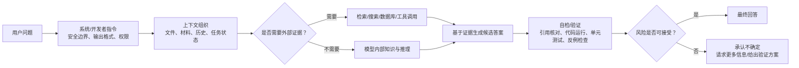

# 02. 先进模型和 Agent 系统如何降低幻觉

> 适用场景：软件部门内部 AI 培训
> 目标听众：普通软件工程师
> 建议时长：20～30 分钟
> 资料核对日期：2026-06-24
> 使用边界：本文只整理公开资料和通用机制，不评价内部或未公开模型。

## 1. 一句话结论

从 GPT-2 到 GPT-5.5、Claude Opus 4.8、GLM-5.2、DeepSeek-V4-Pro 这类现代模型，降低幻觉靠的不是单一技术，而是一整套系统工程：

1. 更大规模、更高质量的预训练；
2. 指令微调和人类/AI 反馈对齐；
3. 诚实性、不确定性和拒答训练；
4. 推理模型和 test-time compute；
5. 检索、搜索、代码执行、测试等工具；
6. 长上下文和高效注意力；
7. 系统卡、红队、评测、监控和真实用户反馈。

但现代模型只能降低幻觉，不能消灭幻觉。

## 2. 现代模型降低幻觉的七层结构



这张图的重点是：现代大模型产品不是单纯的 Transformer。真正可靠性来自模型、工具、权限、上下文、评测和流程共同作用。

## 3. GPT-2：基线模型

GPT-2 是很好的教学基线，因为它展示了“为什么幻觉会自然发生”。

公开资料显示：

- GPT-2 是 decoder-only Transformer；
- 核心训练目标是自回归语言建模；
- 它没有现代 ChatGPT 式的指令对齐；
- 不会主动搜索、引用、跑测试或验证输出。

降低幻觉能力：

- 主要依赖训练数据和采样参数；
- 没有系统化的事实验证；
- 不会默认承认不知道；
- 不会主动使用工具。

培训中可以这样讲：

> GPT-2 是“会续写”的模型，不是“会查证”的模型。它解释了幻觉为什么是语言模型的自然风险。

## 4. InstructGPT / ChatGPT：从续写器到助手

ChatGPT 这类模型在 GPT 式预训练基础上加入了指令微调和 RLHF。

经典来源：

- [Training language models to follow instructions with human feedback](https://arxiv.org/abs/2203.02155)

主要改善：

- 更会遵循用户问题；
- 更会按格式输出；
- 更适合多轮对话；
- 更愿意澄清需求；
- 更少生成明显不符合人类偏好的回答。

它降低的主要是“交互层面的幻觉风险”，例如答非所问、忽略约束、输出格式错误。

局限：

- 仍可能编造引用、API、包名和参数；
- 如果奖励更偏好“有帮助”和“完整回答”，模型可能不愿承认不知道；
- 用户很自信地给出错误前提时，模型可能顺从。

## 5. GPT-4 / GPT-4.5：规模、数据与后训练

公开证据：

- [GPT-4 Technical Report](https://arxiv.org/abs/2303.08774) 提到 GPT-4 是 Transformer-based model，预训练目标仍是预测下一个 token，后训练提升了 factuality 和 desired behavior。
- [Introducing GPT-4.5](https://openai.com/index/introducing-gpt-4-5/) 提到扩大无监督学习、扩展知识和世界理解，有助于降低幻觉；页面也给出 SimpleQA accuracy 和 hallucination rate 对比。

主要机制：

- 更大规模预训练；
- 更高质量数据和过滤；
- 更强后训练；
- 更强上下文理解；
- 更强指令遵循；
- 产品中结合搜索、文件、图像、Canvas 等工具。

适合培训强调：

> 规模和后训练能降低一部分事实错误，但模型仍不是实时事实数据库。版本号、标准条款、论文、法规、API 都要查证。

## 6. GPT-5.5：从回答问题到完成任务

公开证据：

- [Introducing GPT-5.5](https://openai.com/index/introducing-gpt-5-5/) 将 GPT-5.5 定位为面向真实工作的模型，强调写代码、在线研究、分析数据、创建文档和跨工具完成任务。
- [GPT-5.5 System Card](https://deploymentsafety.openai.com/gpt-5-5) 提到预部署安全评测、红队、早期用户反馈；也说明 reasoning models 通过强化学习训练，会在回答前进行内部推理、尝试不同策略并识别错误。
- 系统卡的 Hallucinations 章节提到，在用户标记过事实错误的样本中，GPT-5.5 的单个 claim 更可能正确，回答中出现事实错误的比例也有所降低。

主要机制：

- reasoning / test-time compute；
- 更强工具使用；
- 更长任务保持能力；
- 工作流中的自检；
- 对代码任务更强调测试和验证；
- 系统级安全策略与监控；
- 用真实用户标记错误的案例做针对性评估。

对软件工程师的意义：

- 它不只是生成代码，还更像能查、能跑、能修正的 agent；
- 幻觉降低来自验证闭环，不是来自模型突然永远正确；
- 外部 AI 使用时，仍不能输入公司源码、内部日志或芯片相关材料。

## 7. Claude Opus 4.8：诚实性、判断力和 pushback

公开证据：

- [Introducing Claude Opus 4.8](https://www.anthropic.com/news/claude-opus-4-8) 明确强调 honesty，说明 Anthropic 训练模型避免做无法支持的断言。
- 同页面提到早期测试者反馈它更会标记不确定性、减少 unsupported claims。
- 发布说明还提到 dynamic workflows：Claude 可以规划工作、运行大量并行子代理，并在汇报前验证输出。

主要机制：

- Constitutional AI / Anthropic 风格的安全和价值约束；
- 诚实性训练；
- effort control：用户可选择模型投入多少推理努力；
- 对 agentic coding 的自检和上下文保持；
- 动态工作流中的验证步骤；
- 对用户错误计划更敢于 push back。

培训中可以这样讲：

> Claude Opus 4.8 的重点不是“永远知道更多”，而是“更少装知道，更愿意指出不确定和输入问题”。这对降低幻觉影响很关键。

## 8. GLM-5.2：长上下文、开放权重与工程可验证性

公开证据：

- [GLM-5.2 model card](https://huggingface.co/zai-org/GLM-5.2) 显示 GLM-5.2 是 MIT 许可模型，强调 1M-token context、long-horizon tasks、advanced coding、flexible effort。
- 模型卡提到 IndexShare 复用 sparse attention indexer，在 1M context 下减少每 token FLOPs；还提到改进 MTP layer 用于 speculative decoding。
- 模型卡评测包含 HLE with tools、SWE-bench Pro、Terminal Bench、Tool-Decathlon 等任务。

主要机制：

- 长上下文减少“看不全材料”的幻觉；
- flexible effort 让复杂任务使用更多推理预算；
- 工具类和代码类 benchmark 推动模型在可验证任务上优化；
- 开放权重让企业可以本地部署、接入内部脱敏知识库、加入自定义 verifier；
- 更高效注意力和 speculative decoding 让长任务成本更可控。

谨慎表述：

> GLM-5.2 的公开资料更多展示能力、长上下文和 benchmark，不应直接说“它解决了幻觉”。更稳妥的说法是：它通过长上下文、推理 effort、工具评测和开放部署路径降低幻觉影响。

## 9. DeepSeek-V4-Pro：MoE、长上下文和后训练管线

公开证据：

- [DeepSeek-V4-Pro model card](https://huggingface.co/deepseek-ai/DeepSeek-V4-Pro) 显示它是 MIT 许可的 MoE 模型，DeepSeek-V4-Pro 总参数 1.6T、每 token 激活 49B，支持 1M context。
- 模型卡说明 V4 系列使用 Hybrid Attention Architecture，结合 Compressed Sparse Attention 和 Heavily Compressed Attention，降低 1M context 下的 FLOPs 和 KV cache。
- 模型卡提到 mHC、Muon optimizer、32T+ 高质量 token 预训练，以及 SFT + GRPO + on-policy distillation 的后训练流程。
- 模型卡列出 SimpleQA Verified、FACTS Parametric、Chinese-SimpleQA、BrowseComp、HLE with tools 等事实性或工具相关评测。

主要机制：

- MoE 扩大总知识容量，同时控制每 token 激活成本；
- 长上下文降低材料缺失；
- 混合注意力降低长上下文成本；
- 多 reasoning effort 模式；
- SFT + GRPO + distillation 强化特定领域和推理能力；
- 事实性 benchmark 和工具 benchmark 推动模型减少闭门造车。

谨慎表述：

> DeepSeek-V4-Pro 的公开资料更多是模型卡和 benchmark。可以说它提供了降低幻觉影响的基础能力和验证接口，不宜说“幻觉率确定低于某某模型”。

## 10. Agent 工具：OpenClaw、Claude Code、Codex

Agent 工具确实有机会降低幻觉，但原因不是“agent 模型天然不会幻觉”，而是 agent 把一次性回答变成了带反馈的执行循环。

```text
普通 LLM：
用户问题 → 模型根据上下文直接生成答案

Agent：
用户任务 → 读文件/查资料/调用工具 → 观察结果 → 修改计划 → 再执行 → 验证 → 汇报
```

### 10.1 Agent 为什么能降低一部分幻觉

Agent 可以把一些“凭空猜”的问题变成“工具可观察”的问题。

| 问题类型 | 普通 LLM 容易怎样幻觉 | Agent 的反馈如何降低风险 |
|---|---|---|
| 项目结构 | 猜测文件名、目录名、函数位置 | 直接 `ls`、`rg`、读文件 |
| API 用法 | 凭记忆编造参数 | 查官方文档、看类型定义、跑最小样例 |
| 语法错误 | 生成看似正确但无法编译的代码 | 编译器/解释器直接报错 |
| 行为错误 | 代码能读但行为不对 | 单元测试、集成测试、回归测试反馈 |
| 依赖问题 | 编造不存在的包名或版本 | 查询 registry、安装失败反馈 |
| 修 bug | 只根据错误描述猜原因 | 复现问题、看日志、加测试、再修复 |

一句话总结：

> Agent 降低幻觉的核心不是模型更神，而是它能被现实世界打脸：命令会失败，测试会红，文件不存在会报错，API 参数错了会抛异常。

### 10.2 Agent 新增的幻觉风险

Agent 仍然会产生幻觉，而且有些幻觉比普通聊天更危险，因为它会带着幻觉行动。

常见风险包括：

1. 工具选择幻觉：该查文档却直接回答，或者该跑测试却只做静态猜测。
2. 工具参数幻觉：选对工具，但传错参数、漏掉路径、查错版本。
3. 工具结果解释幻觉：命令跑了，但模型误读输出。
4. 伪验证幻觉：运行了弱测试，却总结为“已充分验证”。
5. 工具调用伪造或汇报不准：夸大、误报或伪造工具结果。
6. Prompt injection：读取网页、issue、邮件、日志时被外部内容污染。
7. 行动型错误：错误可能变成文件修改、删除、提交、部署或外部 API 调用。

相关研究：

- [Reducing Tool Hallucination via Reliability Alignment](https://arxiv.org/abs/2412.04141)
- [Internal Representations as Indicators of Hallucinations in Agent Tool Selection](https://arxiv.org/abs/2601.05214)
- [Tool Receipts, Not Zero-Knowledge Proofs](https://arxiv.org/abs/2603.10060)
- [Dive into Claude Code](https://arxiv.org/abs/2604.14228)

### 10.3 判断 agent 是否能降低幻觉的标准

> 如果任务结果能被工具验证，agent 幻觉影响会明显降低；如果任务结果只能靠语义判断或业务背景判断，agent 仍然容易幻觉。

| 任务 | Agent 降低幻觉效果 | 原因 |
|---|---:|---|
| 生成小脚本并运行 | 高 | 有明确执行结果 |
| 修复有测试覆盖的 bug | 高 | 红绿测试形成反馈 |
| 重构局部代码 | 中到高 | 可编译、可测试，但语义仍需 review |
| 查公开 API 用法 | 中到高 | 可查文档，可跑样例 |
| 性能优化 | 中 | 必须真实 benchmark，否则容易误判 |
| 架构设计 | 中低 | 很多权衡无法自动验证 |
| 需求理解 | 中低 | 模型可能误解真实意图 |
| 公司内部芯片相关问题 | 不适用 | 外部 AI 安全边界优先 |

## 11. 横向对比

| 模型阶段 | 代表模型 | 主要降低幻觉机制 | 公开证据强度 | 培训推荐说法 |
|---|---|---|---|---|
| 纯语言建模 | GPT-2 | 预训练和采样参数 | 强，架构清楚 | 它解释了幻觉为什么自然发生 |
| 指令助手 | InstructGPT / ChatGPT | SFT、RLHF、指令遵循 | 强，论文充分 | 从续写器变成助手，但仍会编造 |
| 大规模通用模型 | GPT-4 / GPT-4.5 | 更大规模、更好数据、后训练 | 强，官方报告 | 规模和后训练降低一部分事实错误 |
| 工具型 reasoning agent | GPT-5.5 | 推理、工具、自检、系统评测 | 强，官方系统卡 | 靠验证闭环降低幻觉影响 |
| 诚实性强化助手 | Claude Opus 4.8 | honesty、uncertainty、pushback | 强，官方说明 | 少装知道，更多指出不确定 |
| 开放长上下文模型 | GLM-5.2 | 1M context、effort、工具评测、开放部署 | 中，模型卡为主 | 靠长上下文和可验证工程链路降低影响 |
| 开放 MoE reasoning 模型 | DeepSeek-V4-Pro | MoE、1M context、GRPO、distillation、reasoning modes | 中，模型卡为主 | 靠长上下文、推理预算和后训练降低影响 |
| Agent 工具 | Claude Code / Codex / OpenClaw | 工具反馈、测试、权限、审计 | 中到强，依工具而定 | 可验证任务更可靠，行动风险也更高 |

## 12. 讲给同事的总结

1. 先进模型降低幻觉，不是因为它们不再做 token 预测，而是因为外面叠加了更多约束、推理和验证系统。
2. 模型越强，能做的事情越多，也越需要权限、审计和人工 review。
3. 对软件工程来说，最可靠的降低幻觉方式不是迷信某个模型，而是把任务设计成可运行、可测试、可复现、可回滚。

## 13. 参考资料

- [GPT-4 Technical Report](https://arxiv.org/abs/2303.08774)
- [Training language models to follow instructions with human feedback](https://arxiv.org/abs/2203.02155)
- [Introducing GPT-4.5](https://openai.com/index/introducing-gpt-4-5/)
- [Introducing GPT-5.5](https://openai.com/index/introducing-gpt-5-5/)
- [GPT-5.5 System Card](https://deploymentsafety.openai.com/gpt-5-5)
- [Introducing Claude Opus 4.8](https://www.anthropic.com/news/claude-opus-4-8)
- [GLM-5.2 model card](https://huggingface.co/zai-org/GLM-5.2)
- [DeepSeek-V4-Pro model card](https://huggingface.co/deepseek-ai/DeepSeek-V4-Pro)
- [Retrieval-Augmented Generation for Knowledge-Intensive NLP Tasks](https://arxiv.org/abs/2005.11401)
- [Chain-of-Verification Reduces Hallucination](https://arxiv.org/abs/2309.11495)
- [SelfCheckGPT](https://arxiv.org/abs/2303.08896)
- [Reducing Tool Hallucination via Reliability Alignment](https://arxiv.org/abs/2412.04141)
- [Internal Representations as Indicators of Hallucinations in Agent Tool Selection](https://arxiv.org/abs/2601.05214)
- [Tool Receipts, Not Zero-Knowledge Proofs](https://arxiv.org/abs/2603.10060)
- [Dive into Claude Code](https://arxiv.org/abs/2604.14228)
