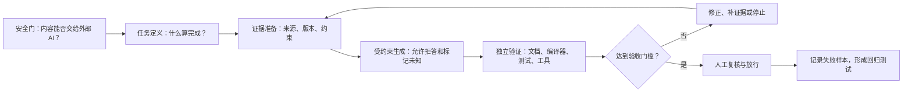

# 03. 使用中如何系统降低幻觉影响

> 适用场景：软件部门内部 AI 培训与个人工作实践
> 目标听众：普通软件工程师
> 建议时长：25～35 分钟，可配合脱敏现场练习
> 资料核对日期：2026-07-01
> 使用边界：当前只能在工作环境之外使用 AI 工具，因此不得输入公司源码、内部日志、芯片结构、接口协议、客户问题或任何可反推出产品信息的材料。

## 1. 先给结论：不要管理“模型自信”，要管理“证据链”

降低幻觉不能只靠一句“请准确回答”。更可靠的方法是把 AI 输出放进一条可检查的工程流程：



这套流程综合了三类权威来源：

- **标准机构**：[NIST AI 600-1](https://doi.org/10.6028/NIST.AI.600-1) 强调治理、内容来源、部署前测试、持续监控和事件记录；
- **原始研究**：RAG、Chain-of-Verification、CRITIC、SelfCheckGPT 等论文分别研究外部知识、独立验证问题、工具反馈和采样一致性；
- **厂商实践**：[Anthropic 的反幻觉指南](https://platform.claude.com/docs/en/test-and-evaluate/strengthen-guardrails/reduce-hallucinations) 与 [GitHub Copilot 负责任使用说明](https://docs.github.com/en/enterprise-cloud@latest/copilot/responsible-use-of-github-copilot-features/responsible-use-of-github-copilot-code-review) 都明确要求来源约束、引用核验以及对生成代码进行人工检查和测试。

关键认识是：

> AI 可以生成候选答案，但不能同时担任候选答案的唯一证人、测试工具和最终审批人。

## 2. 第一步：安全门——先判断任务能不能交给外部 AI

这是流程的硬门槛，优先级高于效率和幻觉控制。

### 2.1 禁止输入

- 公司源码、补丁、代码片段或目录结构；
- 内部日志、错误信息、波形和问题定位过程；
- 芯片结构、寄存器、微架构、接口协议或验证策略；
- 客户问题、内部 benchmark、性能数据和未公开缺陷；
- 内部配置、账号、密钥、网络信息或供应商材料；
- 虽然删除了名称，但仍能通过上下文反推出产品的信息。

“脱敏”不是简单替换公司名。结构、数值、接口组合和故障特征也可能具有识别性。如果不能确定是否可对外，就不应输入。

### 2.2 当前适用任务

- 完全虚构的结构体或数据格式转换脚本；
- 与芯片和真实业务无关的调度器练习；
- 公开语言特性、标准库和公开 API 学习；
- 通用单元测试、lint 配置和文档模板；
- 使用人工构造数据的小型算法实验。

### 2.3 用风险而不是“难度”决定流程强度

| 等级 | 典型任务 | 错误后果 | 处理方式 |
|---|---|---|---|
| L1 草稿 | 脱敏文档改写、教学示例 | 容易发现，可随时丢弃 | 人工阅读后使用 |
| L2 可执行辅助 | 通用脚本、调度器、公开 API 示例 | 可能浪费时间或引入 bug | 必须运行自动验证 |
| L3 决策建议 | 架构取舍、性能判断、根因分析 | 难以自动判定，可能误导决策 | AI 只生成假设，由人和实验验证 |
| 禁止 | 公司代码、芯片信息、真实内部问题 | 信息安全和业务风险 | 不使用外部 AI |

## 3. 第二步：在生成之前定义“什么算正确”

NIST AI 600-1 建议用经过实证验证的方法评估模型能力，并要求测试条件尽量接近实际部署环境；它还特别提醒，不要从狭窄、非系统或轶事式测试中外推模型能力。

因此，先写验收标准，再写提示词。

### 3.1 把任务拆成工件、约束和判定器

```text
工件（artifact）：AI 最终要交付什么？
约束（constraints）：语言版本、依赖、行为和禁止事项是什么？
判定器（oracle）：用什么外部信号判断对错？
```

示例：生成一个教学用 Python 调度器。

```text
工件：scheduler.py 和 test_scheduler.py

约束：
- 只使用 Python 标准库；
- 非抢占式；
- priority 数值越小优先级越高；
- 相同 priority 按输入顺序；
- deadline 无法满足时必须报告；
- 不声称这是全局最优算法。

判定器：
- python -m unittest -v；
- 静态类型检查（如环境已有）；
- 5 个指定边界用例；
- 人工检查复杂度和失败语义。
```

如果一个任务没有可接受的判定器，就不能把模型回答当成完成结果。对架构设计和根因分析，判定器通常是实验、benchmark、复现步骤和人工评审，而不是另一段更流畅的 AI 解释。

### 3.2 建立最小验收表

| 验收项 | 通过条件 | 证据 |
|---|---|---|
| 功能 | 给定用例全部通过 | 测试命令与摘要 |
| 约束 | 没有第三方依赖、版本正确 | 依赖清单与官方文档 |
| 边界 | 空输入、冲突 deadline、相同优先级可解释 | 对应测试 |
| 声明 | 不夸大最优性和验证范围 | 最终报告 |
| 安全 | 输入和输出均为虚构材料 | 人工复核 |

## 4. 第三步：为答案提供可追溯证据，而不是让模型凭记忆补全

### 4.1 区分三类输入

给模型的上下文应明确标记：

1. **事实来源**：官方文档、标准、经过核对的材料；
2. **任务约束**：本次必须遵守的规则；
3. **待判断信息**：允许模型提出假设，但不能当作事实。

```text
【事实来源 S1】Python 3.12 官方文档中关于 heapq 的节选……
【任务约束 C1】只允许使用标准库。
【任务约束 C2】priority 越小越优先。
【待判断 U1】是否需要稳定排序；信息不足时先提问。
```

这样可以在输出中要求模型用 `S1/C1/U1` 标注依据，减少事实、约束和猜测混在一起。

### 4.2 长文档采用“先找证据，再回答”

Anthropic 官方指南建议，对于长文档任务先提取逐字引用，再执行总结或判断；每项事实声明应附支持它的引用，找不到支持时撤回该声明。

具体提示模板：

```text
只依据我提供的公开材料回答。

第一步：列出与问题直接相关的原文片段，并标注来源编号。
第二步：基于这些片段回答。
第三步：为每个事实性结论标注来源编号。
如果某个结论找不到支持材料，请写“材料不足”，不要使用模型记忆补全。
```

注意：引用存在不等于引用支持结论。最终仍需要人工打开来源，核对版本、上下文和原文含义。

### 4.3 需要外部知识时使用检索，但不要神化 RAG

[Retrieval-Augmented Generation](https://arxiv.org/abs/2005.11401) 把参数知识和外部检索结合起来，使知识密集型任务能够参考可更新的来源。工程上可以把它理解为：先找材料，再让模型基于材料生成。

RAG 的完整链路至少包含：

```text
问题 → 检索 → 版本/权限过滤 → 相关性检查
→ 基于证据生成 → 引用对齐检查 → 回答
```

RAG 仍可能失败：

- 检索到了错误、过期或权限不合适的材料；
- 正确材料没有被召回；
- 检索片段缺少上下文；
- 模型引用了材料，但结论超出了材料支持范围；
- 网页或文档中含有 prompt injection。

所以 NIST AI 600-1 不只建议使用 RAG，还要求验证 RAG 数据确实有来源、经过 grounding，并持续检查生成内容的来源和引用。

## 5. 第四步：让模型输出“可验证工件”

### 5.1 允许“不知道”和请求澄清

Anthropic 官方指南建议显式允许模型回答“不知道”；OpenAI 的 [Why Language Models Hallucinate](https://arxiv.org/abs/2509.04664) 则指出，只奖励答对、不给适当拒答留空间的评测会鼓励模型猜测。

可以使用明确的失败协议：

```text
当信息不足时：
1. 不要猜；
2. 指出缺少哪项信息；
3. 说明这项信息会影响什么结论；
4. 给出取得该信息或验证假设的方法。
```

“允许拒答”不是让模型频繁回避，而是为不确定性提供一个比编造更低成本的出口。

### 5.2 固定输出契约

代码任务建议强制输出以下结构：

```text
1. 已知约束；
2. 自行补充的假设；
3. 实现；
4. 测试；
5. 实际运行过的命令及结果；
6. 没有运行或无法验证的项目；
7. 仍需人工判断的风险。
```

如果工具没有执行能力，第 5 项必须写“未运行”，不能用“应该通过”替代“已经通过”。

### 5.3 不要求展示私有思维链，要求展示可检查依据

实务中需要的是：假设、来源、计算步骤、工具输出和验证结果。不要把冗长的自然语言推理当成正确性证明。

更合适的要求是：

```text
请给出可由人或工具复核的依据：输入假设、使用的公式、来源、测试和反例。
不需要输出不可验证的内心推理描述。
```

## 6. 第五步：使用独立判定器验证，而不是只让模型“再想一遍”

### 6.1 代码：把解释交给模型，把裁决交给工具和人

GitHub 的 Copilot 负责任使用说明明确指出，AI 生成的代码可能表面有效，但可能在语法、语义、安全性或问题修复方面出错，因此必须仔细 review 和测试。

建议验证顺序：

```text
格式/语法 → 编译或解释执行 → 单元测试 → 静态分析
→ 边界与失败路径 → 依赖和安全检查 → 人工 review
```

| 输出声明 | 最合适的判定器 |
|---|---|
| “代码能运行” | 编译器或解释器 |
| “满足样例” | 单元测试 |
| “没有明显类型问题” | type checker |
| “没有常见静态缺陷” | lint / static analyzer |
| “性能更好” | 同条件 benchmark 与统计结果 |
| “API 存在且参数正确” | 对应版本的官方文档与最小样例 |
| “依赖存在” | 官方 registry、锁文件和许可证检查 |
| “算法一定最优” | 证明、权威来源或与精确算法的对照实验 |

测试也可能很弱。只覆盖 happy path 的三个测试，不能支持“实现已充分验证”的结论。报告必须说明：跑了什么、没跑什么、覆盖了哪些风险。

### 6.2 文档和事实：建立 claim-evidence matrix

NIST AI 600-1 的明确建议之一，是在部署前测量和持续监控中检查、验证生成内容的来源和引用。

把答案拆成原子声明：

| Claim ID | 事实声明 | 来源 | 来源是否真的支持 | 处理 |
|---|---|---|---|---|
| F1 | 某 API 在 Python 3.12 可用 | 官方文档链接和段落 | 是/否 | 保留或删除 |
| F2 | 某算法复杂度为 O(n log n) | 推导或权威来源 | 是/否 | 修正 |
| F3 | 某方案“性能最好” | 暂无同条件 benchmark | 否 | 改为待验证假设 |

验证重点不是“有没有链接”，而是“链接中的具体内容是否支持这句话”。

### 6.3 根因分析：验证可区分的假设

不要让模型直接输出唯一根因。要求它输出：

```text
候选假设 → 支持证据 → 反证 → 能区分假设的下一步实验
```

例如通用调度器出现顺序错误：

| 假设 | 当前证据 | 区分实验 |
|---|---|---|
| priority 比较方向写反 | 高优先级任务总在后面 | 两个任务、不同 priority 的最小测试 |
| 相同 priority 排序不稳定 | 仅同优先级时重排 | 固定输入顺序重复运行 |
| deadline 被当成排序主键 | 临近 deadline 任务提前 | 去掉 deadline 后对照 |

模型的价值是快速生成假设空间；根因结论来自实验结果。

### 6.4 使用 Chain-of-Verification，而不是一句“请自检”

[Chain-of-Verification](https://arxiv.org/abs/2309.11495) 的核心流程是：先形成草稿，再生成验证问题，独立回答这些问题，最后根据验证结果修订答案。

适合人工操作的版本：

```text
第一轮：给出草稿，并拆出其中可被验证的关键声明。
第二轮：为每个声明设计一个不会预设原答案正确的验证问题。
第三轮：只使用官方材料或工具独立回答验证问题，不复制第一轮结论。
第四轮：建立声明—证据表，删除或降级没有支持的声明。
```

独立性很重要：如果“验证”提示里直接包含原答案和结论，模型容易继续维护原来的错误。

### 6.5 工具反馈优于纯语言自我批评

[CRITIC](https://arxiv.org/abs/2305.11738) 研究让模型调用搜索、解释器等工具检查输出，再依据工具反馈修订。对软件工程任务，这对应：

```text
生成代码 → 运行测试 → 读取失败 → 修改 → 再运行
```

但是工具调用本身也可能错，所以最终报告必须保留：

- 工具名称和关键参数；
- 输入版本和工作目录；
- 退出码或关键结果；
- 模型对结果的解释；
- 尚未运行的验证项。

## 7. 多次采样和多 Agent：用于发现分歧，不用于制造“多数真理”

[SelfCheckGPT](https://arxiv.org/abs/2303.08896) 利用多次采样之间的不一致检测潜在事实错误。它适合在没有外部数据库时寻找可疑声明，但一致并不证明正确：模型可能稳定重复同一个训练偏差或错误前提。

同样，多 Agent 可能提供不同视角，也可能产生 collective hallucination。多个代理共享模型、上下文和提示时，其错误并不独立。

不充分的验证：

```text
Agent A 给结论
→ Agent B 阅读 A 的结论后表示同意
→ 汇总代理宣布“两个模型一致，验证通过”
```

更可靠的安排：

```text
Agent A：查官方来源并返回原文证据
Agent B：运行最小样例和测试
Agent C：只负责构造反例和失败条件
汇总代理：比较相互独立的证据，保留冲突和未验证项
```

相关的新研究 [Collective Hallucination in Multi-Agent LLMs](https://arxiv.org/abs/2606.07941) 是预印本，适合作为风险提示，而不是把某个固定多 Agent 架构当作已被最终证实的解决方案。

## 8. 第六步：人工放行、持续监控和失败回归

### 8.1 人工放行不能被 AI review 取代

GitHub 明确说明，Copilot code review 只给出评论，不等于批准；AI 生成的修改仍应像其他贡献一样接受完整检查。对本培训场景，可以采用：

```text
AI 生成者 ≠ 唯一 reviewer
AI reviewer ≠ 最终批准者
测试通过 ≠ 所有业务语义正确
```

至少以下内容需要人工确认：

- 需求和假设是否正确；
- 引入的依赖、许可证和安全影响；
- 测试是否覆盖真实失败模式；
- 工具输出是否被正确解释；
- 是否存在信息安全或隐私风险；
- 最终表述是否夸大证据范围。

### 8.2 把失败样本变成回归测试

NIST AI 600-1 建议持续监控 confabulation，并记录错误、near-miss 和负面影响。个人或团队实践可以简化为一张失败登记表：

| 字段 | 内容 |
|---|---|
| 任务类型 | 脚本、API 查询、文档总结等 |
| 失败表现 | 编造 API、误读材料、漏约束等 |
| 发现方式 | 编译器、测试、人工核查等 |
| 根因类别 | 来源缺失、提示歧义、验证不足等 |
| 修正措施 | 增加来源、测试、拒答条件等 |
| 回归用例 | 下次评估必须重新运行的样例 |

不要只修一次提示词。把失败样本加入固定测试集，在更换模型、提示模板、工具或检索来源后重新运行，才能知道可靠性是否真的改善。

## 9. 一套可以直接采用的任务模板

```text
【安全声明】
这是完全虚构、脱敏的练习，不包含公司代码、日志、芯片或客户信息。

【目标工件】
说明要生成的文件、文档或分析结果。

【事实来源】
S1: 官方材料及版本……
S2: 官方材料及版本……
只允许依据这些来源做事实性陈述；材料不足时明确说明。

【约束】
C1: ……
C2: ……

【验收标准】
A1: 必须通过的测试……
A2: 必须核对的引用……
A3: 必须人工判断的部分……

【执行流程】
1. 先复述约束，并区分已知条件和自行假设；
2. 生成最小实现或答案；
3. 把事实结论拆成 claim，并标注来源；
4. 生成并运行可执行测试；
5. 根据外部证据修订；
6. 报告实际运行结果、未运行项和剩余风险。

【失败协议】
- 找不到可靠来源：写“未验证”；
- 信息不足：提出需要补充的问题；
- 工具未执行：不得声称已经通过；
- 约束冲突：停止并报告冲突，不自行选择。
```

## 10. 完整示例：脱敏调度器如何走完证据闭环

### 10.1 任务

```text
用 Python 标准库实现教学用非抢占式调度器。
任务包含 id、priority、deadline、duration。
priority 越小越优先；相同 priority 保持输入顺序。
无法满足 deadline 时报告原因。
```

### 10.2 生成前先固定验收标准

- 空输入返回空列表；
- 两个不同 priority 的任务顺序正确；
- 相同 priority 保持稳定；
- deadline 不可满足时不会假装成功；
- duration 为负数时拒绝输入；
- 只使用标准库；
- 文档明确说明算法不保证全局最优。

### 10.3 第一轮只生成候选实现

要求模型同时输出假设、复杂度和未验证项。不要在看到代码“挺像那么回事”后结束任务。

### 10.4 第二轮使用独立判定器

```text
python -m unittest -v
```

再增加一个模型没有提前见过的反例，例如：高优先级任务很长，导致另一个临近 deadline 的任务失败。检查实现是否诚实报告失败，以及文档是否准确描述策略局限。

### 10.5 第三轮形成验收报告

```text
已验证：6 个单元测试通过，退出码为 0。
已核对：仅导入 Python 标准库模块。
未验证：大量任务下的性能；算法的全局最优性。
人工结论：适合作为教学示例，不应直接用于真实调度系统。
```

这份报告比“代码已完成、测试通过”更可靠，因为它明确了证据范围和结论边界。

## 11. 常见但证据不足的做法

| 做法 | 为什么不够 | 应如何替代 |
|---|---|---|
| “请不要幻觉” | 没有提供事实来源或判定器 | 提供来源、验收标准和失败协议 |
| 降低 temperature | 只能降低随机性，可能稳定地产生同一个错误 | 使用外部证据和测试 |
| 让模型再检查一次 | 容易重复维护原结论 | 使用独立验证问题或工具反馈 |
| 生成很多答案后多数投票 | 错误可能高度相关 | 将不一致作为风险信号，再查外部证据 |
| 有引用就相信 | 引用可能不存在或不支持结论 | 做 claim-evidence 对齐核查 |
| 测试通过就直接采用 | 测试可能弱、需求可能理解错误 | 审查测试范围和业务语义 |
| 更强模型可以免审 | 能力增强不会消除 confabulation | 保留同样的放行门槛 |

## 12. 方法、证据和局限对照表

| 方法 | 主要来源 | 能解决什么 | 不能保证什么 |
|---|---|---|---|
| 风险分级、部署前测试、持续监控 | NIST AI 600-1 | 建立组织化治理和测量闭环 | 不提供某个提示词的万能效果 |
| 先引用再回答、允许不知道 | Anthropic 官方指南 | 减少长文档无依据扩写 | 引用本身仍需核验 |
| RAG | Lewis et al., 2020 | 接入可更新、可追踪知识 | 检索质量和引用对齐仍会失败 |
| Chain-of-Verification | Dhuliawala et al., 2023 | 用独立验证问题修订事实声明 | 仍可能共享同一知识盲区 |
| 工具交互批评 CRITIC | Gou et al., 2023 | 用搜索、解释器等反馈纠错 | 工具选择和结果解释可能出错 |
| SelfCheckGPT | Manakul et al., 2023 | 用采样不一致发现可疑内容 | 一致不等于正确 |
| 编译、测试与人工 review | GitHub 官方负责任使用说明 | 为代码提供外部判定信号 | 测试覆盖不足时仍会漏错 |
| 独立多 Agent 分工 | 工程方法；集体幻觉研究作风险提示 | 提高证据来源和反例多样性 | 多 Agent 共识不等于事实 |

## 13. 培训时可以带走的四句话

1. 安全门先于效率：不能输入外部 AI 的内容，不因为“只是验证”而例外。
2. 先写验收标准，再让 AI 生成；没有判定器的答案只是候选方案。
3. 事实靠来源，代码靠运行，性能靠 benchmark，根因靠实验。
4. 最可靠的 AI 工作流不是一次答对，而是错误能够被发现、阻断、记录并进入回归测试。

## 14. 参考资料

- [NIST AI 600-1: Artificial Intelligence Risk Management Framework — Generative AI Profile](https://doi.org/10.6028/NIST.AI.600-1)
- [Anthropic Claude Platform Docs: Reduce hallucinations](https://platform.claude.com/docs/en/test-and-evaluate/strengthen-guardrails/reduce-hallucinations)
- [Why Language Models Hallucinate](https://arxiv.org/abs/2509.04664)
- [Retrieval-Augmented Generation for Knowledge-Intensive NLP Tasks](https://arxiv.org/abs/2005.11401)
- [Chain-of-Verification Reduces Hallucination in Large Language Models](https://arxiv.org/abs/2309.11495)
- [CRITIC: Large Language Models Can Self-Correct with Tool-Interactive Critiquing](https://arxiv.org/abs/2305.11738)
- [SelfCheckGPT: Zero-Resource Black-Box Hallucination Detection](https://arxiv.org/abs/2303.08896)
- [GitHub Docs: Responsible use of GitHub Copilot code review](https://docs.github.com/en/enterprise-cloud@latest/copilot/responsible-use-of-github-copilot-features/responsible-use-of-github-copilot-code-review)
- [Tool Receipts, Not Zero-Knowledge Proofs](https://arxiv.org/abs/2603.10060)
- [Collective Hallucination in Multi-Agent LLMs: Modeling and Defense](https://arxiv.org/abs/2606.07941)
