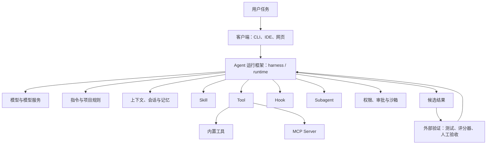

# 01. LLM 幻觉与 Agent：软件工程师需要的原理

> 学习目标：建立足以指导实践的心智模型，而不是完整学习深度学习课程。建议阅读 60～75 分钟。

## 1. 先建立结论

大语言模型（Large Language Model，LLM）最基本的生成目标，是根据已有 token 预测下一个 token。它可以学到大量事实、代码模式和推理结构，但生成时并不会自动连接事实数据库、编译器或真实运行环境。

因此需要同时记住三件事：

1. 语言流畅度来自强大的模式学习，不等于事实已经核实；
2. 模型内部概率反映“哪个 token 更适合接在这里”，不等于“这项事实有多可信”；
3. 工具、检索和 Agent 循环能提供外部反馈，但工具可能失败，模型也可能误读反馈。

软件工程里的实用结论是：不要试图从措辞或自信程度判断正确性，要让输出落到编译、测试、来源、运行结果和人工审查上。

## 2. 从 token 到 Transformer

### 2.1 Token 与向量

模型先把文本或代码切成 token。Token 可能是一个词、词的一部分、符号或常见字符序列。输入序列可写为：

```math
x_1,x_2,\ldots,x_n
```

每个 token ID 被映射为向量并加入位置信息：

```math
h_i^{(0)}=E[x_i]+P_i
```

`E[x_i]` 是 token embedding，`P_i` 表示位置。模型看到的是向量序列，不是编译器拥有的完整类型系统、控制流图和对象生命周期。

这解释了一个常见现象：模型可以生成非常像某个库风格的 API，却可能把版本、参数或生命周期写错。

### 2.2 Self-attention

Transformer 使用 self-attention 让当前位置根据上下文聚合信息。简化公式是：

```math
Q=XW_Q,\qquad K=XW_K,\qquad V=XW_V
```

```math
\mathrm{Attention}(Q,K,V)
=\mathrm{softmax}\left(\frac{QK^T}{\sqrt{d_k}}+M\right)V
```

其中：

- `QK^T` 衡量不同位置之间的相关性；
- `sqrt(d_k)` 防止数值过大导致 softmax 过度饱和；
- `M` 是因果掩码，使自回归模型不能看到未来 token；
- 权重乘以 `V` 后得到融合上下文的表示。

注意力能够建立远距离关联，但“关注到某段文字”不等于理解了其中所有约束，也不保证模型执行了代码。

### 2.3 自回归生成

生成序列的概率可分解为：

```math
P(x_{1:T})=\prod_{t=1}^{T}P(x_t\mid x_{1:t-1})
```

模型每一步产生 logits，经 softmax 变成下一个 token 的概率：

```math
P(x_t=i\mid x_{1:t-1})=
\frac{\exp(z_i/\tau)}{\sum_j\exp(z_j/\tau)}
```

`tau` 是 temperature。降低 temperature 通常让输出更集中，却不能把错误知识变成正确知识。即使某个 token 概率最高，后续陈述也可能没有事实依据。

可使用以下可视化辅助理解：

- [Transformer Explainer](https://poloclub.github.io/transformer-explainer/)：交互观察 GPT-2 small 的 token、attention 和采样；
- [The Illustrated GPT-2](https://jalammar.github.io/illustrated-gpt2/)：理解 decoder-only Transformer；
- [LLM Visualization](https://bbycroft.net/llm)：观察层、向量和注意力的直观流动。

## 3. 幻觉为什么产生

本文把“模型生成了缺乏依据、与事实或给定材料不符的内容”称为幻觉。实际使用中还应同时关注推理错误、遗漏和需求误解，因为它们会造成相同的工程后果。

### 3.1 训练目标与事实验证不同

Next-token prediction 奖励的是合理续写。训练数据中常见的 API 写法，可能比某个具体版本的真实接口更容易被生成。模型除非接入外部来源，否则没有强制的事实核对步骤。

### 3.2 数据存在噪声、冲突和时间边界

训练材料可能包含旧版本文档、错误帖子、互相冲突的示例和重复内容。参数中的知识还是压缩表示，不是能够按主键精确查询并实时更新的数据库。

### 3.3 上下文不完整或被错误组织

用户没有提供平台、版本、失败输入和约束时，模型会使用常见模式补齐空白。长上下文也不自动解决问题：相关内容可能被淹没、相互冲突，或者根本没有进入有效上下文。

### 3.4 对齐可能鼓励“尽量回答”

指令训练让模型更有帮助，但也可能让它在信息不足时继续给出完整答案，或者顺从用户问题中的错误前提。更强的诚实性训练可以降低这种倾向，不能消灭它。

### 3.5 生成错误会逐步累积

前面生成的错误 token 会成为后续条件。一个错误 API 名称可能继续诱导模型编造参数、返回值和示例，最终形成结构完整但整体不存在的方案。

### 3.6 软件任务还有环境幻觉

Coding Agent 可能：

- 声称运行了实际没有运行的测试；
- 把 Apple Clang 当作 GNU GCC；
- 只运行测试子集，却报告“全部通过”；
- 误读退出码、截断日志或缓存结果；
- 在报错位置增加 `if`，让原始错误不再表现；
- 修改测试、配置或依赖来迎合实现。

这类问题不能只靠要求“不要幻觉”解决。

## 4. 从 LLM 到 Agent 系统

### 4.1 Agent 与普通聊天的区别

本文采用一个实用定义：**Agent 是在明确边界内，围绕目标选择步骤、调用工具、读取环境反馈并决定继续或停止的系统。** 不同机构对 Agent 的边界并不完全相同，因此应关注系统实际拥有的能力和权限，而不是产品名称。

```text
普通聊天：输入 → 生成回答

固定工作流：输入 → 预先定义的步骤 A → 步骤 B → 输出

Agent：目标 → 观察 → 计划 → 调用工具 → 读取结果
          ↑                              ↓
          └────── 修正、继续或停止 ──────┘
```

### 4.2 现代 Agent 系统由哪些部分组成

LLM 只是 Agent 系统中负责理解、判断和生成候选行动的部分。用户实际使用的 Coding Agent，通常还包含交互界面、运行框架、上下文组织、工具、扩展机制、权限边界和验证器。把这些层分开，才能判断错误究竟来自模型、上下文、工具，还是外围系统。



这里的 **harness**（可译为运行框架或脚手架）是容易被忽略的一层。它负责组装上下文、调用模型、执行工具、维护会话、处理权限和控制循环。同一个模型放进不同 harness，可能因为工具、提示、上下文压缩和停止条件不同而得到明显不同的结果。

一个可工作的 Agent 通常包含：

| 组成 | 含义与作用 | Coding Agent 示例 |
|---|---|---|
| 模型（model） | 理解输入并生成下一步候选行动；模型不等于完整 Agent | 判断应先读日志还是查调用点 |
| 模型服务（provider / API） | 托管和调用模型的服务层；可能影响可用模型、限额和数据边界 | 公有云 API 或内网推理服务 |
| 客户端（client / surface） | 用户与 Agent 交互的入口，不是 Agent 的“大脑” | CLI、IDE 插件、网页或桌面应用 |
| 运行框架（harness / runtime） | 组织上下文、模型调用、工具执行和循环控制 | 把模型产生的工具请求交给终端执行 |
| 指令与规则（instructions / rules） | 定义目标、行为约束和项目惯例 | 任务 Prompt、`AGENTS.md`、`CLAUDE.md` |
| 上下文（context） | 本次模型调用实际可见的信息 | issue、相关源码、构建说明和工具输出 |
| 会话与状态（session / state） | 保存一次任务的历史、阶段和运行状态 | 已检查文件、失败假设、待办和剩余预算 |
| 记忆（memory） | 被选择保存、检索并在之后重新提供的信息 | 项目惯例或以前任务中确认的偏好 |
| Skill | 可复用的知识、指令和工作流程；具体封装方式因产品而异 | 按既定流程检查 CMake 构建问题 |
| 工具（tool / function calling） | 让模型读取或改变外部环境的可执行能力 | 搜索、编辑、编译、测试和 Git |
| MCP | 连接 Agent 与外部工具、资源或提示模板的开放协议 | 通过 MCP Server 查询 issue 或数据库 |
| Hook | 在特定生命周期事件发生时自动执行的处理器 | 编辑后运行格式化，工具调用前检查策略 |
| Subagent | 在独立或较隔离的上下文中执行子任务的 Agent 循环 | 分别调查 Linux 和 Windows 行为 |
| 权限、审批与沙箱 | 决定能做什么、何时询问用户，以及系统层面真正阻止什么 | 只写工作区、断网、禁止直接 push |
| 判定器（verifier / evaluator / oracle） | 根据外部标准判断结果是否可接受 | 测试、Sanitizer、schema、评分器和人工验收 |

一次典型的工具循环是：harness 把任务、项目规则和相关上下文交给模型；模型请求读取文件；权限层决定允许、拒绝或询问；工具输出回到上下文；模型据此修改代码并运行测试。最终是否接受修改，不应只依据模型的完成声明，而应由独立检查和人工判断决定。

### 4.3 Skill、Tool、MCP、Plugin 与 Hook

这几个词都与“扩展 Agent 能力”有关，但扩展的位置不同：

| 名词 | 主要回答的问题 | 典型内容 | 需要注意的边界 |
|---|---|---|---|
| Skill | “这类任务应该怎样做？” | 可复用指令、步骤、示例，也可能附带脚本或资料 | 主要提供方法，不会自动保证模型遵守或结果正确 |
| Tool | “Agent 能执行什么操作？” | 读文件、运行命令、搜索、调用 API | 工具可能失败、返回旧数据或被错误调用 |
| MCP | “怎样以统一方式连接外部能力？” | MCP Server 暴露的 tools、resources 和 prompts | 协议统一不等于服务可信，也不等于已经获得授权 |
| Plugin | “怎样安装、组合和分发扩展？” | 可能打包 Skill、Hook、MCP 配置、子 Agent 或程序 | 属于产品相关的包装机制，内容应像代码依赖一样审查 |
| Hook | “某个事件发生时自动做什么？” | 工具调用前审批、修改后检查、结束时记录 | 比自然语言提醒更确定，但 Hook 本身也可能配置错误或执行恶意代码 |

可以用一句话记忆：**Skill 教方法，Tool 提供动作，MCP 连接外部能力，Plugin 负责包装分发，Hook 在事件发生时自动介入。** 例如，“C++ 缺陷诊断 Skill”可以要求先复现再定位；它调用的编译器是 Tool；远程 issue 服务可以经 MCP 接入；组织可以用 Plugin 一并分发 Skill、Hook 和 MCP 配置；Hook 则在代码修改后自动运行格式检查。

不同产品对 Skill 和 Plugin 的文件格式、发现方式及加载时机并不完全相同。Claude Code 的[扩展机制总览](https://code.claude.com/docs/en/features-overview)区分了项目规则、Skills、MCP、Subagents、Hooks 和 Plugins；其[工具参考](https://code.claude.com/docs/en/tools-reference)也区分了可执行工具与复用现有工具的 Skill。[MCP 官方架构](https://modelcontextprotocol.io/docs/learn/architecture)则把 MCP 定义为 host、client 与 server 之间的协议，并规定 tools、resources 和 prompts 等基本能力。

### 4.4 四组必须分清的关系

#### 模型、Agent 与 Agent 产品

- **模型**负责根据输入产生候选输出；
- **Agent**增加目标循环、工具、状态和停止判断；
- **Agent 产品**还包含界面、harness、扩展、权限和服务配置。

因此比较两个内部模型时，应固定 harness、Prompt、工具、权限和预算；否则测到的是整个系统差异，不只是模型差异。

#### Context、Session、Memory 与 Compaction

- **Context window** 是一次模型调用当前能看到的内容范围；
- **Session** 是持续任务及其历史和状态；
- **Memory** 是被选择保存并可能在以后取回的信息；
- **Compaction** 是对较早上下文进行摘要、裁剪或重组，以便任务继续运行。

“会话中出现过”不代表信息仍在当前上下文；“写入记忆”也不代表每次都会被正确检索。压缩还可能遗失条件、把假设写成事实或弱化否定信息。

#### Permission、Approval 与 Sandbox

- **Permission** 描述允许、拒绝或需要询问的规则；
- **Approval** 是高风险操作前由用户作出的授权决定；
- **Sandbox** 是文件系统、进程、网络或容器实际实施的技术隔离。

Prompt 中写“不要联网”只是指令；网络在系统层被阻断才是强制边界。三层最好同时存在，并遵循最小权限原则。

#### Subagent、Multi-Agent 与独立验证

Subagent 可以隔离上下文或并行调查，多个 Agent 也可以分工协作，但它们可能共享模型、训练数据和错误前提。让另一个同类 Agent 说“看起来正确”不是独立验证；编译器、测试、来源、评分器和人工审查才能提供不同类型的证据。

### 4.5 其他常见名词：先能识别，不必马上深入

| 名词 | 最小理解 |
|---|---|
| Retrieval / RAG | 从外部资料检索相关内容并放入上下文；检索结果仍需核实来源和时效 |
| Connector | 连接 GitHub、数据库、消息系统等外部服务的适配层；通常会引入新的权限和数据边界 |
| Embedding / Vector Database | 把内容映射为向量并进行相似度检索；相似不等于事实正确 |
| LSP | Language Server Protocol，为编辑器或 Agent 提供符号、定义、引用和诊断等语言能力 |
| Headless Mode | 不依赖交互界面，通过命令行、脚本或 CI 运行 Agent |
| Checkpoint | 保存可恢复的任务或工作区状态，便于回退和比较 |
| Git Worktree | Git 提供的独立工作目录，常用于隔离并行 Agent 的代码修改 |
| Orchestrator | 分配子任务、管理依赖、汇总结果并控制多个 Agent 的协调层 |

基础篇只需要掌握这些概念在系统中的位置和边界。具体如何配置 Skill、MCP、Hook、Plugin 和项目规则，会随产品快速变化，应查阅对应版本的官方文档，并在 [02：Coding Agent 实战手册](02_coding_agent_playbook.md) 中结合实际任务学习。

[ReAct](https://arxiv.org/abs/2210.03629) 展示了推理、行动和环境观察交错进行的基本范式；[Anthropic 的工程说明](https://www.anthropic.com/engineering/building-effective-agents) 则明确区分固定工作流和由模型动态决定路径的 Agent。

## 5. 工具反馈为什么有用，又为什么不充分

工具把模型的部分主张变成可观测结果：

```text
“这段代码应该能编译” → 编译器退出码和诊断
“这个 API 存在”       → 官方文档或实际导入
“错误已修复”           → 原始复现和回归测试
“没有越界”             → 覆盖目标路径的 ASan 运行
```

这会显著降低“只凭语言继续猜”的风险。但反馈闭环仍可能在任意环节失败：

1. Agent 选择了错误工具或错误参数；
2. 测试本身没有覆盖问题；
3. 工具输出被截断、缓存或误读；
4. Agent 修改了判定器；
5. 环境与真实目标环境不同；
6. 工具只证明局部性质，Agent 却把结论扩大到全部场景。

因此应把 Agent 看作“会使用工具的候选方案生成者”，而不是因使用工具就自动可信。

## 6. 选择最低必要自动化程度

从简单到复杂依次考虑：

```text
确定性程序 → 普通聊天 → 固定工作流 → 单 Agent + 工具 → 多 Agent
```

| 方案 | 适合任务 | 主要优点 | 主要限制 |
|---|---|---|---|
| 确定性程序 | 格式转换、固定计算、规则校验 | 便宜、稳定、易测试 | 不擅长模糊语义 |
| 普通聊天 | 解释、改写、头脑风暴 | 交互简单 | 用户负责推进和验证 |
| 固定工作流 | 步骤已知、分支有限 | 可预测、易审计 | 对新情况适应较弱 |
| 单 Agent | 路径未知但目标可验证 | 能根据反馈调整 | 成本和错误面增加 |
| 多 Agent | 工作包真正独立、并行收益明显 | 扩大覆盖面 | 协调、重复和相关性错误 |

任务适合交给 Agent，通常需要同时满足：

- 目标和允许范围能够说清；
- 完成结果可以由测试、来源或人工验收；
- 路径存在不确定性，固定脚本很难覆盖；
- 错误能在产生严重后果前被阻断；
- 使用的数据、工具和操作已经授权。

以下情况不应直接交给高自治 Agent：

- 付款、删除、发送、生产变更等不可逆操作无人审批；
- 输入包含未经授权的内部代码、日志、凭证或个人数据；
- 连“什么算正确”都无法定义；
- 规则稳定，十几行脚本就能完成；
- Agent 必须获得远超任务需要的系统权限。

## 7. 单 Agent 与多 Agent

多 Agent 不等于多个独立真相源。多个 Agent 可能共享模型、训练数据、搜索结果和错误前提，从而形成一致但错误的结论。

只有满足以下条件时才考虑并行：

1. 工作包的输入和输出边界明确；
2. 大部分时间不需要写同一文件或共享可变状态；
3. 各工作包可以独立验收；
4. 并行节省的时间高于协调、合并和额外 token 成本。

适合并行的是“调查 Linux 行为”和“调查 Windows 行为”；不适合的是让三个 Agent 同时修改同一个核心函数，再用投票决定哪份正确。

## 8. 自查与小练习

### 自查问题

1. 为什么 temperature 降低后，模型仍可能稳定地产生错误答案？
2. 为什么 token 概率不能作为事实置信度？
3. 测试通过能证明什么，不能证明什么？
4. 工具反馈在哪些位置仍可能失真？
5. 什么条件下固定工作流比 Agent 更合适？
6. Skill、Tool、MCP、Plugin 和 Hook 分别扩展了哪一层？
7. 为什么 Prompt 中写“禁止联网”不等于网络已经被隔离？
8. 同一个模型在两个 harness 中结果不同，可能有哪些原因？
9. 为什么另一个 Subagent 的赞同不能代替独立验证？

### 小练习

为下面任务分别选择“脚本、聊天、固定工作流、单 Agent、多 Agent”，并写出判定器：

1. 将 500 个日期统一为 ISO 8601；
2. 解释一条公开的 CMake 错误；
3. 在公开仓库中调查一个偶发崩溃并提交候选补丁；
4. 比较三个公开编译器对同一语言特性的实现；
5. 自动删除服务器上的过期构建物。

参考判断：第 1 项优先脚本；第 2 项通常聊天足够；第 3 项适合单 Agent 加测试工具；第 4 项在来源和实验可独立时可并行；第 5 项即使使用 Agent，也必须先预览、限制路径并人工批准删除。

再选择自己正在使用的一个 Coding Agent，画出它的模型、harness、项目规则、Skill、Tool、MCP、权限层和验证器。无法确认的部分标记为“未知”，不要根据产品宣传自行补齐。

下一步阅读 [02：Coding Agent 实战手册](02_coding_agent_playbook.md)。
