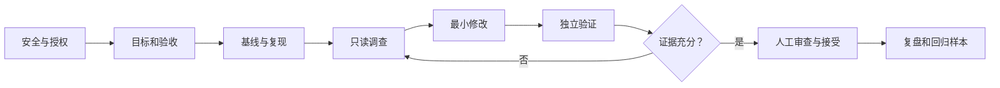

# 02. Coding Agent 实战手册

> 学习目标：能够选择任务、编写指令、分阶段执行、验证结果，并在 Agent 偏离时及时停止。建议阅读 60～75 分钟。

## 1. 把 Agent 放进工程闭环

Coding Agent 既会生成代码，也会读取文件、执行命令和改变工作区。最合适的定位是：

> 能力很强但不完全可信的代码贡献者和命令执行者。

一次可靠任务至少包含以下闭环：



这里最重要的分工是：Agent 可以提出修改和验证计划，但完成标准、受保护测试、权限边界和最终接受决定不能只由同一个 Agent 控制。

## 2. 第一步：判断任务是否适合

开始前回答六个问题：

1. **工件是什么？** 是补丁、脚本、报告，还是一个可运行项目？
2. **正确如何判断？** 有没有测试、来源、基准或人工验收标准？
3. **路径是否真的不确定？** 若步骤固定，脚本或工作流可能更合适。
4. **失败是否可逆？** 能否在独立分支、容器或副本中试错？
5. **需要什么权限？** 是否涉及网络、凭证、外部系统或敏感材料？
6. **价值是否覆盖成本？** Agent 的运行、复核和返工时间是否低于人工完成？

可使用一个简单判断表：

| 条件 | 不满足时的处理 |
|---|---|
| 交付物明确 | 先澄清，不开始自治执行 |
| 有外部判定器 | 只允许生成草稿或候选假设 |
| 输入已授权 | 更换为公开、虚构或脱敏材料 |
| 操作可回滚 | 降低权限并增加人工审批 |
| 路径存在不确定性 | 改用脚本或固定工作流 |
| 人能够复核 | 缩小任务，避免无法接管的长任务 |

## 3. 第二步：写任务合同

高质量指令不是堆砌礼貌词，而是把任务变成双方都能检查的合同。建议包含八项：

| 项目 | 要回答的问题 |
|---|---|
| 目标 | 最终要改变什么行为？ |
| 已知事实 | 哪些输入、版本、日志和复现已经确认？ |
| 非目标 | 哪些相邻问题这次不解决？ |
| 修改范围 | 可以读取、修改哪些目录和文件？ |
| 工作方式 | 先调查还是可以直接实现？何时暂停？ |
| 工具与权限 | 可以运行什么？是否允许网络、安装、Git 操作？ |
| 完成标准 | 哪些检查必须通过，结果如何记录？ |
| 停止条件 | 遇到什么情况必须停止并询问？ |

### 3.1 一个够短的通用模板

```text
目标：<可观察的结果>。

背景与已知事实：
- <版本、输入、复现、已有证据>；
- 未确认的信息必须标为假设。

范围：
- 允许读取：<路径>；
- 允许修改：<路径>；
- 不修改测试、接口、依赖和无关文件，除非先说明必要性并获得确认。

工作方式：
1. 先建立基线并复现；
2. 先调查根因，列出证据和可证伪实验；
3. 证据足够后进行最小修改；
4. 运行约定检查，失败则继续调查或停止。

完成标准：
- <原始复现>；
- <针对性回归测试>；
- <构建、测试、静态或动态检查>；
- 输出 diff、实际命令、退出码、未验证项和剩余风险。

权限与停止：
- 不访问网络、不安装依赖、不提交或 push，除非单独批准；
- 遇到范围外修改、测试需要弱化、工具环境异常或两次无进展时停止。
```

这个模板不是越长越好。删除与任务无关的条目，让关键限制更容易被看到。能由沙箱、只读目录、CI 和脚本强制的规则，不只依赖自然语言。

## 4. 第三步：组织上下文

上下文应帮助 Agent形成正确问题，而不是把所有材料一次塞进去。

### 4.1 区分四类信息

```text
F（Fact）：已经由日志、源码或工具确认的事实
C（Constraint）：用户或项目给出的约束
H（Hypothesis）：尚未验证的候选解释
U（Unknown）：需要调查或询问的信息
```

例如：

```text
F1：ASan 在释放函数中报告 heap-use-after-free。
F2：崩溃只在输入超过 64 个节点时出现。
C1：不能改变公开接口。
H1：链表节点在 A 处被提前释放。
U1：是否还有另一个线程持有该节点。
```

要求 Agent 在报告中保持这些标签，可以减少把假设写成事实。

### 4.2 只提供必要材料

- 给出稳定复现、完整错误栈和构建命令；
- 明确操作系统、编译器、语言标准和依赖版本；
- 提供相关接口和不变量，而不是整个无关仓库；
- 长任务使用短状态文件记录目标、已完成、当前阻塞和下一步；
- 每个阶段结束后重新检查范围，不靠无限增长的聊天历史维持状态。

### 4.3 不能提交真实工作材料时

不要把“删除名称”误认为充分脱敏。结构、路径、时间、稀有数值和组合特征仍可能泄露来源。个人练习优先使用：

- 公开开源仓库；
- 标准 benchmark；
- 完全虚构的数据和接口；
- 自己拥有且明确允许上传的项目。

使用云端 AI 前还应核对数据保留、训练使用、处理地区、第三方连接器和删除能力。本地运行也不自动等于离线或不留日志。

## 5. 第四步：先诊断，再修改

当你事先不知道错误类型时，不需要提前告诉 Agent“这是内存越界”。应该告诉它如何形成可验证结论。

### 5.1 A 处产生，B 处表现

C/C++ 中常见的因果链是：

```text
A：数组越界、错误释放、未初始化写入
        ↓
内存或对象状态已经非法，但程序继续运行
        ↓
B：allocator、析构函数、另一个线程或普通读取处崩溃
```

如果 Agent 只在 B 处增加 `if`、跳过 `free()`、捕获异常或关闭 Sanitizer，现象可能消失，但 A 仍在破坏状态。

### 5.2 不知道根因时的诊断协议

```text
当前只诊断，不修改源码。

1. 使用项目指定命令稳定复现，记录输入、退出码和完整错误；
2. 建立时间线，寻找第一次状态偏离不变量的位置；
3. 根据需要使用编译器告警、ASan、UBSan、LSan、调试器、静态分析和针对性日志；
4. 对每个候选根因列出支持证据、反证和一个可证伪实验；
5. 区分“错误发生位置”和“错误被检测位置”；
6. 没有足够证据时返回未知和下一步，不为了给答案而修改；
7. 形成因果链后暂停，等待确认是否进入修复阶段。
```

### 5.3 判断是否真正修复 A

一个根因修复至少应满足：

1. 原始复现从失败变为通过；
2. 新增的测试直接触发 A 处不变量，而不是只检查 B 不再报错；
3. 修改发生在第一次破坏不变量的位置，或能够解释为什么还需要改 B；
4. B 原有的错误检查、释放和失败语义没有被删除；
5. Sanitizer 或对应动态工具不再报告错误；
6. 旧功能回归测试仍通过；
7. 临时撤销关键修复后，根因测试重新失败，恢复后再次通过。

第 7 项是反事实验证：它帮助确认测试真的对修复敏感，而不是恰好通过。

### 5.4 修复前先写因果说明

要求 Agent 使用下面格式：

```text
第一次非法状态：<位置和状态>
违反的不变量：<应成立但未成立的条件>
传播路径：<A 如何影响到 B>
B 为什么只是检测位置：<证据>
候选修复：<为什么恢复不变量>
反例与剩余风险：<尚未排除什么>
```

如果 Agent 无法写出这条链，应继续调查，而不是根据最后一条堆栈直接改代码。

## 6. 第五步：控制权限和影响半径

权限控制应位于模型之外。推荐从下面的默认值开始：

| 资源 | 默认 | 需要单独批准的情况 |
|---|---|---|
| 文件 | 只写独立工作区或分支 | 越出 allowlist、覆盖用户修改 |
| Git | 允许 diff/status，不自动 commit | commit、push、改历史、改远端 |
| 网络 | 关闭 | 下载依赖、查资料、访问 API |
| 凭证 | 不提供 | 临时最小权限令牌，操作后吊销 |
| 测试与 CI | 只读或单独审查 | 修改断言、skip、配置和评分器 |
| 系统命令 | 无副作用命令优先 | 删除、安装、服务操作和权限提升 |
| 外部系统 | 不连接 | 邮件、数据库、云资源和生产环境 |

一个实用顺序是：

```text
只读调查 → 允许工作区修改 → 允许本地测试 → 独立评分 → 人工批准外部动作
```

开始前记录 `git status` 和基线 commit。用户已有修改属于用户，Agent 不得为了获得“干净环境”擅自覆盖。

### 6.1 立即停止条件

- 读取或写入任务范围外的敏感路径；
- 请求生产凭证或大范围网络权限；
- 删除、跳过或放宽测试来获得通过；
- 连续两轮执行相同失败动作，没有新增证据；
- 构建环境与要求不符，却继续宣称完成；
- diff 突然扩大到无关文件；
- 发现用户未提交修改与 Agent 修改冲突；
- 需要执行不可逆或对外操作。

停止不是失败，它是可靠系统的正常状态。

## 7. 第六步：建立分层证据

不同工具证明不同主张，不应把它们简单排成一个万能分数。

| 主张 | 优先证据 | 仍不能单独证明 |
|---|---|---|
| 能编译 | 指定编译器、标准、警告和退出码 | 运行行为正确 |
| 已知问题修复 | 旧版失败、新版通过的回归测试 | 未见输入全部正确 |
| 没有本次越界 | 覆盖目标路径的 ASan 运行 | 未执行路径没有越界 |
| 没有明显静态问题 | clang-tidy、cppcheck、编译器告警 | 所有语义和安全问题 |
| 没有破坏旧行为 | 完整回归、兼容性和属性测试 | 需求本身正确 |
| 性能没有退化 | 固定环境 benchmark 和阈值 | 所有负载都不会退化 |
| 修改符合用户意图 | 人工验收和领域判断 | 穷尽全部实现错误 |

### 7.1 最小证据包

每次任务至少保留：

```text
目标与非目标
基线 commit 和原始失败
最终 diff 与修改文件列表
实际执行命令、退出码和环境
测试或工具原始输出
未运行的检查和剩余风险
人工接受或拒绝决定
```

不要只保存 Agent 对日志的摘要。原始工具输出才允许后来复查。

### 7.2 检查 diff，而不只看测试

Review 时专门检查：

- 是否出现无关格式化或重构；
- 是否修改测试、CI、构建、依赖或锁文件；
- 是否增加无条件成功、默认返回、吞错或 suppression；
- 是否改变 API、ABI、数据格式、错误码或资源所有权；
- 是否删除日志、断言、释放和权限检查；
- 是否留下调试代码、凭证、绝对路径或生成物。

### 7.3 独立评分器

如果 Agent 能修改源代码和测试，它可能有意或无意地让验收失去敏感性。更可靠的做法是：

- Agent 只操作候选工作区；
- 隐藏测试和评分脚本位于 Agent 不可读写的位置；
- 评分从干净基线应用 patch；
- 评分器保存退出码、日志、patch hash 和环境标识；
- Agent 的完成声明不影响评分结果。

配套 [SWE-bench 练习](../lab/swebench-fmt-2310/README.md) 使用的就是这种结构。

## 8. 拆分复杂任务

不要先创建“架构师 Agent、程序员 Agent、测试 Agent”等模糊角色。先按依赖和证据拆分：

```text
工作包 1：复现与基线
输出：固定命令、输入、失败证据

工作包 2：根因调查
输入：工作包 1
输出：候选因果链与可证伪实验

工作包 3：最小实现
输入：已确认根因和约束
输出：候选 patch

工作包 4：独立验证
输入：patch，不输入 Agent 自我评价
输出：原始工具结果与是否达到门槛
```

只有无强依赖的工作包适合并行。例如调查不同平台或独立来源可以并行；复现、修复和验证具有明确先后关系，不应为了“多 Agent”强行同时进行。

主 Agent 或人负责：去重、检查遗漏、处理冲突、确认依赖和决定停止。多个 Agent 同意不是验收标准。

## 9. 减少幻觉、重复工作和无效调用

### 9.1 让不确定性可见

要求输出：

```text
已确认事实
当前假设
支持证据
反证或缺口
下一步最小实验
```

禁止使用“应该没问题”“显然已解决”替代证据。

### 9.2 使用执行台账

长任务记录：

```text
已读文件与目的
已运行命令及结果
已排除假设
当前修改文件
剩余验收项
累计工具调用与时间
```

这可以减少重复搜索和因上下文压缩而重做工作。

### 9.3 设置预算和熔断

- 最多允许几轮无新增证据的重试；
- 限制一次任务的文件数和 diff 大小；
- 搜索连续两次没有新增一手来源时停止；
- 工具失败先检查环境，不盲目换参数重试；
- 达到时间或费用预算时返回部分结果、缺口和下一步。

### 9.4 将确定性工作交给程序

路由、字段校验、去重、统计、格式检查和门禁应尽量使用代码。LLM 用于模糊语义、假设生成和路径选择，程序用于可以精确定义的部分。

## 10. 成本控制

总成本不仅是模型费用：

```text
总成本 = 模型调用 + 工具运行 + 环境准备 + 人工复核 + 错误返工
```

有效做法包括：

- 简单任务使用聊天或小模型；
- 先缩小相关文件，再让模型深读；
- 只在任务真正独立时并行；
- 缓存不易变化的构建环境和官方资料；
- 里程碑保存状态，避免长会话从头重建上下文；
- 把“人工复核时间”作为核心指标，不能只比较 Agent 墙钟时间；
- 重复运行时固定任务、环境、权限和评分器。

强模型一次完成，可能比弱模型反复尝试更便宜；复杂 Prompt 如果没有改变权限、证据或任务理解，也可能只是增加 token。

## 11. 常见失败与改进

| 失败 | 表现 | 改进 |
|---|---|---|
| 任务过宽 | 顺手重构、越做越多 | 写非目标、文件 allowlist 和 diff 预算 |
| 过早修改 | 根据最后一条堆栈直接打补丁 | 强制只读诊断阶段和可证伪实验 |
| 症状掩盖 | B 处加 `if`、吞错或跳过释放 | 寻找第一次非法状态，做反事实验证 |
| 伪验证 | 声称测试通过但没有命令和退出码 | 外部重跑并保存原始日志 |
| 修改测试迎合实现 | 删除断言、skip、mock 核心逻辑 | 测试只读、test diff 单独审批、隐藏评分 |
| 工具误读 | 忽略失败码或把截断日志当完整结果 | 固定 canonical 命令，检查环境和原始输出 |
| 长任务漂移 | 忘记约束、重复读取、范围扩大 | 阶段状态、台账、每阶段重新验收 |
| 多 Agent 虚假共识 | 多个 Agent 使用同一错误来源 | 独立来源和外部判定器，不投票判真 |
| 成本失控 | 无限搜索和重试 | 调用预算、无进展熔断、部分结果交付 |
| 权限失控 | 联网、安装或外部动作超出目标 | 默认断网、最小权限、关键动作人工批准 |

## 12. 接受修改前的最后五问

1. 我能指出需求、diff 和验证结果之间的对应关系吗？
2. 测试是在旧版失败、新版通过，还是只在新版运行过？
3. Agent 是否修改了判定器、依赖或环境，使结果更容易通过？
4. 如果根因在 A、报错在 B，我是否有证据证明因果链？
5. 哪些风险尚未验证，我是否愿意明确接受？

无法回答时，状态应是“候选修改，尚未接受”，而不是“完成”。

下一步打开 [03：个人实践](03_personal_practice.md)，复制最小模板并运行标准练习。
