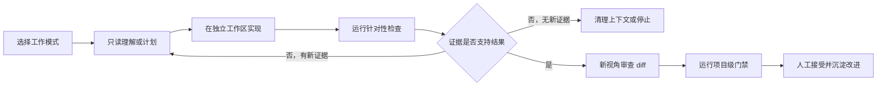

# 02. Coding Agent 实战手册

> 学习目标：不把 Coding Agent 当作“更会聊天的代码生成器”，而是学会准备仓库、选择工作模式、持续纠偏，并用可执行证据验收结果。建议阅读 60～90 分钟。

本文最后核对于 **2026-07-19**。Codex、Claude Code 和 Grok Build 更新很快，涉及命令、权限模式和产品能力时，应再次打开对应官方页面确认。

## 1. 先看结论：效果不只由 Prompt 决定

把 Prompt 写得更长，并不等于 Agent 更可靠。OpenAI、Anthropic 和 SpaceXAI 的当前资料，以及 OpenAI、Stripe、Anthropic 工程人员公开的实践，反复指向四个更重要的条件：

1. **环境可运行**：Agent 能使用正确的构建命令、依赖和工具；
2. **仓库可理解**：入口、约定和架构资料容易找到；
3. **任务可验证**：Agent 能运行测试、构建或可复现检查；
4. **边界可强制**：文件、网络、凭证和外部操作由沙箱与权限控制，而不只写在 Prompt 中。

可以把一次任务的实际效果近似理解为：

```text
任务效果 ≈ 模型能力 × 环境质量 × 上下文质量 × 验证质量 × 人的纠偏
```

任何一项接近零，换一个“神奇 Prompt”通常也救不回来。

为避免把不同强度的资料混在一起，本文使用四种标签：

- **[官方]**：产品官方文档或官方工程文章；
- **[工程案例]**：公开、可追溯的真实项目经验，但不代表普遍效果；
- **[个人经验]**：从业者公开分享，适合作为线索，不应当成实验结论；
- **[外部调查]**：媒体或安全研究者的调查，需要与源码、厂商声明和自己的测试交叉验证；
- **[本文归纳]**：根据多项来源整理出的操作建议，需要在自己的任务上验证。

## 2. 不要从万能模板开始，先选择工作模式

真实使用不是把所有任务都塞进同一个“先分析、再规划、再实现”的大纲。应根据不确定性切换模式。

| 当前任务 | 合适的起点 | 何时进入修改 |
|---|---|---|
| 了解陌生仓库或调用链 | Ask、只读调查 | 形成源码可核对的地图后 |
| 多文件修改，方案不确定 | Plan | 计划覆盖约束、风险和验证后 |
| 小而清楚的局部修改 | 直接实现 | 立即修改并运行针对性检查 |
| 未知原因的 Bug | 只读复现和诊断 | 找到可证伪的候选根因后 |
| 审查已有补丁 | 新会话或独立 reviewer | 通常不再修改，先报告问题 |
| 后台长任务 | 先定义状态文件和完成检查 | 有沙箱、恢复点和自动验证后 |

**[官方]** OpenAI 内部使用 Codex 时，大改动通常先在 Ask Mode 形成实现计划，再进入 Code Mode；但 Claude Code 官方也明确提醒，Plan 会增加开销，简单修改可以跳过。两者并不矛盾：**是否规划取决于方案的不确定性，不取决于任务看起来是否“高级”**。

一个实用判断是：如果你暂时说不清会改哪些模块、有哪些兼容性风险、如何验收，就先调查或计划；如果这些都清楚，直接实现更高效。

## 3. 先把仓库变成 Agent 容易工作的环境

### 3.1 仓库说明应该是地图，不是百科全书

Codex 会读取 `AGENTS.md`，Claude Code 会读取 `CLAUDE.md`。它们最适合保存 Agent **无法稳定从代码推断**、而且会在多个任务中重复使用的信息：

- 仓库结构和关键入口；
- 标准构建、测试、格式化命令；
- 项目特有的设计约束与禁区；
- 可以模仿的参考实现；
- “完成”的项目级定义；
- 更详细文档的链接。

不要把所有架构知识、编码规范和历史决定都复制进去。Claude Code 官方建议保持 `CLAUDE.md` 简短并持续修剪；OpenAI 的 Agent-first 工程案例也报告，巨型 `AGENTS.md` 会失效，后来改为约 100 行的目录，并把仓库内结构化文档作为事实来源。

**[官方源码]** Grok Build 提供了更具体的实现参考：它从仓库根目录到当前目录分层发现 `AGENTS.md`、`CLAUDE.md` 和规则目录，越深的规则越晚进入上下文；`grok inspect` 可以列出实际加载的规则及其近似 token 数。它也会同时加载同一目录中匹配的多个文件，因此不要让 `AGENTS.md` 与 `CLAUDE.md` 各复制一份相互漂移的规则。

可以让两个入口指向同一份共享说明，避免相互矛盾：

```text
AGENTS.md
CLAUDE.md
docs/agent-guide.md       # 共享的构建、测试、约束和文档索引
docs/architecture/        # 架构与模块边界
docs/decisions/           # 重要设计决策
```

### 3.2 给 Agent 可组合的命令

与其在每个 Prompt 中解释十几条命令，不如在仓库中提供稳定入口：

```text
./tools/bootstrap          # 准备环境
./tools/repro ISSUE-123    # 复现已知问题
./tools/test-target parser # 运行针对性测试
./tools/check              # 项目规定的完整检查
```

**[官方]** OpenAI 的 Codex 用例专门建议为内部 API、日志源和团队脚本创建可组合 CLI。OpenAI 内部经验也指出，启动脚本、环境变量和正确依赖会显著减少 Agent 在环境问题上的失败。

命令应有明确退出码，失败时输出可搜索的错误摘要，并把详细日志写入文件。这样 Agent 不必把几万行日志全部塞进上下文。

### 3.3 先做一次 15 分钟校准

第一次把 Agent 接入仓库时，先完成一个很小但完整的任务：

1. 让它只读说明构建入口和目标模块；
2. 让它运行一条标准检查命令；
3. 修复一个小问题或增加一个小测试；
4. 检查它是否读对说明、改对范围、解释对结果；
5. 把反复出现的环境问题修进脚本或仓库说明。

校准失败时先修“Agent 的工作环境”，而不是立即堆更多指令。

## 4. 把任务写成一条可执行的 GitHub Issue

**[官方]** OpenAI 内部 Codex 指南建议像写 GitHub Issue 一样写 Prompt：指出文件路径、组件名、相关 diff、文档片段或参考实现。Claude Code 官方给出的高质量 Prompt 也强调目标症状、可能区域、约束和“修好”的可观察定义。

### 4.1 最有用的六项

```text
目标：最终应出现什么可观察行为？
现状：复现命令、输入和完整错误是什么？
线索：相关路径、接口、文档或参考实现在哪里？
约束：哪些 API、行为、文件或依赖不能改变？
验证：必须运行什么命令，成功应看到什么？
边界：哪些操作需先问我，什么情况必须停止？
```

弱 Prompt：

```text
修复 parser 的问题，确保代码健壮。
```

较好的 Prompt：

```text
修复 src/parser/tokenizer.cc 在读取长度超过 4096 的输入时崩溃的问题。

复现：./tools/repro ISSUE-123；当前在 Clang 18 + Linux x86_64 下退出码为 1。
先阅读 docs/parser-invariants.md，并参考 src/parser/stream_reader.cc 的边界处理。

保持 Tokenizer 公共 API、错误码和正常输入性能不变；不要修改测试或增加依赖。
先复现并定位第一次违反不变量的位置，再做最小修改。

完成前运行：
1. ./tools/test-target tokenizer
2. ./tools/check

报告实际命令、退出码、diff 和未验证项。若无法稳定复现或需要越出
src/parser/，先停止并说明原因。
```

这段指令仍然没有规定具体修法。它提供的是**问题空间、证据入口和验收条件**。

### 4.2 大功能可以先让 Agent 采访你

需求含糊时，不必独自写一大段规格。Claude Code 官方建议让 Agent 使用提问工具澄清实现、界面、边界条件和权衡，生成自包含的 `SPEC.md`，然后在新会话中执行。

可复制指令：

```text
我想实现 <目标>，但规格还不完整。现在只做需求澄清，不修改代码。
阅读相关源码后逐项询问会改变实现方案的问题，包括边界行为、兼容性、
错误处理、性能和验收方式。最后生成一份自包含的 SPEC.md：明确目标、
非目标、示例、约束、开放问题和可执行验收。不要替我猜测未确认的需求。
```

## 5. 执行中最重要的能力是纠偏

### 5.1 一个适合日常开发的循环



### 5.2 及早打断，避免错误上下文滚雪球

- Agent 刚走错模块时立即纠正，不要等它生成大 patch；
- 纠正时补充一条新证据或新约束，不只是重复“再想想”；
- Claude Code 官方建议：连续两次纠正仍没有进展，就清理上下文，用学到的信息重写首条 Prompt；
- 同一任务可以继续会话，不相关任务应使用新会话；
- 长任务把目标、决定、当前状态和下一步写进仓库内状态文件，不只依赖聊天历史。

不要用“思考文字长短”评估过程，也不需要要求模型展示私有思维过程。检查可观察产物：读过哪些文件、运行了什么、证据如何改变假设、diff 是否集中、哪些检查未运行。

### 5.3 让 Agent 说明事实、假设和未知

诊断过程中可以要求短格式汇报：

```text
已确认事实：<源码、日志或工具直接支持>
当前假设：<尚未确认的解释>
反证或缺口：<什么会推翻它>
下一步最小实验：<一条命令或一个观察>
```

这比要求一篇完整“推理过程”更容易核对，也更节省上下文。

## 6. 给 Agent 一面镜子：可执行验证

Claude Code 官方把“给 Claude 验证自己工作的方式”列为最高杠杆实践之一；OpenAI 当前 Codex 用例也把测试、review、评分循环和 UI 视觉检查作为标准工作方式。

### 6.1 验证必须与主张对应

| Agent 的主张 | 至少需要的证据 |
|---|---|
| 能编译 | 指定工具链的构建命令和退出码 |
| 已修复 Bug | 原始复现 + 旧版失败新版通过的定向测试 |
| 没有破坏旧行为 | 项目规定的回归检查 |
| C/C++ 内存问题已修复 | 覆盖目标路径的 ASan、UBSan 或 LSan 运行 |
| UI 已正确实现 | 自动化交互或截图与预期对比 |
| 符合需求 | 逐条需求核对 + 人工领域判断 |

测试通过不等于所有主张都成立。编译器不能证明业务语义，静态分析不能证明所有运行路径，另一个 Agent 的赞同也不是独立验收。

### 6.2 根因在 A、报错在 B 时

C/C++ 常见的传播链是：

```text
A：越界、错误释放或未初始化写入
        ↓
对象或内存状态已经非法，但程序继续运行
        ↓
B：allocator、析构函数或普通读取处检测到问题
```

如果 Agent 只在 B 处增加 `if`、吞掉错误、跳过 `free()` 或关闭 Sanitizer，现象可能消失，但错误仍然存在。

可复制指令：

```text
当前不知道根因。先只读复现和诊断，不修改源码。

寻找第一次状态违反不变量的位置，不要默认最后一条堆栈就是根因。
对候选根因给出：支持证据、反证、一个可证伪实验，以及从错误产生位置
到检测位置的传播链。证据不足就标记未知。

确认后只修复第一次破坏不变量的位置。禁止通过删除检查、吞错、跳过释放、
关闭 Sanitizer 或增加 suppression 获得通过。完成时给出原始复现、根因定向
测试、回归检查、Sanitizer 结果和完整 diff。
```

判断是否真正修复 A：

1. 原始复现由失败变为通过；
2. 测试直接触发 A 处的不变量，而非只检查 B 不再报错；
3. B 原有检查、失败语义和资源清理没有被弱化；
4. 适用的 Sanitizer 与回归测试通过；
5. 临时撤销关键修复后，定向测试重新失败。

第 5 项是反事实检查，用来确认测试真的对关键修复敏感。

### 6.3 写代码和审查代码使用不同视角

Claude Code 官方建议对重要修改使用新的 writer/reviewer 上下文：一个会话实现，另一个新会话根据需求和 diff 找缺口。这样可以减少 reviewer 继承实现者假设的概率。

Reviewer 的重点应是正确性、边界和需求遗漏，而不是为了显示工作量提出样式重构。最终门禁仍应由确定性工具和人工决定。

可复制审查指令：

```text
只审查这个 patch，不修改代码。根据 <需求/issue> 检查正确性、回归、安全性
和越界修改。优先寻找能用具体输入或源码路径证明的问题；不要提出纯样式改进。
区分“已证实缺陷”“需要验证的风险”和“非阻塞建议”，并给出最小复现方式。
```

## 7. 权限要写进运行环境，而不只写进 Prompt

### 7.1 沙箱与审批是两件事

**[官方]** Codex 文档把它们分成两层：沙箱决定技术上能访问哪些文件和网络，审批策略决定何时暂停请求许可。Claude Code 的权限模式同样在模型会话外设置；仅在聊天中说“不要联网”不是等价控制。

个人学习和公开仓库练习可从下面的默认值开始：

| 资源 | 推荐默认值 |
|---|---|
| 文件 | 只写当前工作区或独立 worktree |
| Git | 可读 `status`、`diff`，不自动 commit 或 push |
| 网络 | 默认关闭；确有需要时使用域名 allowlist |
| 凭证 | 不提供；需要时使用测试环境的短期最小权限凭证 |
| 测试与评分 | Agent 可运行，不可弱化；独立评分器不可写 |
| 外部系统 | 发送、发布、部署、数据库写入前人工批准 |

Codex 官方文档显示，本地默认使用操作系统级沙箱，通常将写权限限制在工作区并关闭网络；Claude Code 官方只建议在隔离容器或虚拟机中使用绕过权限模式。

### 7.2 为什么不能靠不断点击“允许”

**[工程案例]** Anthropic 在[权限隔离复盘](https://www.anthropic.com/engineering/how-we-contain-claude)中报告，内部遥测里约 93% 的权限请求被接受，说明用户容易形成审批疲劳；其[沙箱方案](https://www.anthropic.com/engineering/claude-code-sandboxing)在内部把权限提示减少了 84%。这些数字只描述 Anthropic 的环境，但支持一个通用设计原则：**高频、低风险动作由可靠的沙箱策略预先约束，高风险越界动作才请求人批准**。

对以后要迁移到内网 Linux 的练习，建议固定：

- Linux 发行版和架构；
- 编译器、依赖和容器镜像 digest；
- 工作区可写路径；
- 网络策略和可用工具；
- 统一的构建与验收命令。

这既提高可复现性，也便于比较内外网 Agent 的差异。

## 8. 大型仓库的长任务：先建立外部状态，再考虑并行

局部 Bug 可以依靠一个会话内的调用链和测试闭环；跨模块功能常常会超过一次上下文能够稳定承载的范围。问题不只是“模型想得不够久”，而是目标、已确认事实、设计决定、未完成依赖和验证结果混在聊天记录中，压缩或新会话后容易丢失。

### 8.1 把长任务变成可恢复的状态机

**[本文归纳]** 对单 Agent 长任务，至少把五类状态写入仓库内、但不进入最终 patch 的工作文件：

| 状态文件 | 只记录什么 | 更新时机 |
|---|---|---|
| `REPO_MAP.md` | 入口、调用链、所有权、构建和测试位置 | 发现原判断错误或新模块时 |
| `SPEC.md` | 目标、非目标、边界行为和可执行验收 | 需求澄清后，实施前冻结 |
| `DESIGN.md` | 组件改动、接口、清理、错误传播和风险 | 方案变化时 |
| `TASKS.md` | 有依赖关系的小工作包及完成证据 | 每个工作包开始/完成时 |
| `STATUS.md` | 已确认事实、决定、当前工作、失败尝试和下一步 | 上下文压缩、暂停或交接前 |

推荐的单 Agent 流程不是“一次生成完整计划后盲目执行”，而是：

```text
仓库地图 → 可核对规格 → 跨模块设计 → 依赖化工作包
    ↑                                      ↓
    └──── 新证据修正状态 ← 小步实现与定向验证
                                           ↓
                         干净环境集成 + 独立评分
```

每个工作包应有一个可观察完成条件，例如“新的解析数据结构拥有明确清理入口，目标单元测试和 ASan 路径通过”，而不是“实现变量模块”。`STATUS.md` 只保存接手所需的短事实，不复制长日志；命令输出留在日志文件，并记录路径和退出码。

遇到以下情况应停下来重规划，而不是让 Agent 继续堆 patch：

- 规格中的开放问题会改变接口或兼容行为；
- 设计发现新的跨模块依赖，原工作包顺序不再成立；
- 连续两轮没有新增证据，或重复搜索同一批文件；
- 局部测试通过，但从干净目录无法构建或功能未接入最终入口；
- 当前上下文已经无法准确复述约束、已完成项和未验证项。

本仓库的 [curl 长任务实验室](../lab/curl-variable-long-task/README.md) 把这套方法做成可重复环境：同一修复前源码、固定工具链、五个外部状态文件、全新 run、独立黑盒和隐藏测试、Sanitizer 与回归门禁。它适合观察一个 Agent 多会话工作的完整度，不把思考文字长度当成指标。

### 8.2 并行不是默认答案

选择并行方式前先看任务依赖：

| 情况 | 做法 | 主要代价 |
|---|---|---|
| 阶段共享大量上下文、彼此依赖 | 一个主会话顺序完成 | 会话变长 |
| 独立且输出很啰嗦的调查或 review | 子 Agent 隔离上下文 | 额外 token 和汇总成本 |
| 多个互不相交的代码任务 | 多个 worktree 并行 | 合并冲突和环境成本 |
| 大型、可分解且需要动态协调的项目 | Agent team 或编排工作流 | 控制面复杂，费用高 |

Claude Code 官方建议并行改代码时使用 Git worktree，并先用 2～3 个样本验证 Prompt 和流程，再批量扩展。多个会话会成倍增加 token，并且只有真正独立的任务才会缩短墙钟时间。

**[工程案例]** Nicholas Carlini 使用 16 个 Claude Agent 构建 C 编译器时发现，可分解的架构、独立测试和文件边界适合并行；但让所有 Agent 同时解决同一个 Linux 内核阻塞问题没有帮助。并行增加的是搜索宽度，不会自动突破同一个串行瓶颈。

## 9. 六个真实案例告诉了我们什么

### 9.1 OpenAI 内部：像 Issue 一样交任务

**来源类型：官方经验汇总。** OpenAI 工程团队公开建议：

- 把任务缩小到约一小时、几百行代码的量级；
- 大改动先 Ask/Plan，再 Code；
- 给出路径、组件、diff、文档和参考实现；
- 改善启动脚本和开发环境；
- 用 `AGENTS.md` 保存无法从代码推断的项目知识；
- 需要比较多个方案时使用 Best-of-N 候选，而不是接受第一个结果。

这里的“一小时、几百行”是他们的经验尺度，不是硬性标准。应根据仓库测试速度、模块耦合和人的复核能力调整。

### 9.2 OpenAI Agent-first 项目：修地图和工具，而不是只催模型

**来源类型：工程案例。** Ryan Lopopolo 报告，一个小团队在约五个月内让 Agent 生成约百万行代码和约 1500 个 PR。案例最有价值的不是产出数字，而是工程条件：

- 人负责目标、约束和反馈，Agent 执行；
- 失败经常暴露的是环境、工具或文档能力缺口；
- 先建设小而可验证的基础能力，再向上组合；
- 给 Agent 每个 worktree 内可访问的 UI、日志和指标；
- `AGENTS.md` 只做目录，计划与文档成为版本化工件；
- 用 linters、CI 和结构测试机械执行不变量；
- 预留持续清理，避免 Agent 复制仓库中已有的不一致模式。

文章也明确提醒：没有类似的测试、验证、review 和恢复投入，不应直接外推其开发速度。

### 9.3 Anthropic C 编译器：验证器决定自主性的上限

**来源类型：工程案例 + 公开仓库。** Nicholas Carlini 让 16 个并行 Agent、约 2000 个会话构建了约 10 万行的 C 编译器，报告成本约 2 万美元。项目同时公开了[代码仓库](https://github.com/anthropics/claudes-c-compiler)。

可迁移的做法包括：

- 所有 Agent 在容器中运行，不直接使用宿主环境；
- 高质量测试和已知正确的 GCC 作为 oracle；
- 回归出现后持续收紧 CI；
- 控制台只保留短摘要，详细日志写文件，错误便于搜索；
- 使用快速、确定性的样本测试，避免 Agent 在慢测试上耗尽时间；
- 用 delta debugging 缩小失败输入；
- 使用 README 和进度文件让新会话恢复状态。

局限同样重要：仓库 README 明确说该编译器未被人工验证、不建议实际使用；文章还报告了效率低、代码质量低于专家、fallback 和“为了过测试”的行为。这正说明**“测试变绿”是必要条件，不是高风险代码的充分条件**。

### 9.4 Stripe Agent 基准：真实验收必须覆盖端到端行为

**来源类型：大厂工程案例 + 开源仓库。** Stripe 的 2026 年基准构建了 11 个完整环境，使用固定 Agent harness，并用 API 调用、自动化 UI 测试和 Stripe 测试对象组成确定性 grader。公开结果中，有的 Agent 对无效数据得到 400 响应后就误认为接口完成；更成功的运行会先创建有效测试数据再验证。

这个案例给日常开发的启发是：不要只测“某个命令运行过”，而要测用户真正关心的端到端结果。Stripe 已在 [`stripe/ai`](https://github.com/stripe/ai) 仓库公开 `benchmarks/`，可以查看一个生产型 Agent eval 如何组织环境、grader 和执行框架。

### 9.5 Claude Code 创建者：不要为了显得专业而过度定制

**来源类型：个人经验。** Claude Code 创建者 Boris Cherny 在 [X 原帖](https://x.com/bcherny/status/2007179832300581177)中说明，他自己的设置相当接近默认值，而且团队成员的使用方式差异很大，没有唯一正确的配置。

这不能证明“默认配置总是最好”，但提醒我们把自定义当成对已观察问题的修复：先使用、记录摩擦，再添加规则、Skill、Hook 或 MCP；不要一次安装大量扩展，反而消耗上下文并扩大权限面。

### 9.6 SpaceXAI Grok Build：直接研究 Agent harness

**来源类型：官方源码 + 外部安全调查。** SpaceXAI 在 2026-07-15 开源了 [`xai-org/grok-build`](https://github.com/xai-org/grok-build)。这不是模型权重，而是 Rust 编写的 Coding Agent harness、终端界面和运行时。官方仓库把主要责任分成了清楚的层次：

| 源码区域 | 责任 | 对个人学习的意义 |
|---|---|---|
| `xai-grok-pager` | TUI、计划预览、diff 和交互 | 人如何观察和纠偏 Agent |
| `xai-grok-shell` | Agent 循环、会话、headless/ACP 入口 | 模型、工具和观察如何循环 |
| `xai-grok-tools` | 文件、终端、搜索等工具实现 | 工具返回什么证据给模型 |
| `xai-grok-workspace` | 文件系统、Git、执行、checkpoint | 如何把修改、恢复和工作区状态外置 |
| `xai-grok-sandbox` | 文件与网络限制 | 权限为何必须由模型外机制执行 |
| 配置、Hooks、Skills、Plugins | 可复用规则和扩展 | 哪些内容常驻，哪些能力按需加载 |

与只读产品文档相比，源码可以验证几个具体设计：

1. 工具授权不是一句 Prompt，而是 `PreToolUse hook → deny/ask/allow 规则 → 已记忆授权 → 只读自动批准 → 权限模式` 的管线，而且 `deny` 优先；
2. Plan Mode 只允许写会话的 `plan.md`，其他编辑工具会被运行时拒绝，不依赖模型自觉；
3. 会话、compaction、rewind、checkpoint 和 hunk tracking 都是独立状态机制，不只存在聊天文本中；
4. 项目规则、Skills、Plugins、Hooks、MCP 和子 Agent 都有明确的发现与装载代码；
5. 可通过 `config.toml` 指向自定义模型和 `base_url`，因此可以作为内网模型的候选实验 harness。

但这个仓库同样展示了“开源”不等于“默认安全”：

- 仓库 README 说明它只是从 SpaceXAI 单体仓库定期同步的源码快照，并用 `SOURCE_REV` 记录上游版本；公开时只有很短的 Git 历史，而且不接受外部贡献，不能把它当成完整开发历史；
- Grok Build 的 OS 沙箱**默认关闭**。内置 `workspace` profile 仍允许读取系统各处并允许网络，不等于最小权限；
- Plan Mode 只拦截编辑工具，不检查 shell 重定向，写权限子 Agent 也不自动继承父会话的计划编辑门禁，因此 Plan Mode 不能代替只读沙箱；
- Linux 的子进程网络限制不覆盖进程内的模型 API、`web_search` 和 `web_fetch`；macOS 上相应的子进程断网还是 no-op；
- Linux 对 deny glob 的读取隔离只展开启动时已经存在的匹配文件。真正敏感路径应使用精确路径，并用容器或主机级 egress policy 再隔离一层。

**[外部调查]** Axios 在 2026-07-14 报道了 Grok Build 过度上传代码仓库的数据事件。当前开源快照也能看到 trace/upload 相关模块，但仅凭公开源码无法证明某个二进制版本、服务端开关或历史运行实际发送了哪些数据。因此正确结论不是“源码证明所有版本都会泄露”，而是：**把云端 Coding Agent 接到内部代码前，必须测量真实网络行为，不能只阅读隐私说明或本地配置。**

如果以后把它用于内网 Linux 模型测试，建议先做以下受控接入：

1. 固定公开 commit 与 `SOURCE_REV`，从源码构建，不直接使用自动更新的二进制；
2. 把 `base_url` 指向内网推理服务，关闭不需要的 Web、MCP、Plugin 和远端功能；
3. 用 `grok inspect` 保存实际加载的规则、Skills、Plugins、Hooks 和 MCP 清单；
4. 在无外网容器或虚拟机中运行，并叠加 `strict` 或自定义 deny profile；
5. 使用代理日志、DNS/连接审计或主机 egress 规则确认没有未授权外连；
6. 用同一公开任务、同一权限和同一外部评分器比较不同模型，不把 harness 差异误算为模型能力。

这里最值得学习的不是 Grok 的默认 Prompt，而是它如何把上下文、工具、权限、恢复和扩展拆成可检查的工程组件。

建议按下面的顺序阅读固定在本次核对 commit 的源码，避免只在庞大的 Rust workspace 中漫游：

1. [README 与模块边界](https://github.com/xai-org/grok-build/blob/7cfcb20d2b50b0d18801a6c0af2e401c0e060894/README.md)；
2. [项目规则发现](https://github.com/xai-org/grok-build/blob/7cfcb20d2b50b0d18801a6c0af2e401c0e060894/crates/codegen/xai-grok-pager/docs/user-guide/12-project-rules.md)；
3. [Plan Mode](https://github.com/xai-org/grok-build/blob/7cfcb20d2b50b0d18801a6c0af2e401c0e060894/crates/codegen/xai-grok-pager/docs/user-guide/19-plan-mode.md)；
4. [工具授权管线](https://github.com/xai-org/grok-build/blob/7cfcb20d2b50b0d18801a6c0af2e401c0e060894/crates/codegen/xai-grok-pager/docs/user-guide/22-permissions-and-safety.md)；
5. [OS 沙箱及平台差异](https://github.com/xai-org/grok-build/blob/7cfcb20d2b50b0d18801a6c0af2e401c0e060894/crates/codegen/xai-grok-pager/docs/user-guide/18-sandbox.md)；
6. [Session、resume、rewind 与 compaction](https://github.com/xai-org/grok-build/blob/7cfcb20d2b50b0d18801a6c0af2e401c0e060894/crates/codegen/xai-grok-pager/docs/user-guide/17-sessions.md)。

## 10. 一套可直接使用的个人工作流

### 第 1 步：建立任务入口

记录基线 commit 和 `git status`，确认工作区、工具链、权限和标准命令。首次接触仓库时先做只读地图。

### 第 2 步：写 Issue 式 Prompt

写目标、复现或示例、相关路径、关键约束、验证命令和停止条件。只保留会改变结果的信息。

### 第 3 步：按不确定性选择模式

- 不熟悉或方案不确定：Ask/Explore → Plan；
- 任务局部明确：直接 Code；
- 未知 Bug：先诊断再修复；
- 重要 patch：实现和 review 使用不同上下文。

### 第 4 步：边做边验证

先运行最快的定向检查，再运行完整门禁。工具失败要读取退出码和原始输出，不能把“尝试运行”写成“通过”。

### 第 5 步：审查完整 diff

专门检查无关重构、测试弱化、依赖与锁文件变化、错误吞噬、默认成功、权限扩大、API/ABI 变化和调试残留。

### 第 6 步：独立接受

从干净基线应用 patch，重跑项目规定检查。保留命令、退出码、日志、patch hash、未验证项和人工接受决定。

### 第 7 步：沉淀一次改进

复盘这次最浪费时间的摩擦，只选择一个可复用改进：修脚本、补文档、增加测试、添加静态门禁，或缩短一条失效规则。

## 11. 常见误区及替代做法

| 误区 | 为什么会失败 | 替代做法 |
|---|---|---|
| 先写超长万能 Prompt | 关键约束被淹没，仍缺少环境反馈 | Issue 式任务 + 仓库级持久说明 |
| 所有任务强制先计划 | 小任务增加延迟，计划本身也可能错 | 根据方案不确定性选择模式 |
| 把整个仓库知识塞进上下文 | 上下文拥挤，旧信息持续干扰 | 短入口 + 渐进式读取文档 |
| 连续重复“再试一次” | 错误假设留在上下文中累积 | 两次无进展后清理上下文并重写首条指令 |
| Agent 自称通过就接受 | 可能误读日志、漏跑测试或测错对象 | 保存原始命令、退出码和外部重跑结果 |
| 用 reviewer Agent 代替测试 | reviewer 也会幻觉并继承错误假设 | 新视角 review + 确定性门禁 + 人工判断 |
| 为同一阻塞点开很多 Agent | 增加费用，不改变串行依赖 | 先拆分问题或设计新的可证伪实验 |
| 为省提示而开放全部权限 | 扩大 prompt injection 和误操作影响 | 沙箱内自动化，越界动作单独批准 |
| 一次安装大量 Skill/MCP/Hook | 增加上下文、故障点和权限面 | 针对反复出现的摩擦逐个添加并验证 |

## 12. 个人练习与复盘

先选择一个公开仓库中的 30～90 分钟任务，按下面顺序练习一次：

1. 不修改代码，让 Agent 画出相关调用链和验证入口；
2. 自己写一条 Issue 式 Prompt；
3. 让 Agent 在独立工作区完成并运行定向检查；
4. 新开 reviewer 上下文，只提供需求和 diff；
5. 自己从干净状态执行最终命令；
6. 记录哪一条环境、文档或验证改进能帮助下一次任务。

复盘问题：

1. 我选择 Ask、Plan、Code 或 Review 的理由是什么？
2. Agent 失败时，是模型推理问题，还是仓库环境不完整？
3. 哪条 Prompt 信息实际改变了结果，哪些只是噪声？
4. Agent 能否用命令验证自己的关键主张？
5. review 是否发现实现会话忽略的假设？
6. 权限限制是否由系统强制，而非只靠文字？
7. 下一次应修改 Prompt、仓库说明、工具还是测试？

下一步打开 [03：个人实践](03_personal_practice.md)，使用标准任务把本章流程完整运行一遍。

完成局部修复练习后，再进入 [curl 长任务实验室](../lab/curl-variable-long-task/README.md)。重点不是追求一次通过，而是检查：新会话能否仅凭状态文件准确恢复、各工作包是否有实际完成证据、独立评分是否暴露了 Agent 自报完成与真实集成之间的差距。

## 13. 来源与证据边界

| 来源 | 类型 | 本文使用的内容 |
|---|---|---|
| OpenAI, [How OpenAI uses Codex](https://openai.com/business/guides-and-resources/how-openai-uses-codex/) | 官方经验 | Ask/Code 切换、任务粒度、Issue 式 Prompt、环境和 `AGENTS.md` |
| OpenAI, [Harness engineering](https://openai.com/index/harness-engineering/) | 工程案例 | 短入口文档、渐进披露、可观测性、机械约束和案例边界 |
| OpenAI, [Prompting Codex](https://learn.chatgpt.com/docs/prompting#use-editor-context) | 官方文档 | 目标、上下文、边界、验证和会话纠偏 |
| OpenAI, [Agent approvals & security](https://learn.chatgpt.com/docs/agent-approvals-security) | 官方文档 | OS 沙箱、审批策略、网络与工作区默认值 |
| OpenAI, [Codex use cases](https://developers.openai.com/codex/use-cases) | 官方文档与演示入口 | 代码理解、迁移、review、QA、CLI 和评分循环示例 |
| Anthropic, [Claude Code best practices](https://code.claude.com/docs/en/best-practices) | 官方文档 | 验证、Explore-Plan-Code、上下文控制、`CLAUDE.md`、新会话 review |
| Anthropic, [Common workflows](https://code.claude.com/docs/en/common-workflows) | 官方文档 | 任务配方、恢复会话、worktree 和研究子 Agent |
| Anthropic, [Run agents in parallel](https://code.claude.com/docs/en/agents) | 官方文档 | 子 Agent、并行会话、Agent team 与 token 代价 |
| Anthropic, [Permission modes](https://code.claude.com/docs/en/permission-modes) | 官方文档 | 权限模式及隔离环境要求 |
| Anthropic, [How we contain Claude](https://www.anthropic.com/engineering/how-we-contain-claude) | 工程案例 | 权限审批疲劳与外部隔离的必要性 |
| Anthropic, [Claude Code sandboxing](https://www.anthropic.com/engineering/claude-code-sandboxing) | 工程案例 | 审批疲劳与沙箱数据 |
| Anthropic, [Building a C compiler](https://www.anthropic.com/engineering/building-c-compiler) | 工程案例 | 并行、测试、日志、oracle、成本和局限 |
| GitHub, [anthropics/claudes-c-compiler](https://github.com/anthropics/claudes-c-compiler) | 公开仓库 | C 编译器代码、README 中的未验证声明 |
| Stripe, [Can AI agents build real Stripe integrations?](https://stripe.com/blog/can-ai-agents-build-real-stripe-integrations) | 工程案例 | 完整环境、确定性 grader、端到端验证和失败案例 |
| GitHub, [stripe/ai](https://github.com/stripe/ai) | 公开仓库 | `benchmarks/`、工具与 Agent 集成实例 |
| Boris Cherny, [Claude Code setup thread](https://x.com/bcherny/status/2007179832300581177) | 个人经验 | 无唯一正确配置、避免无依据的过度定制 |
| SpaceXAI, [Grok Build is Now Open Source](https://x.ai/news/grok-build-open-source) | 官方公告 | 开源范围、local-first 与扩展系统 |
| GitHub, [xai-org/grok-build](https://github.com/xai-org/grok-build) | 官方源码 | Agent 循环、规则发现、计划、权限、沙箱、会话和扩展实现 |
| SpaceXAI, [Grok Build docs](https://docs.x.ai/build/overview) | 官方文档 | 本地构建、headless/ACP、自定义模型和 `grok inspect` |
| Axios, [Hackers embrace AI](https://www.axios.com/newsletters/axios-future-of-cybersecurity-9168e100-7af2-11f1-bc32-bbfb768a7518) | 外部调查 | 2026-07 代码上传事件；需与源码和网络实测交叉验证 |

案例中的产出规模、成功率、成本和内部遥测只能说明相应团队在特定模型、工具、仓库与时间点的结果。本文从中提取的是可测试的工作假设，不把这些数字当作对当前模型或你的内网环境的保证。
