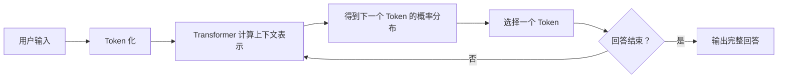

# 大语言模型为什么会产生幻觉，以及如何降低幻觉的影响

> 适用场景：软件部门内部 AI 培训
> 目标听众：普通软件工程师
> 建议时长：极简版 20 分钟；标准版 30 分钟；完整版 60～75 分钟
> 使用边界：案例均为通用或虚构内容，不包含公司源码、日志、接口、芯片型号及内部架构

---

## 一、培训目标

完成本节后，听众应当能够：

1. 用通俗语言解释什么是大语言模型幻觉。
2. 从 Transformer、训练目标和文本生成过程理解幻觉为何难以完全消除。
3. 识别软件研发中常见的幻觉类型。
4. 使用提示词、资料约束、工具验证和流程设计降低幻觉造成的影响。
5. 明确外部 AI 工具的使用边界，不以“提高准确率”为由输入公司敏感信息。

### 建议开场

可以先问大家：

> 如果一段回答逻辑完整、术语准确、语气非常自信，我们通常会不会下意识认为它是正确的？

LLM 最需要警惕的地方，恰恰不是它偶尔说出明显荒谬的话，而是它能够非常流畅地表达一个错误答案。

---

## 二、什么是 LLM 幻觉

LLM 幻觉通常指：模型生成了缺乏依据、与事实不符、与给定材料矛盾，或者无法由现有信息推出的内容，却把它表达得像一个可信答案。

软件研发中的典型表现包括：

- 编造不存在的 API、类、命令或参数。
- 混用不同版本的软件接口。
- 声称引用了某份标准或文档，但章节并不存在。
- 根据有限日志直接断言唯一根因。
- 生成无法编译、存在越界或资源泄漏的代码。
- 声称“测试已经通过”，但模型实际上没有执行测试。
- 忽略用户给出的约束，随后自行补充一个看似合理的实现条件。

### 幻觉不完全等于“胡说八道”

下面几类问题需要区分：

| 类型 | 含义 | 示例 |
|---|---|---|
| 事实性幻觉 | 陈述了错误或不存在的事实 | 编造 `std::scheduler` |
| 上下文幻觉 | 与用户提供的材料或约束矛盾 | 要求 C++17，却使用 C++20 接口 |
| 推理错误 | 已知信息正确，但推导过程错误 | 错误计算结构体对齐后的大小 |
| 信息缺失 | 答案没有覆盖关键情况 | 调度器未处理任务取消时的资源释放 |
| 需求误解 | 对模糊需求作了错误假设 | 把“超时”理解为执行前超时，而不是执行超时 |

培训中可以把这些问题统称为“幻觉风险”，但在排查时应区分原因，因为对应的治理方法不同。

---

## 三、LLM 是怎样生成回答的

### 3.1 从文字到 Token

模型不会直接理解完整句子。输入首先会被切分成 Token。Token 可能是一个词、词的一部分、一个符号或一段常见字符。

代码同样会被 Token 化，例如类型名、标识符、括号和运算符都会成为模型处理的序列元素。模型看到的是 Token 之间的统计关系，而不是编译器所拥有的抽象语法树、类型系统和执行语义。

设输入经过分词后得到 Token 序列：

$$
x_1,x_2,\ldots,x_n
$$

每个 Token ID 会通过嵌入矩阵映射为向量，再加入位置信息：

$$
h_i^{(0)}=E[x_i]+P_i
$$

其中，$E[x_i]$ 是 Token 嵌入，$P_i$ 是位置编码或位置嵌入。此时的 $h_i^{(0)}$ 不是一个可直接阅读的“词义表”，而是一个高维数值向量。模型后续通过多层计算不断更新它。

对软件工程师而言，这里有两个值得注意的结果：

1. 相似的名称和代码模式在表示空间中可能具有相近关系，因此模型擅长模仿 API 风格。
2. Token 序列并不自带编译器语义，因此“形式很像正确代码”不等于类型、生命周期和并发行为正确。

### 3.2 Transformer 在做什么

Transformer 的核心机制之一是自注意力（Self-Attention）。它允许模型在处理当前 Token 时，根据上下文判断其他 Token 的相关程度。

例如，对于下面的需求：

```text
实现一个支持优先级和取消操作的任务调度器。
取消只对尚未执行的任务有效。
```

生成取消逻辑时，注意力机制可以让模型关联前面“尚未执行”这个限制。多层 Transformer 会逐步形成对语法、语义、模式和上下文关系的内部表示。

#### Query、Key、Value 的计算

对某一层的输入矩阵 $X$，模型通过训练得到的参数矩阵产生 Query、Key 和 Value：

$$
Q=XW_Q,\qquad K=XW_K,\qquad V=XW_V
$$

缩放点积注意力的核心公式是：

$$
\operatorname{Attention}(Q,K,V)
=\operatorname{softmax}\left(\frac{QK^T}{\sqrt{d_k}}+M\right)V
$$

其中：

- $QK^T$ 衡量当前位置的 Query 与其他位置 Key 的匹配程度；
- $\sqrt{d_k}$ 用于缩放，避免维度增大时点积过大导致 Softmax 过度饱和；
- $M$ 是掩码。自回归模型使用因果掩码，使当前位置不能看到未来 Token；
- Softmax 将分数转换为归一化权重；
- 权重与 $V$ 加权求和，形成当前 Token 的上下文表示。

多头注意力让不同的注意力头在不同表示子空间中计算：

$$
\operatorname{MultiHead}(Q,K,V)
=\operatorname{Concat}(head_1,\ldots,head_H)W_O
$$

一个头可能更关注语法结构，另一个头可能更关注标识符之间的关联。但不应把某个注意力权重简单解释为模型的完整“思考原因”：注意力只是网络计算的一部分，后面还有残差连接、归一化、前馈网络以及多层组合。

上述结构来自 Vaswani 等人的 Transformer 原始论文 [*Attention Is All You Need*](https://arxiv.org/abs/1706.03762)。现代 LLM 的具体结构可能使用不同的位置编码、归一化顺序、激活函数或注意力优化，但核心思想仍然相通。

但是，自注意力并不是：

- 数据库查询；
- 事实核验器；
- 编译器；
- 程序执行器；
- 对现实世界的直接观察。

它主要帮助模型判断上下文中的哪些部分与当前生成有关，并不能保证被关联的信息本身正确。

### 3.3 自回归生成：一次预测一个 Token

生成回答时，模型根据已有上下文计算下一个 Token 的条件概率。一个长度为 $T$ 的序列，其联合概率可按链式法则分解为：

$$
p_\theta(x_1,\ldots,x_T)
=\prod_{t=1}^{T}p_\theta(x_t\mid x_1,\ldots,x_{t-1})
$$

预训练时常见的目标是最小化下一个 Token 的负对数似然，也就是交叉熵损失：

$$
\mathcal{L}_{\text{NLL}}(\theta)
=-\sum_{t=1}^{T}\log p_\theta(x_t\mid x_{<t})
$$

这个目标会奖励模型给训练文本中的下一个 Token 分配更高概率。它并没有直接包含一个逐句调用的“事实是否真实”函数，也没有要求每个陈述必须附带可核查来源。GPT-3 等模型属于自回归语言模型；可参考 Brown 等人的 [*Language Models are Few-Shot Learners*](https://arxiv.org/abs/2005.14165)。

选择一个 Token 后，它会被加入上下文，模型再预测下一个 Token。这个过程不断重复，最终形成完整回答。



关键点是：模型在优化“接下来什么文字最合理”，而不是在每生成一句话前自动执行“这句话是否真实”的检查。

#### 从隐藏状态到下一个 Token

最后一层隐藏状态经过输出投影得到每个候选 Token 的 Logit：

$$
z=W_{out}h_t+b
$$

再通过 Softmax 转换为概率。引入温度 $\tau$ 后：

$$
p_i(\tau)=\frac{\exp(z_i/\tau)}{\sum_j\exp(z_j/\tau)}
$$

- $\tau<1$ 会让概率分布更尖锐，输出通常更稳定；
- $\tau>1$ 会让概率分布更平坦，候选输出更丰富；
- Top-k 或 Top-p 采样还会先限制候选集合，再进行选择。

温度控制的是候选 Token 的相对概率，不会把错误知识自动改成正确知识。如果错误 Token 本来就是最高概率，贪心解码或低温度可能稳定地重复错误。

#### 自回归误差会向后传播

生成阶段中，模型会把自己刚刚输出的 Token 当成下一步输入。若前面引入了错误的 API 名称或错误假设，后续 Token 往往会围绕它继续构造参数、示例和解释，于是一个小错误可能扩展成一段内部连贯但整体错误的回答。

### 3.4 训练过程提供了什么能力

一个简化的理解是：

1. **预训练**：从大量文本和代码中学习语言规律、知识关联及常见代码模式。
2. **指令微调**：学习按照用户指令组织回答。
3. **偏好对齐**：让回答更有帮助、更清晰、更符合人类偏好和安全要求。

这些过程使模型更善于回答问题，但并不会自然地把模型变成一个始终可靠的事实数据库。

偏好对齐还带来一个需要注意的现象：模型通常被鼓励积极帮助用户。当信息不足时，“尽力给出答案”的倾向可能与“谨慎承认不知道”发生冲突。

指令微调和基于人类反馈的对齐方法可参考 Ouyang 等人的 [*Training Language Models to Follow Instructions with Human Feedback*](https://arxiv.org/abs/2203.02155)。应谨慎理解这篇论文与幻觉的关系：它说明如何改善指令遵循和人类偏好，并不意味着对齐训练自动保证每个事实正确。

一种简化的偏好优化理解是，在提高人类偏好奖励的同时，约束新策略不要偏离原始模型过远：

$$
\max_\theta\ \mathbb{E}[r_\phi(x,y)]
-\beta D_{KL}\left(\pi_\theta(\cdot\mid x)\|\pi_{ref}(\cdot\mid x)\right)
$$

这里的奖励模型学习的是人类对回答的偏好信号。若评价者偏爱流畅、完整和积极作答的内容，而没有充分核验事实，偏好信号与事实正确性之间仍可能存在差距。

### 3.5 为什么“概率高”不等于“事实真”

可以用一个工程类比理解：语言模型更像一个极强的“模式补全器”，而不是带有完备规格库和编译执行环境的证明器。

$$
\underset{\text{模型擅长估计}}{p(\text{某段文字会怎样继续})}
\neq
\underset{\text{用户真正关心}}{p(\text{这段陈述在现实中为真})}
$$

两者会高度相关，因为训练语料中有大量正确知识；但它们不是同一个量。TruthfulQA 的研究还表明，模型可能学习并复现人类文本中常见的错误观念，说明“更像训练分布”并不天然等于“更真实”。参见 Lin 等人的 [*TruthfulQA: Measuring How Models Mimic Human Falsehoods*](https://aclanthology.org/2022.acl-long.229/)。

### 3.6 推荐的动画与交互演示

培训现场建议使用交互式可视化，而不是直接转载他人的 GIF。这样既便于逐步讲解，也减少版权和清晰度问题。

1. [Transformer Explainer](https://poloclub.github.io/transformer-explainer/)：由 Georgia Tech 与 IBM Research 研究人员开发，可逐步观察 Token、嵌入、自注意力、各层计算、下一个 Token 概率和温度变化。适合现场演示 5～8 分钟；其设计论文见 [Cho et al., 2024](https://arxiv.org/abs/2408.04619)。
2. [Langsplain](https://langsplain.com/)：覆盖分词、嵌入、注意力、训练损失、采样和自回归生成，适合听众课后自行探索。
3. [Dodrio](https://poloclub.github.io/dodrio/)：Georgia Tech 的 Transformer 注意力交互分析工具，适合希望进一步理解多头注意力的听众。

演示建议：输入一个不完整句子，先观察模型给不同候选 Token 的概率；再调整温度，比较概率分布与输出变化。需要提醒听众：可视化用于理解计算流程，不代表可以仅凭注意力图解释模型全部决策。

---

## 四、幻觉为什么会产生

NIST 在生成式 AI 风险管理文件中使用“Confabulation”描述模型自信地产生错误内容，并指出这种风险与生成模型逼近训练数据统计分布的设计方式有关。参见 [NIST AI 600-1：Generative AI Profile](https://doi.org/10.6028/NIST.AI.600-1)。关于幻觉的分类、数据因素、训练因素和推理因素，可进一步参考 Ji 等人发表于 ACM Computing Surveys 的 [*Survey of Hallucination in Natural Language Generation*](https://doi.org/10.1145/3571730)。

需要避免一个过度简化的说法：“只因为模型预测下一个 Token，所以必然幻觉。”更准确的表述是：**训练目标、数据质量、知识表示、上下文、解码方式和用户交互共同造成了事实性目标与语言建模目标之间的错位**。

### 原因一：训练目标不直接等于事实正确

语言上最可能出现的内容，不一定是事实上的正确答案。

如果许多库都采用相似的命名方式，模型可能按照命名规律生成一个“非常像真的”API。它在语言模式上可能是合理的，在真实库中却不存在。

从损失函数看，只要某个 API 名称在当前上下文中具有较高语言概率，模型就可能选择它；模型不会因为这个字符串无法链接或不存在于标准文档中而自动受到编译器式惩罚，除非训练、工具调用或反馈环节显式提供了这类信号。

### 原因二：模型拥有的是参数化知识，不是完整资料库

模型把训练中学到的规律分散地编码在参数中。它通常不能像数据库那样准确指出一条知识来自哪里，也不保证完整保留每个 API 签名、版本差异或标准条款。

当记忆不完整时，模型可能根据相似模式补齐缺失部分。

RAG 原始论文把预训练模型参数称为“参数化记忆”，并指出其在精确访问、更新知识和提供来源方面存在局限。参见 Lewis 等人的 [*Retrieval-Augmented Generation for Knowledge-Intensive NLP Tasks*](https://arxiv.org/abs/2005.11401)。

### 原因三：问题缺少必要上下文

例如：

```text
请实现一个线程安全的任务队列。
```

这里至少缺少：

- 单生产者还是多生产者；
- 队列是否有界；
- 满队列时阻塞还是返回失败；
- 关闭时如何唤醒等待线程；
- 是否允许异常；
- 使用哪个 C++ 标准。

如果用户没有说明，模型只能询问、列出假设或自行补充。自行补充错误时，就可能形成幻觉或需求偏差。

### 原因四：训练资料存在冲突、空白或时效差异

不同资料可能对应：

- 不同版本的标准或软件库；
- 不同平台和编译器；
- 已废弃和当前有效的接口；
- 正确示例和错误示例。

模型可能将它们混合，形成一个单独看每一部分都眼熟、组合起来却不能工作的答案。

训练语料中的系统性错误也可能被模型学到。TruthfulQA 专门使用容易诱发人类错误观念的问题进行评估，实验说明模型可能模仿训练文本中的常见错误，而不是自动过滤它们。

### 原因五：采样过程具有不确定性

模型通常不是永远选择概率最高的 Token，而是按照一定策略从候选 Token 中选择。温度等参数会影响输出的随机性和多样性。

- 较高温度通常增加多样性，也可能增加偏离事实的风险。
- 较低温度通常使输出更稳定，但不能保证正确。

即使温度为零或接近零，模型仍可能稳定地输出同一个错误答案。因此，降低温度是控制手段之一，不是事实保证机制。

从温度公式可以看出，降低温度只会放大 Logit 之间已有的相对差异。如果排名第一的 Token 就是错误候选，低温度反而会让它更稳定地被选择。

### 原因六：长上下文中的信息竞争

当输入包含大量代码、日志和要求时，模型可能：

- 忽略较早出现的约束；
- 混淆名称相近的变量；
- 把不同文件的逻辑错误拼接；
- 抓住显眼但不关键的信息；
- 在多轮对话中继承先前的错误假设。

提供上下文的原则不是“越多越好”，而是“相关、完整、结构清晰”。

### 原因七：用户的提问方式迫使模型给出确定结论

例如：

```text
请给出这个故障的唯一根因，不要回答信息不足。
```

如果材料不足，这类要求会鼓励模型把推测包装为结论。更合理的要求是列出候选原因、依据和验证方法。

HaluEval 的实验表明，LLM 不仅会生成不可验证内容，也难以可靠识别生成文本中的幻觉；研究同时观察到，提供外部知识或增加推理步骤能够改善识别表现。参见 Li 等人的 [*HaluEval*](https://aclanthology.org/2023.emnlp-main.397/)。这也说明“让模型自己检查”可以成为一道防线，但不应是唯一防线。

---

## 五、三个软件研发案例

### 案例一：编造不存在的 C++ API

#### 第一轮提问

```text
请使用 C++17 的 std::scheduler 实现一个支持优先级的任务调度器。
```

风险点：C++17 标准库中不存在名为 `std::scheduler` 的标准类型。模型可能正确指出问题，也可能根据 `std::thread`、执行器或其他库的模式编造接口。

#### 改进后的提问

```text
请先核实 C++17 标准库中是否存在 std::scheduler。

回答时请区分：
1. C++17 标准库明确提供的能力；
2. 需要自行实现的能力；
3. 需要查阅官方资料确认的内容。

在完成核实前，不要生成实现代码，也不要编造替代接口。
```

#### 验证方式

1. 查阅对应标准或权威实现文档。
2. 使用目标编译器编译最小示例。
3. 不用另一次自然语言回答代替文档与编译结果。

#### 讲解重点

“请再确认一次”可能只会得到语气更坚定的错误答案。可靠性来自外部证据，而不是模型的自信程度。

---

### 案例二：生成可以编译但存在缺陷的 C++ 代码

假设让模型实现一个通用任务队列，它可能生成类似代码：

```cpp
class TaskQueue {
public:
    void push(std::function<void()> task) {
        std::lock_guard<std::mutex> lock(mutex_);
        tasks_.push(std::move(task));
        cv_.notify_one();
    }

    std::function<void()> pop() {
        std::unique_lock<std::mutex> lock(mutex_);
        cv_.wait(lock, [this] { return !tasks_.empty(); });
        auto task = std::move(tasks_.front());
        tasks_.pop();
        return task;
    }

private:
    std::queue<std::function<void()>> tasks_;
    std::mutex mutex_;
    std::condition_variable cv_;
};
```

代码可能可以编译，但仍有需求和设计风险：

- 没有关闭状态，等待线程可能永远无法退出。
- 没有定义销毁对象时等待线程的行为。
- 没有容量限制，持续写入可能导致内存增长。
- 没有定义空任务是否有效。
- `pop()` 无法表达关闭、超时或取消。
- “线程安全”只描述了数据竞争问题，没有覆盖完整生命周期。

#### 改进策略

不要直接要求完整代码，先让模型完成需求审查：

```text
在编写代码前，请列出实现线程安全任务队列必须明确的需求。
至少覆盖：容量、阻塞行为、关闭流程、对象生命周期、异常处理和返回值设计。

请将内容分为：
- 已明确需求；
- 当前假设；
- 需要用户确认的问题。
```

#### 讲解重点

幻觉风险不只包括“API 不存在”。模型也可能生成局部正确、整体设计不完整的代码。这类问题更隐蔽，因为编译通过容易让人放松警惕。

---

### 案例三：根据日志过早断言根因

使用一段完全虚构的日志：

```text
10:15:02 scheduler: task 42 start
10:15:05 worker: timeout waiting for response
10:15:05 scheduler: task 42 failed, code=-7
10:15:06 cleanup: resource release delayed
```

不良提问：

```text
请告诉我任务失败的根本原因。
```

模型可能断言：网络故障、锁竞争、工作线程阻塞或资源泄漏。但日志只能证明“等待响应超时”发生了，无法单独证明为什么超时。

改进后的提问：

```text
请分析以下虚构日志，不要将相关性直接解释为因果关系。

请输出：
1. 日志能够直接证明的事实；
2. 最多三个候选原因；
3. 每个候选原因的支持证据和反对证据；
4. 为验证每个原因还需要收集什么信息；
5. 建议的排查顺序。

如果无法确定根因，请明确写出“现有信息不足以确定根因”。
```

#### 讲解重点

模型更适合帮助提出假设和设计排查路径，而不是替代工程师根据运行证据作出最终判断。

---

## 六、降低幻觉影响的方案

幻觉无法仅靠一句“不要产生幻觉”彻底消除。更可靠的方法是建立多层防线。


### 研究依据概览

| 方法 | 代表性研究或权威依据 | 研究支持的结论 | 不能推出的结论 |
|---|---|---|---|
| 检索增强生成 | [RAG，Lewis et al., 2020](https://arxiv.org/abs/2005.11401) | 在论文评估的知识密集任务上，检索增强模型比纯参数化基线生成了更具体、更多样且更事实化的文本 | 接入知识库后不会再幻觉 |
| 外部证据与修订 | [RARR，Gao et al., ACL 2023](https://aclanthology.org/2023.acl-long.910/) | 搜索证据并修订不受支持的陈述，可以改善输出的可归因性 | 搜索结果和修订过程一定正确 |
| 多次采样一致性检查 | [SelfCheckGPT，Manakul et al., 2023](https://arxiv.org/abs/2303.08896) | 在其 WikiBio 评估中，事实性内容的多次采样通常更一致，幻觉内容更容易分歧 | 多次回答一致就能证明事实正确 |
| 验证链 | [Chain-of-Verification，Dhuliawala et al., 2023](https://arxiv.org/abs/2309.11495) | 先生成、再规划验证问题、独立回答并重写，在论文多类任务中减少了幻觉 | 同一模型的自我检查可替代外部证据 |
| 工具调用 | [Toolformer，Schick et al., 2023](https://arxiv.org/abs/2302.04761) | 语言模型可以学习在合适位置调用搜索、计算器等外部工具，并改善多项任务表现 | 工具参数、工具结果解释一定正确 |
| 代码执行反馈 | [OpenCodeInterpreter，Zheng et al., Findings of ACL 2024](https://aclanthology.org/2024.findings-acl.762/) | 将代码执行和反馈用于迭代改进，在相关代码基准上提升了表现 | 模型自行生成的测试足以证明实现正确 |
| 自我置信与校准 | [Language Models (Mostly) Know What They Know，Kadavath et al., 2022](https://arxiv.org/abs/2207.05221) | 特定设置下，模型的自我评估具有一定校准能力；跨任务泛化仍有困难 | 模型口头说“90% 确定”就是可靠概率 |
| 组织级风险管理 | [NIST AI 600-1，2024](https://doi.org/10.6028/NIST.AI.600-1) | 应根据应用情境对生成式 AI 风险进行治理、测量和管理 | 存在一项能消除所有风险的单点技术 |

表中的方法来自不同模型、数据集和评估设置，不能直接把论文中的提升幅度套用到本公司的任务。培训时应使用“研究显示在特定实验中有效”，避免说“研究证明该方法总能防止幻觉”。

### 方案一：改善输入质量

这是成本最低的实践控制：减少歧义、限定版本和输出结构，可以减少模型自行补全未知条件的空间。它并不是事实保证机制。HaluEval 的实验为“外部知识和额外推理步骤有助于幻觉识别”提供了研究证据，但不能据此推导出某个固定提示词在所有任务上都有效。

提示词至少应包含：

- **背景**：这是一个什么类型的通用问题；
- **任务**：希望模型完成什么；
- **环境**：语言版本、系统、编译器和可用依赖；
- **约束**：允许和禁止的实现方式；
- **输出格式**：代码、表格、步骤或测试清单；
- **不确定性要求**：信息不足时如何处理。

通用模板：

```text
角色：你是一名熟悉 C++17 的软件工程师。

背景：以下任务为完全虚构的通用编程练习，不涉及真实项目。

任务：设计一个单线程、支持优先级和取消操作的任务调度器。

环境：
- C++17
- Linux
- 仅使用标准库

约束：
- 取消只对尚未执行的任务有效
- 不使用全局变量
- 明确对象销毁时的行为

回答要求：
1. 先复述需求并指出歧义；
2. 区分已知事实、设计假设和待确认项；
3. 确认需求后再给出接口与实现；
4. 给出边界测试和已知限制；
5. 不确定时明确说明，不要编造 API。
```

### 方案二：把事实、推测和建议分开

可以固定要求模型使用以下结构：

```text
请将回答分为：
- 已知事实：能够直接从输入材料得出的内容；
- 合理推测：可能成立但尚未验证的判断；
- 待验证项：需要通过文档、编译、测试或更多信息确认的内容；
- 行动建议：下一步如何获得证据。
```

这不会让模型自动变得正确，但能降低用户把推测误当事实的概率。

这种结构化输出主要属于风险沟通和人工复核设计，而非独立的事实校验算法。Kadavath 等人的研究说明模型在特定格式下能够进行一定程度的自我评估，但也明确观察到跨任务校准困难。因此，“模型标记为事实”仍需要证据。

### 方案三：先澄清需求，再生成实现

推荐工作顺序：

1. 让模型复述需求。
2. 让模型列出歧义和隐含假设。
3. 人工确认关键选择。
4. 先生成接口和测试场景。
5. 再生成最小实现。
6. 最后进行独立审查和实际验证。

需求还没说清楚时，生成越多代码，后续返工越大。

### 方案四：要求证据，但不要虚构引用

可以要求模型：

- 指出结论来自用户材料的哪个部分；
- 对公开 API 给出需要核查的官方文档名称；
- 对无法确认的内容标记为待验证；
- 不生成无法核实的章节号、链接或引用。

需要注意：模型给出的引用本身也可能是幻觉，引用必须实际打开并检查。

RARR 的研究思路是先为生成内容寻找外部归因，再对缺乏支持的内容进行修订。对日常使用可借鉴为：把回答拆成可核查陈述，逐条找到真实来源，再决定保留、修改或删除。

### 方案五：使用外部工具形成证据闭环

对于代码输出，至少考虑：

- 编译器及高等级警告；
- 单元测试和边界测试；
- 静态分析；
- 格式化和类型检查；
- 内存、线程及未定义行为检查工具；
- 目标语言或库的官方文档。

推荐原则：

> AI 提出候选方案，工具产生可重复的证据，工程师作出最终判断。

模型说“代码应该可以编译”，不等于代码已经编译；模型说“测试应该通过”，不等于测试已经执行。

Toolformer 和 OpenCodeInterpreter 等工作支持一个共同方向：让模型利用搜索、计算器、解释器或执行反馈，能够弥补纯文本生成的部分局限。对软件工程而言，编译器和测试结果比模型自我描述更接近可重复证据。

但工具闭环仍有三类残余风险：

1. 模型可能调用错误工具或传入错误参数；
2. 测试本身可能由模型生成，因而与实现共享同一误解；
3. 测试通过只说明覆盖到的行为符合断言，不说明需求完整或没有未覆盖缺陷。

### 方案六：进行独立的反向审查

第一轮生成完成后，可以开启新的对话或清除原有结论，让模型以审查者身份工作：

```text
你现在是独立代码审查者。不要假设以下实现正确，也不要继续替作者辩护。

请重点检查：
- API 是否真实存在并适用于指定版本；
- 编译错误和类型错误；
- 生命周期与资源释放；
- 越界、整数溢出和未定义行为；
- 并发竞争和死锁；
- 异常路径；
- 实现与需求不一致之处；
- 缺失的测试。

每个问题请给出：位置、触发条件、影响和验证方法。
无法确认时请标记为待验证。
```

独立审查仍然不能替代工具验证，但能帮助发现第一轮生成中未被注意的风险。

Chain-of-Verification 提出了一套更严格的自检顺序：先生成初稿，再规划核验问题，随后尽量独立地回答这些问题，最后重写答案。关键点是“独立核验”，避免验证步骤直接照抄初稿中的错误。

可以把它改写为工程流程：

```text
初版设计或代码
    ↓
生成独立检查问题
    ↓
不参考初版结论，分别核对 API、边界和生命周期
    ↓
结合编译、测试和官方资料修订
```

### 方案七：控制生成随机性

如果所用工具允许配置温度，可以在事实提取、代码转换等任务中使用较低的随机性，让输出更加稳定。

但必须明确：

- 低温度不等于低错误率；
- 稳定输出可能只是稳定地重复同一个错误；
- 需要创意时，过低温度还可能限制候选方案。

反过来，也可以有意识地提高随机性并多次采样，用于发现答案是否稳定。SelfCheckGPT 的核心直觉是：如果模型真正掌握某项事实，多次采样往往更一致；缺乏知识时，回答更容易互相矛盾。

不过，一致性只能作为风险信号：训练数据中的流行谬误或模型的稳定错误，也可能在每次回答中保持一致。

### 方案八：在允许的环境中使用检索增强

如果未来公司提供合规的内部 AI 环境，可以考虑检索增强生成（RAG）：回答前先从批准的文档库中检索相关资料，再要求模型基于检索结果回答。

RAG 的基本概率形式可以写为：

$$
p(y\mid x)=\sum_{z\in\mathcal{Z}}p_\eta(z\mid x)\,p_\theta(y\mid x,z)
$$

其中 $x$ 是问题，$z$ 是检索到的文档，$p_\eta(z\mid x)$ 是检索器给文档的相关概率，$p_\theta(y\mid x,z)$ 是生成器在问题与文档条件下产生答案的概率。它把一部分事实依据从难以更新的模型参数转移到可管理的外部文档中。

RAG 可以降低模型仅凭参数记忆回答的风险，但仍不能彻底消除幻觉：

- 可能检索到错误或过期文档；
- 可能没有检索到关键内容；
- 模型可能误读检索结果；
- 多份资料可能互相冲突。

因此仍需版本管理、资料权限、引用展示和人工核验。

在当前只能于工作环境之外使用 AI 的情况下，不应把内部资料复制到外部工具中建立所谓“临时 RAG”。

### 方案九：按后果而不是按“幻觉概率”设计流程

工程上不必先精确知道某次回答产生幻觉的概率，才能采取控制措施。可以按照错误输出造成的后果决定验证强度：

- 低影响输出采用快速人工检查；
- 通用脚本必须在虚构数据上运行；
- 并发、内存和接口代码必须编译、测试并审查；
- 高后果决策不允许由外部 AI 独立完成。

这与 NIST AI 风险管理框架的思路一致：风险不仅取决于错误发生的可能性，也取决于错误的影响以及具体使用情境。目标是持续治理、测量和管理，而不是宣称已经彻底消除幻觉。

---

## 七、外部 AI 工具的安全边界

减少幻觉需要上下文，但不能以泄露信息为代价提供上下文。

### 红黄绿分级

| 等级 | 内容 | 是否可输入外部 AI |
|---|---|---|
| 绿灯 | 教科书问题、公开资料、虚构数据、通用算法 | 可以 |
| 黄灯 | 从工作问题抽象出的通用需求 | 谨慎，必须彻底去项目化和业务化 |
| 红灯 | 公司源码、日志、芯片信息、内部接口、项目名称、客户信息、内部架构 | 禁止 |

### 重要提醒

- 删除公司名称不等于完成脱敏。
- 独特的结构体、接口名称、错误码、日志格式和架构描述本身也可能是敏感信息。
- 不应为了让模型“少幻觉”而补充内部上下文。
- 外部生成的代码进入工作环境前，应遵循公司的安全、许可和代码审查流程。

推荐闭环：

```text
在工作中识别重复任务
        ↓
抽象成与业务无关的通用问题
        ↓
使用虚构输入在外部生成原型或辅助工具
        ↓
人工审查代码、依赖和许可证
        ↓
按照公司流程带入工作环境
        ↓
使用内部工具重新验证
```

---

## 八、不同风险等级的处理方式

| AI 输出类型 | 风险等级 | 建议处理方式 |
|---|---:|---|
| 文案润色、命名建议 | 低 | 人工快速检查 |
| 通用脚本、数据格式转换 | 中 | 审查并使用虚构数据运行 |
| 单元测试和测试点建议 | 中 | 人工补充遗漏并实际执行 |
| 库接口、并发、内存管理代码 | 高 | 核对官方文档、专项测试和人工评审 |
| 安全相关代码、关键设计决策 | 很高 | 不将 AI 输出作为最终决策依据 |

风险越高，越不能只依赖提示词优化，越需要独立证据和多人审查。

---

## 九、现场演示设计

### 演示 A：不存在的 API（约 5 分钟）

1. 输入包含 `std::scheduler` 的提问。
2. 观察模型是否直接生成代码。
3. 使用改进提示词要求区分事实和待验证项。
4. 查阅公开文档或编译最小示例。
5. 强调“再次询问模型”与“真正验证”的差别。

### 演示 B：任务队列设计缺陷（约 7 分钟）

1. 展示可以编译但没有关闭机制的任务队列。
2. 请听众找问题。
3. 让 AI 以独立审查者身份找问题。
4. 比较人工和 AI 各自发现了什么。
5. 补充单元测试与生命周期测试。

### 演示 C：日志相关性不等于因果关系（约 5 分钟）

1. 展示虚构超时日志。
2. 先要求模型给出“根本原因”。
3. 再要求区分事实、假设与验证方法。
4. 比较两次答案的可信度和可执行性。

### 演示注意事项

- 提前保存一份模型输出，避免现场网络或回答差异影响节奏。
- 不使用真实项目材料，即使已经删除公司名称。
- 不把“模型这次答对了”解释为“模型不会产生幻觉”。
- 如果模型第一轮就正确识别问题，可以反过来说明：模型可能答对，但正确性仍需证据确认。

---

## 十、工程师使用检查清单

### 输入前

- [ ] 内容是否允许输入外部 AI？
- [ ] 是否包含源代码、日志、项目名称、芯片信息或内部接口？
- [ ] 能否用虚构数据和通用名称表达问题？
- [ ] 是否明确语言、版本、平台和依赖？
- [ ] 是否写清楚成功条件和禁止事项？

### 阅读输出时

- [ ] 模型是否引入了未说明的假设？
- [ ] API、参数、命令和版本是否真实存在？
- [ ] 回答是否区分事实、推测和待验证项？
- [ ] 是否遗漏异常路径、边界条件和生命周期？
- [ ] 引用的文档或标准是否可以实际找到？
- [ ] “已经验证”究竟是模型描述，还是工具真的执行过？

### 采用输出前

- [ ] 代码是否实际编译？
- [ ] 测试是否实际运行并覆盖边界情况？
- [ ] 是否经过静态分析或必要的专项检查？
- [ ] 是否检查第三方依赖和许可证？
- [ ] 是否符合公司的代码评审和安全流程？
- [ ] 最终结论是否由工程师负责确认？

---

## 十一、常见误区

### 误区一：“加一句不要产生幻觉就可以了”

这类提示能提醒模型谨慎，但不能改变模型的基本生成机制。仍需资料约束、工具验证和人工审查。

### 误区二：“模型回答得很详细，所以应该是对的”

细节丰富只说明模型善于生成连贯文本。虚构的 API、参数和引用同样可能非常详细。

### 误区三：“同一个问题多问几遍，答案一致就是真的”

一致性能够提供有限参考，但多个回答可能共享同一个错误模式。低随机性尤其可能稳定复现错误。

### 误区四：“让另一个模型检查就足够了”

不同模型可以互相补充，但也可能受到相似训练资料和常见错误模式影响。模型审查不能替代编译、测试和官方文档。

### 误区五：“只要脱敏，就可以上传真实材料”

脱敏不只是删除名称。结构、字段、错误码和交互方式都可能泄露信息。当前环境下应优先使用完全虚构材料和通用问题。

---

## 十二、总结

可以用以下五句话结束本节：

1. LLM 的核心能力是根据上下文生成合理文本，而不是自动验证事实。
2. Transformer 能有效建立上下文关联，但注意力机制不等于事实核验。
3. 幻觉既包括编造事实，也包括错误推理、需求误解和关键遗漏。
4. 好的提示词可以降低风险，但编译、测试、官方资料和人工审查才构成证据。
5. 我们的目标不是假设 AI 永远正确，而是建立一套即使 AI 出错，也能及时发现并控制影响的流程。

### 推荐收尾语

> 把 AI 当成一位知识面很广、速度很快，但偶尔会自信地记错细节的协作者。让它帮助我们提出方案、发现线索和减少重复劳动，同时把验证权与最终决定权留在工程师手中。

---

## 附录 A：20 分钟极简讲法

如果培训时间有限，可以只讲以下内容：

1. **2 分钟**：幻觉定义及软件研发中的典型表现。
2. **5 分钟**：Token、Transformer、自注意力和下一个 Token 预测。
3. **5 分钟**：演示不存在的 API 或日志误判。
4. **6 分钟**：事实/推测分离、任务拆解、工具验证和独立审查。
5. **2 分钟**：外部 AI 安全边界与总结。

可以跳过：训练阶段细节、RAG、完整任务队列案例和常见误区。

## 附录 B：30 分钟标准讲法

1. **3 分钟**：定义、分类和开场互动。
2. **9 分钟**：Token、注意力公式、自回归目标和采样机制。
3. **6 分钟**：不存在的 API 与日志误判演示。
4. **8 分钟**：RAG、验证链、工具执行和人工审查。
5. **4 分钟**：安全边界、总结与提问。

## 附录 C：60～75 分钟完整版讲法

1. **5 分钟**：定义、分类和开场互动。
2. **18 分钟**：Token、Transformer、注意力公式、自回归生成、训练与偏好对齐。
3. **15 分钟**：三个软件研发案例。
4. **18 分钟**：九类降低影响方案及其论文依据。
5. **7 分钟**：外部 AI 使用边界和风险分级。
6. **7～12 分钟**：现场讨论与答疑。

## 附录 D：讨论题

1. 一段代码能够编译通过，是否足以证明 AI 没有产生幻觉？
2. 为什么让模型“再确认一次”不能替代官方文档？
3. 在任务调度器案例中，哪些需求应该在生成代码前明确？
4. 哪些工作问题可以安全地抽象为外部 AI 可处理的通用问题？
5. 对于 AI 生成的单元测试，工程师还需要检查哪些内容？

## 附录 E：论文与权威资料索引

### 原理与幻觉定义

1. Vaswani, A. et al. (2017). [*Attention Is All You Need*](https://arxiv.org/abs/1706.03762). Transformer 与缩放点积注意力的基础论文。
2. Brown, T. B. et al. (2020). [*Language Models are Few-Shot Learners*](https://arxiv.org/abs/2005.14165). GPT-3 与自回归语言模型的代表性论文。
3. Ouyang, L. et al. (2022). [*Training Language Models to Follow Instructions with Human Feedback*](https://arxiv.org/abs/2203.02155). 指令微调与基于人类反馈的对齐训练。
4. Ji, Z. et al. (2023). [*Survey of Hallucination in Natural Language Generation*](https://doi.org/10.1145/3571730). ACM Computing Surveys 上关于幻觉定义、成因、评估和缓解方法的综述。
5. Lin, S., Hilton, J., & Evans, O. (2022). [*TruthfulQA: Measuring How Models Mimic Human Falsehoods*](https://aclanthology.org/2022.acl-long.229/). 研究模型复现人类常见错误观念的问题。
6. Li, J. et al. (2023). [*HaluEval: A Large-Scale Hallucination Evaluation Benchmark for Large Language Models*](https://aclanthology.org/2023.emnlp-main.397/). 大规模人工标注幻觉评估基准。
7. NIST (2024). [*Artificial Intelligence Risk Management Framework: Generative Artificial Intelligence Profile, NIST AI 600-1*](https://doi.org/10.6028/NIST.AI.600-1). 生成式 AI 风险及组织治理建议。

### 检测与降低幻觉

8. Lewis, P. et al. (2020). [*Retrieval-Augmented Generation for Knowledge-Intensive NLP Tasks*](https://arxiv.org/abs/2005.11401). RAG 的代表性基础工作。
9. Gao, L. et al. (2023). [*RARR: Researching and Revising What Language Models Say, Using Language Models*](https://aclanthology.org/2023.acl-long.910/). 使用外部证据进行归因和修订。
10. Manakul, P., Liusie, A., & Gales, M. J. F. (2023). [*SelfCheckGPT: Zero-Resource Black-Box Hallucination Detection for Generative Large Language Models*](https://arxiv.org/abs/2303.08896). 利用多次采样的一致性检测事实风险。
11. Dhuliawala, S. et al. (2023). [*Chain-of-Verification Reduces Hallucination in Large Language Models*](https://arxiv.org/abs/2309.11495). 初稿、验证问题、独立核验和重写流程。
12. Kadavath, S. et al. (2022). [*Language Models (Mostly) Know What They Know*](https://arxiv.org/abs/2207.05221). 模型自我评估与置信校准研究。
13. Schick, T. et al. (2023). [*Toolformer: Language Models Can Teach Themselves to Use Tools*](https://arxiv.org/abs/2302.04761). 让模型学习调用搜索、计算器等外部工具。
14. Zheng, T. et al. (2024). [*OpenCodeInterpreter: Integrating Code Generation with Execution and Refinement*](https://aclanthology.org/2024.findings-acl.762/). 代码执行、反馈与迭代改进。

### 可视化资料

15. Cho, A. et al. (2024). [*Transformer Explainer: Interactive Learning of Text-Generative Models*](https://arxiv.org/abs/2408.04619). 面向非专家的 Transformer 交互式可视化工具及设计论文。
16. Wang, Z. J., Turko, R., & Chau, D. H. (2021). [*Dodrio: Exploring Transformer Models with Interactive Visualization*](https://arxiv.org/abs/2103.14625). 多头注意力交互分析工具。

### 引用说明

- 培训材料中的公式主要用于解释机制，省略了批次维度、偏置项和不同模型实现中的工程细节。
- 论文实验结论受模型、数据集、提示方式和评价指标约束，不应外推为对所有模型和任务的保证。
- 现场可直接打开交互式工具演示；若要截取、录制或重新发布其中的动画，应先核对对应项目的许可证并保留作者与项目出处。
