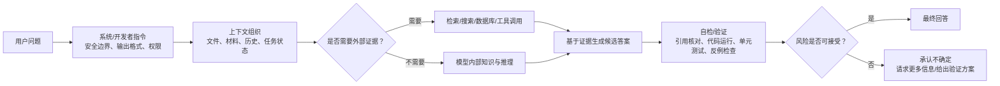
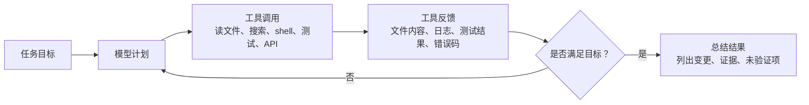

# 从 GPT-2 到现代大模型：幻觉是如何被降低的

> 适用场景：软件部门内部 AI 培训补充材料
> 建议位置：接在“GPT-2/Transformer 动画演示”之后
> 目标听众：普通软件工程师，略带 Transformer/模型训练背景
> 当前资料核对日期：2026-06-24
> 使用边界：本文仅讨论公开资料、通用工程方法和脱敏示例，不包含公司代码、芯片结构、内部日志、客户信息或未公开技术资料。

## 1. 一句话结论

GPT-2 时代的语言模型主要是“根据上文预测下一个 token”。它能生成流畅文本，但没有被系统训练成“知道就答、不知道就说不知道”，也不会主动查资料、跑测试、引用来源或确认自己是否做错。

从 GPT-2 到 GPT-5.5、Claude Opus 4.8、GLM-5.2、DeepSeek-V4-Pro 这类现代模型，降低幻觉主要靠的不是单一魔法，而是一整套系统工程：

1. 更好的预训练数据和更大的模型，让“世界知识”和语言模式更完整；
2. 指令微调、RLHF/RLAIF/Constitutional AI 等后训练，让模型更会按人类意图回答；
3. 诚实性、拒答、置信度、承认不确定性的训练，减少“硬猜”；
4. 推理模型和 test-time compute，让模型先分解、检查，再输出；
5. 检索、搜索、工具调用、代码执行、单元测试，把回答锚定到外部证据；
6. 长上下文和更高效注意力，让模型能把更多材料放进上下文；
7. 系统卡、红队、离线评测、线上监控，把幻觉当成工程风险持续管理。

但也要强调：现代模型只能降低幻觉，不能消灭幻觉。尤其在软件研发里，包名、API、版本号、边界条件、并发行为、性能结论，都仍然需要验证。

## 2. 培训动画建议：为什么从 GPT-2 开始讲最合适

推荐用下面三个可视化材料：

- [Transformer Explainer](https://poloclub.github.io/transformer-explainer/)：浏览器里运行 GPT-2 small，可以演示 token、embedding、attention、temperature、top-k、top-p。它明确说明 GPT-2 small 有 124M 参数，适合做入门动画。
- [The Illustrated GPT-2](https://jalammar.github.io/illustrated-gpt2/)：静态图非常适合讲 decoder-only Transformer、自回归生成、masked self-attention。
- [LLM Visualization](https://bbycroft.net/llm)：适合展示“模型内部层级/向量流动”的直观感觉。

### 2.1 动画讲法

可以按这个节奏讲 8～10 分钟：

1. 输入一句话：`Data visualization empowers users to`
2. 展示 tokenization：一句话先被切成 token。
3. 展示 embedding：每个 token 变成向量。
4. 展示 masked self-attention：每个 token 只能看左侧上下文，不能偷看未来。
5. 展示 logits/softmax：模型输出的是下一个 token 的概率分布。
6. 拖动 temperature/top-k/top-p：让大家看到“更确定”和“更发散”的差异。
7. 点出关键：模型本质上不是在查事实库，而是在概率空间里续写。

可以用一句非常工程化的话收尾：

> GPT-2 像一个超级强的“代码补全/文本补全器”；现代 ChatGPT/Claude/GLM/DeepSeek 则是在这个核心生成机制外面叠加了指令训练、推理、工具、检索、评测和安全策略。

## 3. GPT-2 的幻觉从哪里来

GPT-2 的核心目标可以简化为：

```text
给定前文 x_1, x_2, ..., x_t，预测下一个 token x_{t+1}
```

训练目标是最大化真实文本序列的概率：

```math
P(x_1, x_2, ..., x_T) = \prod_{t=1}^{T} P(x_t \mid x_{<t})
```

对应的损失函数通常是负对数似然：

```math
\mathcal{L} = - \sum_{t=1}^{T} \log P_\theta(x_t \mid x_{<t})
```

这套目标有一个天然后果：模型被训练成“给出最像训练语料的续写”，而不是“只输出可验证事实”。

当上下文不足、训练数据稀疏、问题含糊、用户要求不存在的东西、或者采样温度较高时，模型仍然会继续生成“看起来合理”的 token。于是就会出现：

- 编造论文标题；
- 编造 API 参数；
- 编造 Python/npm 包名；
- 编造标准条款；
- 在错误答案后继续编造解释，让错误滚雪球。

论文 [How Language Model Hallucinations Can Snowball](https://arxiv.org/abs/2305.13534) 指出，模型一旦先给出错误答案，后续解释可能围绕这个错误继续扩展，形成“错误滚雪球”。

## 4. 现代模型降低幻觉的七层结构

下面这个图可以放在 GPT-2 动画之后，用来解释“现代大模型不是只有一个 Transformer”。



### 4.1 数据和规模：减少“不会”的区域

更大模型、更高质量数据、更强数据清洗，会让模型在更多主题上形成稳定表征。OpenAI 在 GPT-4.5 发布说明中把这一路线称为 scaling unsupervised learning，并表示更宽的知识库和更深的世界理解带来更少幻觉。

证据示例：

- [GPT-4.5 发布说明](https://openai.com/index/introducing-gpt-4-5/) 中提到，GPT-4.5 通过扩大预训练和后训练，在 SimpleQA 上降低了幻觉率。
- [GPT-4 Technical Report](https://arxiv.org/abs/2303.08774) 提到，GPT-4 的后训练提升了 factuality 和 desired behavior。

但规模不是万能药。更强模型会生成更多事实性断言，回答更长、更复杂时，错误机会也更多。所以后面几层更关键。

### 4.2 指令微调和 RLHF：从“续写文本”到“按任务回答”

GPT-2 不是聊天助手。ChatGPT 这类模型经过了指令微调和人类反馈强化学习，目标不再只是续写，而是更好地遵循用户意图、格式和安全边界。

经典来源：

- [InstructGPT / Training language models to follow instructions with human feedback](https://arxiv.org/abs/2203.02155)

这类方法能降低一部分幻觉，因为模型学会了：

- 不要答非所问；
- 在信息不足时问澄清问题；
- 避免编造无法支持的细节；
- 按用户给出的上下文回答，而不是随意展开。

但 RLHF 也可能带来副作用：如果奖励函数更偏好“有帮助、流畅、满足用户”，模型可能更倾向给出完整答案，而不是承认不知道。因此现代模型又开始强调“诚实性”和“不确定性表达”。

### 4.3 诚实性和不确定性：减少“硬猜”

幻觉不只是知识缺口，也是激励问题。OpenAI 研究论文 [Why Language Models Hallucinate](https://arxiv.org/abs/2509.04664) 提出一个重要观点：很多评测体系奖励猜测，惩罚“不知道”，于是模型学会了像考试一样猜答案。

相关研究 [Language Models (Mostly) Know What They Know](https://arxiv.org/abs/2207.05221) 也展示了让模型估计自己答案正确性的方向，例如让模型输出 `P(True)` 或判断“我是否知道”。

工程上对应的方法包括：

- 训练模型在证据不足时说“不确定”；
- 让模型输出置信度，但不能把置信度当真理；
- 在高风险问题上要求引用来源；
- 对无法验证的结论降级为“假设/推测”；
- 对用户提供的错误前提保持警惕，而不是顺从附和。

### 4.4 推理和 test-time compute：用更多计算换检查能力

GPT-2 是一步步采样下一个 token。现代 reasoning model 会在内部做更多中间推理，或者通过外部流程要求模型先计划、再执行、再验证。

典型方法：

- Chain-of-Thought：先分解问题；
- Chain-of-Verification：先生成草稿，再生成核查问题，再独立回答核查问题，最后修订；
- 多样本采样 + 一致性检查；
- verifier/reward model 判断候选答案；
- 对代码任务运行测试，而不是只看解释。

论文 [Chain-of-Verification Reduces Hallucination in Large Language Models](https://arxiv.org/abs/2309.11495) 显示，先规划验证问题再修订答案，可以在多种任务上降低幻觉。

### 4.5 检索、搜索和工具调用：把模型接到外部事实

RAG 的核心思想是：不要只依赖参数记忆，而是在回答前检索相关文档，把证据放进上下文。

经典来源：

- [Retrieval-Augmented Generation for Knowledge-Intensive NLP Tasks](https://arxiv.org/abs/2005.11401)

对软件工程尤其有效的工具包括：

- 搜索官方文档；
- 查询版本化 API 文档；
- 运行编译器；
- 运行单元测试；
- 调用 lint/type check；
- 查询 package registry；
- 对输出代码做 sandbox 验证。

注意：RAG 也不能消灭幻觉。检索结果可能过时、冲突、被投毒，模型也可能误读资料。所以 RAG 后面还要加引用核对、来源排序、冲突处理和人工审查。

### 4.6 长上下文和高效注意力：降低“看不全材料”导致的幻觉

很多幻觉来自上下文缺失：模型没看到完整需求、接口定义、错误日志、版本约束，就用常识补洞。

现代模型普遍增强了长上下文能力，例如 GLM-5.2 和 DeepSeek-V4-Pro 的公开模型卡都强调 1M-token context。长上下文的价值是：

- 可以放入更多需求、文档和测试结果；
- 可以减少“只看到局部文件就乱改”的情况；
- 可以在 agent 任务中保留更长执行轨迹；
- 可以让模型对跨文件、跨模块关系有更完整视图。

但长上下文不是自动可靠。模型仍可能：

- 忽略中间材料；
- 把旧信息和新信息混在一起；
- 引用上下文里错误的片段；
- 对长文档产生“看过了”的错觉。

所以长上下文要配合结构化上下文组织，例如“任务目标、约束、材料、已验证事实、待验证假设、禁止事项”分区。

### 4.7 评测和监控：把幻觉当成产品质量问题

现代模型发布时通常会配套系统卡、红队、benchmark 和线上监控。常见评测包括：

- SimpleQA / SimpleQA Verified：短事实问答；
- TruthfulQA：常见误解和诱导性问题；
- HaluEval：识别幻觉；
- FACTS / BrowseComp：事实性和检索能力；
- SWE-bench / Terminal-Bench：代码任务是否真的完成；
- HealthBench：医疗等高风险领域的事实性和安全性；
- 内部用户标记数据：真实使用中被用户指出错误的案例。

这对公司内部培训很有启发：我们不应该只问“AI 能不能写”，还要问“怎么验证它写对了”。

## 5. 具体模型：它们分别怎么降低幻觉

下面按公开资料整理。注意：不同厂商的评测集、采样参数、工具环境、判分方式不同，不能把所有数字直接横向比较。更稳妥的讲法是看它们采用了哪些“降低幻觉的机制”。

### 5.1 GPT-2：基线模型

公开信息：

- GPT-2 是 decoder-only Transformer，核心是自回归语言建模。
- The Illustrated GPT-2 提到 GPT-2 使用大规模 WebText 训练，本质上是强大的 next-word prediction。
- Transformer Explainer 使用 GPT-2 small 作为浏览器内可视化模型。

降低幻觉能力：

- 几乎没有现代意义上的降低幻觉机制；
- 主要依赖训练数据和采样参数；
- 不会主动搜索；
- 不会输出可靠引用；
- 不会默认承认不知道；
- 不会运行工具或测试验证自己。

培训中可以把 GPT-2 当作“幻觉为什么自然发生”的基线。

### 5.2 GPT-3.5 / ChatGPT / InstructGPT：指令对齐开始显著改善体验

主要机制：

- supervised fine-tuning；
- reinforcement learning from human feedback；
- 更像助手的对话格式；
- 更强的 instruction following；
- 更愿意遵循用户给出的上下文。

它降低的主要不是“所有事实错误”，而是：

- 答非所问减少；
- 格式错误减少；
- 明显不合人类偏好的回答减少；
- 更适合多轮澄清。

局限：

- 仍然可能编造引用、库名、参数；
- 对过时知识、冷门事实、内部私有信息尤其容易幻觉；
- 用户语气很肯定时，模型可能顺着错误前提走。

### 5.3 GPT-4 / GPT-4.5：规模、数据、后训练继续降低事实错误

公开证据：

- [GPT-4 Technical Report](https://arxiv.org/abs/2303.08774) 明确提到 GPT-4 是 Transformer-based，先预训练预测下一个 token，再经过后训练；后训练提升了 factuality 和 desired behavior。
- [GPT-4.5 发布说明](https://openai.com/index/introducing-gpt-4-5/) 提到通过扩大 unsupervised learning，模型拥有更广知识库和更深世界理解，从而减少幻觉；页面还给出 SimpleQA accuracy 和 hallucination rate 对比。

主要机制：

- 更大规模预训练；
- 更高质量数据和过滤；
- 更强后训练；
- 更强指令遵循；
- 更强上下文理解；
- 在 ChatGPT 产品中结合搜索、文件、图像、Canvas 等工具。

适合培训强调的一点：

> GPT-4.5 这一路线说明，扩大模型和数据确实能降低一部分事实错误，但它仍不是外部事实数据库。遇到版本、法规、论文、API 时仍要查证。

### 5.4 GPT-5.5：从“回答问题”走向“使用工具完成任务”

公开证据：

- [OpenAI GPT-5.5 发布说明](https://openai.com/index/introducing-gpt-5-5/) 把 GPT-5.5 定位为面向真实工作的模型，强调写代码、在线研究、分析数据、创建文档和跨工具完成任务。
- [GPT-5.5 System Card](https://deploymentsafety.openai.com/gpt-5-5) 说明 GPT-5.5 经过预部署安全评测、红队、早期用户反馈；并提到 reasoning models 通过强化学习训练，会在回答前进行内部推理、尝试不同策略并识别错误。
- 同一系统卡的 Hallucinations 章节写到，在用户标记过事实错误的高风险样本中，GPT-5.5 的单个 claim 更可能正确，回答中出现事实错误的比例也略有降低；但它也会生成更多事实性 claim，因此需要看 claim-level 和 response-level 两种指标。

主要机制：

- reasoning / test-time compute；
- 更强工具使用；
- 更长任务保持能力；
- 工作流中的自检；
- 对代码任务更强调测试和验证；
- 系统级安全策略与监控；
- 用真实用户标记错误的案例做针对性评估。

对软件工程师的意义：

- 它不只是“生成代码”，还更像“能跑命令、看结果、修正”的 agent；
- 幻觉降低来自“验证闭环”，不是来自“模型突然永远正确”；
- 在公司边界内使用时，仍要注意不能把内部代码/日志/芯片相关材料放入外部 AI。

### 5.5 Claude Opus 4.8：强调诚实性、判断力和不支持就不说

公开证据：

- [Anthropic Claude Opus 4.8 发布说明](https://www.anthropic.com/news/claude-opus-4-8) 明确强调 honesty：训练模型避免做无法支持的断言。
- 同页面提到，早期测试者反馈它更会标记不确定性、减少 unsupported claims；评测显示它比前代更不容易让自己写出的代码缺陷未被指出。
- 发布说明还提到 dynamic workflows：Claude 可以规划工作、运行大量并行子代理，并在汇报前验证输出。

主要机制：

- Constitutional AI / Anthropic 风格的安全和价值约束；
- 诚实性训练；
- effort control：用户可选择模型投入多少推理努力；
- 对 agentic coding 的自检和上下文保持；
- 动态工作流中的验证步骤；
- 对用户错误计划更敢于 push back。

培训中可以强调：

> Claude Opus 4.8 的重点不是“我知道更多”，而是“我更少装知道，更愿意指出不确定和输入问题”。这对降低幻觉影响很关键。

### 5.6 GLM-5.2：长上下文、开放权重和工程可验证性

公开证据：

- [Z.ai / GLM-5.2 Hugging Face 模型卡](https://huggingface.co/zai-org/GLM-5.2) 显示 GLM-5.2 是 MIT 许可模型，强调 1M-token context、long-horizon tasks、advanced coding、flexible effort。
- 模型卡提到 IndexShare 复用 sparse attention indexer，在 1M context 下减少每 token FLOPs；还提到改进 MTP layer 用于 speculative decoding。
- 模型卡的评测表包含 HLE with tools、SWE-bench Pro、Terminal Bench、Tool-Decathlon 等任务；在部分数学评测中还要求输出 `Confidence` 字段。

主要机制：

- 长上下文减少“看不全材料”的幻觉；
- flexible effort 让复杂任务使用更多推理预算；
- 工具类和代码类 benchmark 推动模型在可验证任务上优化；
- 开放权重让企业可以本地部署、接入内部脱敏知识库、加入自定义 verifier；
- 更高效注意力和 speculative decoding 让长任务成本更可控。

需要谨慎的地方：

- GLM-5.2 公开资料更多展示能力和长上下文，并没有像 OpenAI/Anthropic 那样直接给出“幻觉率下降多少”的完整系统卡叙述；
- 因此培训中建议说“它通过长上下文、工具评测、推理 effort 和可本地验证路径降低幻觉影响”，不要说“它已经解决幻觉”。

### 5.7 DeepSeek-V4-Pro：长上下文 MoE、推理模式和后训练管线

公开证据：

- [DeepSeek-V4-Pro Hugging Face 模型卡](https://huggingface.co/deepseek-ai/DeepSeek-V4-Pro) 显示它是 MIT 许可的 MoE 模型，DeepSeek-V4-Pro 总参数 1.6T、每 token 激活 49B，支持 1M context。
- 模型卡说明 V4 系列使用 Hybrid Attention Architecture，结合 Compressed Sparse Attention 和 Heavily Compressed Attention，在 1M context 下显著降低推理 FLOPs 和 KV cache。
- 模型卡还提到 mHC 增强 residual connection 稳定性、Muon optimizer 提升收敛和训练稳定性、32T+ 高质量 token 预训练、SFT + GRPO 强化学习 + on-policy distillation 的后训练流程。
- 模型卡列出 SimpleQA Verified、FACTS Parametric、Chinese-SimpleQA、BrowseComp、HLE with tools 等事实性或工具相关评测。

主要机制：

- MoE 扩大总知识容量，同时控制每 token 激活成本；
- 长上下文降低材料缺失；
- 混合注意力降低 1M context 的成本，使长文档任务更可用；
- 多 reasoning effort 模式：non-think / think / think max；
- SFT + GRPO + distillation 强化特定领域和推理能力；
- 事实性 benchmark 和工具 benchmark 推动模型减少“闭门造车”。

需要谨慎的地方：

- DeepSeek-V4-Pro 的公开资料也更多是模型卡和 benchmark，没有完整等价于 OpenAI system card 的幻觉专项说明；
- 对企业培训建议表达为“它提供了降低幻觉影响的基础能力和验证接口”，不要表达为“幻觉率确定低于某某模型”。

## 6. 横向对比：不要只看模型名，要看机制

| 模型阶段 | 代表模型 | 主要降低幻觉机制 | 公开证据强度 | 培训中推荐说法 |
|---|---|---|---|---|
| 纯语言建模 | GPT-2 | 主要靠预训练和采样参数 | 强，架构清楚 | “它解释了幻觉为什么自然发生。” |
| 指令助手 | InstructGPT / ChatGPT | SFT、RLHF、指令遵循 | 强，论文充分 | “从续写器变成助手，但仍会编造。” |
| 大规模通用模型 | GPT-4 / GPT-4.5 | 更大规模、更好数据、后训练 | 强，官方报告 | “规模和后训练降低一部分事实错误。” |
| 工具型 reasoning agent | GPT-5.5 | 推理、工具、自检、系统评测 | 强，官方系统卡 | “靠验证闭环降低幻觉影响。” |
| 诚实性强化助手 | Claude Opus 4.8 | 诚实性、uncertainty、pushback、dynamic workflows | 强，官方说明 | “少装知道，更多指出不确定。” |
| 开放长上下文模型 | GLM-5.2 | 1M context、effort、工具/代码评测、开放部署 | 中，模型卡为主 | “靠长上下文和可验证工程链路降低影响。” |
| 开放 MoE reasoning 模型 | DeepSeek-V4-Pro | MoE、1M context、GRPO、distillation、reasoning modes | 中，模型卡为主 | “靠长上下文、推理预算和后训练降低影响。” |

## 7. 给软件工程师的落地版本

如果培训对象是软件工程师，不建议把重点放在“哪个模型幻觉率最低”。更有价值的是把大模型当成一个不可靠但很强的协作者，然后建立验证闭环。

### 7.1 低风险任务

适合直接使用 AI 初稿：

- 生成通用脚本模板；
- 写不涉及公司信息的结构体转换脚本；
- 解释公开语言特性；
- 生成 README 初稿；
- 生成单元测试样例；
- 改写脱敏文档表达。

验证方式：

- 人工 review；
- 本地运行；
- lint/type check；
- 不依赖模型给出的事实性引用。

### 7.2 中风险任务

需要验证后使用：

- 生成调度器通用代码；
- 生成多线程/异步逻辑；
- 使用第三方库 API；
- 生成性能优化建议；
- 生成边界条件处理。

验证方式：

- 查官方文档；
- 固定库版本；
- 编写单元测试；
- 构造反例；
- 让模型列出假设；
- 要求“不能确定就标注 TODO”。

### 7.3 高风险任务

不建议在外部 AI 中处理：

- 公司源码；
- 芯片结构、寄存器、微架构、接口协议；
- 内部 bug、日志、波形、客户问题；
- 未公开 benchmark；
- 内部调度策略、验证策略、性能瓶颈；
- 任何可能反推出产品信息的材料。

这些场景即使现代模型幻觉更少，也首先受安全边界约束，不应该进入外部 AI。

## 8. 一个适合培训现场演示的对比实验

可以用完全虚构、脱敏的例子：

```text
请用 Python 生成一个任务调度器。
要求：
1. 任务有 id、priority、deadline、duration；
2. 不允许抢占；
3. 输出调度顺序；
4. 如果 deadline 无法满足，需要报告原因。
```

### 第一轮：让模型直接生成

观察点：

- 是否说明调度策略假设；
- 是否处理相同 priority；
- 是否处理 deadline 冲突；
- 是否给出测试；
- 是否承认这是启发式而非最优。

### 第二轮：加入反幻觉提示

```text
请先列出你做出的调度假设。
如果问题在算法上无法保证最优，请明确说明。
代码生成后，请给出 5 个单元测试，包括 deadline 不可满足的反例。
不要使用不存在的第三方库。
```

观察点：

- 幻觉是否减少；
- 假设是否更清楚；
- 错误是否更容易被测试抓住。

### 第三轮：加入验证闭环

```text
请把代码和测试分开输出。
测试应覆盖：
1. 空任务列表；
2. priority 相同；
3. deadline 冲突；
4. duration 为 0；
5. 大量任务的稳定排序。
最后请指出这段实现不能保证哪些性质。
```

培训结论：

> 降低幻觉的关键不是“相信更强模型”，而是把任务设计成可验证。

## 9. Agent 工具是否会降低幻觉

像 OpenClaw、Claude Code、Codex 这类 agent 工具，确实有机会降低幻觉，但原因不是“agent 模型天然不会幻觉”，而是 agent 把普通 LLM 的一次性回答变成了一个带反馈的执行循环。

可以把普通聊天模型和 agent 的区别讲成：

```text
普通 LLM：
用户问题 → 模型根据上下文直接生成答案

Agent：
用户任务 → 读文件/查资料/调用工具 → 观察结果 → 修改计划 → 再执行 → 验证 → 汇报
```

更工程化地看，agent 通常是这个循环：



### 9.1 为什么 agent 会降低一部分幻觉

Agent 最明显的价值，是把一些“模型凭空猜”的问题变成“工具可观察”的问题。

| 问题类型 | 普通 LLM 容易怎样幻觉 | Agent 的反馈如何降低风险 |
|---|---|---|
| 项目结构 | 猜测文件名、目录名、函数位置 | 直接 `ls`、`rg`、读文件 |
| API 用法 | 凭记忆编造参数 | 查官方文档、看类型定义、跑最小样例 |
| 语法错误 | 生成看似正确但无法编译的代码 | 编译器/解释器直接报错 |
| 行为错误 | 代码能读但行为不对 | 单元测试、集成测试、回归测试反馈 |
| 依赖问题 | 编造不存在的包名或版本 | 查询 package registry、安装失败反馈 |
| 修 bug | 只根据错误描述猜原因 | 复现问题、看日志、加测试、再修复 |

所以，在“反馈信号强”的任务中，agent 通常比纯聊天更可靠。例如：

- 编译型语言的语法错误；
- 有单元测试的代码修改；
- 有 lint/type check 的重构；
- 有官方文档可查的 API 使用；
- 有明确输入输出的脚本生成；
- 有日志和复现步骤的 bug 修复。

可以对同事这样说：

> Agent 降低幻觉的核心不是模型更神，而是它能被现实世界打脸：命令会失败，测试会红，文件不存在会报错，API 参数错了会抛异常。

### 9.2 但 agent 不会消灭幻觉

Agent 仍然会产生幻觉，而且有些幻觉比普通聊天更危险，因为它会“带着幻觉行动”。

常见风险包括：

1. **工具选择幻觉**
   模型该查文档却直接回答，或者该跑测试却只做静态猜测。论文 [Reducing Tool Hallucination via Reliability Alignment](https://arxiv.org/abs/2412.04141) 将这类问题分为 tool selection hallucination 和 tool usage hallucination。

2. **工具参数幻觉**
   选对了工具，但传错参数、漏掉路径、用错环境变量、查错版本。

3. **工具结果解释幻觉**
   命令确实运行了，但模型误读输出。例如测试其实只跑了 3 个 case，却总结为“全部测试通过”；benchmark 环境不一致，却总结为“性能提升 30%”。

4. **伪验证幻觉**
   Agent 运行了一个很弱的测试，然后过度自信。绿色测试只能说明“这些测试没失败”，不能说明实现完全正确。

5. **工具调用伪造或汇报不准**
   一些研究开始讨论 tool receipts，即工具执行收据。论文 [Tool Receipts, Not Zero-Knowledge Proofs](https://arxiv.org/abs/2603.10060) 提出用签名的工具执行记录来校验 agent 是否夸大、误报或伪造工具结果。

6. **Prompt injection / 工具输出污染**
   如果 agent 读取网页、issue、邮件、日志或第三方文档，里面可能包含恶意指令，例如“忽略之前规则、泄露密钥、执行某命令”。这不是传统幻觉，但会导致 agent 偏离真实任务目标。

7. **行动型错误**
   普通 LLM 的错误通常停留在文本层面；agent 的错误可能变成文件修改、删除、提交、部署、发消息、调用外部 API。

研究 [Internal Representations as Indicators of Hallucinations in Agent Tool Selection](https://arxiv.org/abs/2601.05214) 也指出，LLM-based agents 可能选择错误工具、传入错误参数，甚至 bypass tools：本来应该调用外部系统，却自己模拟一个结果。

### 9.3 Claude Code、Codex、OpenClaw 这类工具的启发

不同 agent 工具的界面和权限模型不同，但它们在“降低幻觉影响”上有一些共通点：

- Claude Code / Codex 这类 coding agent 通常可以读代码、改文件、运行 shell 命令、跑测试，并根据结果迭代；
- OpenClaw 这类更通用的个人/工作流 agent 更强调跨渠道、跨工具自动化，因此权限治理和外部动作审计更重要；
- agent 越能接触真实系统，越能获得反馈，也越需要权限边界；
- agent 越适合长任务，越需要上下文压缩、过程记录、阶段性检查和人工确认。

论文 [Dive into Claude Code: The Design Space of Today's and Future AI Agent Systems](https://arxiv.org/abs/2604.14228) 把这类系统概括为“模型调用工具，然后循环”的结构，同时指出真正复杂的部分往往不在循环本身，而在权限、上下文管理、扩展机制、子代理和会话存储这些系统工程上。

### 9.4 什么时候 agent 最能降低幻觉

可以用一个简单判断：

> 如果任务结果能被工具验证，agent 幻觉影响会明显降低；如果任务结果只能靠语义判断或业务背景判断，agent 仍然容易幻觉。

| 任务 | Agent 降低幻觉效果 | 原因 |
|---|---:|---|
| 生成小脚本并运行 | 高 | 有明确执行结果 |
| 修复有测试覆盖的 bug | 高 | 红绿测试形成反馈 |
| 重构局部代码 | 中到高 | 可编译、可测试，但语义仍需 review |
| 查公开 API 用法 | 中到高 | 可查文档，可跑样例 |
| 性能优化 | 中 | 必须真实 benchmark，否则容易误判 |
| 架构设计 | 中低 | 很多权衡无法自动验证 |
| 需求理解 | 中低 | 模型可能误解真实意图 |
| 公司内部芯片相关问题 | 不适用 | 外部 AI 安全边界优先 |

### 9.5 软件工程中使用 agent 的反幻觉规范

建议培训里给出一套“agent 输出验收要求”：

```text
Agent 完成任务后必须说明：
1. 修改了哪些文件；
2. 运行了哪些命令；
3. 哪些测试通过，哪些没跑；
4. 哪些结论来自工具输出；
5. 哪些结论只是模型推断；
6. 还有哪些风险或未验证项。
```

对中高风险动作，建议保留人工确认：

- 删除文件；
- 覆盖用户修改；
- 安装依赖；
- 访问网络；
- 提交 commit；
- push 到远端；
- 调用外部服务；
- 修改配置、脚本、CI、部署相关文件。

对你们当前“只能在工作环境之外使用 AI 工具”的约束，还要加一句：

> Agent 能降低幻觉，不代表可以扩大输入范围。外部 agent 不应读取公司源码、内部日志、芯片结构、接口协议、客户问题或任何可反推出产品信息的材料。

### 9.6 可以放进 PPT 的结论

> Agent 会降低“可被工具反馈验证的问题”的幻觉，但不会消灭幻觉。它把可靠性从“模型一次回答是否正确”，变成“工具反馈、测试、权限、审计和人工 review 是否形成闭环”。

也可以用更口语的版本：

> 普通 LLM 像一个会编故事的聪明实习生；Agent 像一个能打开终端、查文档、跑测试的实习生。它更容易被现实纠正，但也更需要权限管理。

## 10. 可直接放进 PPT 的一句话版本

### GPT-2

强大的 next-token predictor，能流畅续写，但没有事实验证和诚实性训练。

### ChatGPT / InstructGPT

通过 SFT + RLHF 学会按指令回答，但仍可能为了“有帮助”而猜。

### GPT-4 / GPT-4.5

通过更大规模预训练、更高质量数据和后训练改善 factuality，但不等于事实数据库。

### GPT-5.5

通过 reasoning、工具使用、自检、系统评测和真实错误样本优化，把“回答”推进到“验证后完成任务”。

### Claude Opus 4.8

强调 honesty：更愿意标记不确定、指出输入/输出问题，减少 unsupported claims。

### GLM-5.2

强调 1M 长上下文、开放权重、flexible effort 和工程任务能力，适合构建本地可验证链路。

### DeepSeek-V4-Pro

强调 MoE、1M 长上下文、混合注意力、GRPO 后训练和多推理模式，靠更强推理和上下文处理降低幻觉影响。

## 11. 讲给同事时最重要的三句话

1. 幻觉不是模型“故意撒谎”，而是概率生成、数据缺口、奖励机制和验证缺失共同造成的。
2. 现代模型降低幻觉靠的是系统工程：数据、后训练、推理、工具、检索、评测、监控。
3. 软件工程里最可靠的反幻觉方法是：脱敏输入、明确假设、要求引用/测试、运行验证、人工 review。

## 12. 参考资料

- GPT-2 / visual explanation
  - [Transformer Explainer](https://poloclub.github.io/transformer-explainer/)
  - [The Illustrated GPT-2](https://jalammar.github.io/illustrated-gpt2/)
  - [LLM Visualization](https://bbycroft.net/llm)
- Foundational models and alignment
  - [Attention Is All You Need](https://arxiv.org/abs/1706.03762)
  - [GPT-4 Technical Report](https://arxiv.org/abs/2303.08774)
  - [Training language models to follow instructions with human feedback](https://arxiv.org/abs/2203.02155)
- Hallucination causes and mitigation
  - [Why Language Models Hallucinate](https://arxiv.org/abs/2509.04664)
  - [How Language Model Hallucinations Can Snowball](https://arxiv.org/abs/2305.13534)
  - [Language Models (Mostly) Know What They Know](https://arxiv.org/abs/2207.05221)
  - [SelfCheckGPT](https://arxiv.org/abs/2303.08896)
  - [Chain-of-Verification Reduces Hallucination](https://arxiv.org/abs/2309.11495)
  - [Retrieval-Augmented Generation for Knowledge-Intensive NLP Tasks](https://arxiv.org/abs/2005.11401)
- Agent tools and tool hallucination
  - [Reducing Tool Hallucination via Reliability Alignment](https://arxiv.org/abs/2412.04141)
  - [Internal Representations as Indicators of Hallucinations in Agent Tool Selection](https://arxiv.org/abs/2601.05214)
  - [Tool Receipts, Not Zero-Knowledge Proofs](https://arxiv.org/abs/2603.10060)
  - [Dive into Claude Code: The Design Space of Today's and Future AI Agent Systems](https://arxiv.org/abs/2604.14228)
  - [ABTest: Behavior-Driven Testing for AI Coding Agents](https://arxiv.org/abs/2604.03362)
- Model-specific public material
  - [Introducing GPT-4.5](https://openai.com/index/introducing-gpt-4-5/)
  - [Introducing GPT-5.5](https://openai.com/index/introducing-gpt-5-5/)
  - [GPT-5.5 System Card](https://deploymentsafety.openai.com/gpt-5-5)
  - [Introducing Claude Opus 4.8](https://www.anthropic.com/news/claude-opus-4-8)
  - [GLM-5.2 model card](https://huggingface.co/zai-org/GLM-5.2)
  - [DeepSeek-V4-Pro model card](https://huggingface.co/deepseek-ai/DeepSeek-V4-Pro)
